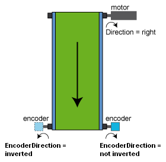

# EncoderDirection

EncoderDirection

General

|  |  |
| --- | --- |
| Type | EF |
| Offline editable | Yes |
| Devices supporting the parameter | Lexium LXM52 Drive, Lexium LXM52 Linear Drive,  Lexium LXM62 Drive, Lexium LXM62 Linear Drive |
| Traceable | No |

Functional Description

|  |
| --- |
| Caution_Color.gifCAUTION |
| UNINTENDED MOTOR MOVEMENT: THROUGH AN INVALID PARAMETERIZATION, THE COMMUTATION OF THE MOTOR IS CALCULATED INCORRECTLY |
| oThis function may only be used by technically qualified personnel, who knows the system design and who can assess the consequences.  oEnsure that no one is in the hazard area during the startup.  oThe parameter EncoderDirection has to fit to the mechanical existing coupling between the motor and the encoder.  oSet the parameter to not inverted / 1 for the Schneider-Electric servo motors of the series SH3, BSH, or BMH. |
| Failure to follow these instructions can result in injury or equipment damage. |

Is used to select the encoder direction relative to the motor direction.

EncoderDirection parameter using the example of the conveyor belt for rotary drives

| Value | Data type | Meaning |
| --- | --- | --- |
| inverted / 0 | BOOL | The encoder shaft moves in the opposite direction of the motor shaft.  (If the motor shaft moves clockwise, the encoder shaft moves counterclockwise.) |
| not inverted / 1 | BOOL | The encoder shaft moves in the same direction as the motor shaft.  (If the motor shaft moves clockwise, then the encoder shaft also moves clockwise.) |

The rotation direction is considered when calculating the parameters [EncoderPosition](Encoder_2-3.htm#XREF_D_SE_0071802_1), [Position](../RefActualValues/RefActualValues-7.htm#XREF_D_SE_0071521_1), [MechPosition](../RefActualValues/RefActualValues-8.htm#XREF_D_SE_0071499_1), and [ShaftMechPosition](../RefActualValues/RefActualValues-10.htm#XREF_D_SE_0071503_1). The EncoderPosition is also between 0 and the converted [EncoderRange](Encoder_2-4.htm#XREF_D_SE_0071805_1) of the load side, by inverted / 0. The EncoderPosition is positive.

NOTE: Modifications to the parameter are only applied during the Sercos phase up (communication phase 0 => communication phase 4).

This parameter has no effect for asynchronous motors in open-loop V / f mode ([ControlMode](../ControlLoop_2/ControlLoop_2-2.htm#XREF_D_SE_0071561_1) = open-loop control / 1).

Synchronous Motors with Inverted EncoderDirection

If EncoderDirection is set to inverted / 0, then the commutation saved in the motor nameplate is not evaluated. Saving the commutation into the motor nameplate with the object parameter [MotorCommutationControl](../Motor_2/Motor_2-19.htm#XREF_D_SE_0071796_1) is not possible. The commutation has to be determined over again every time the drive is newly switched on or reset.

EIO0000003543.00

© 2018 Schneider Electric. All rights reserved.