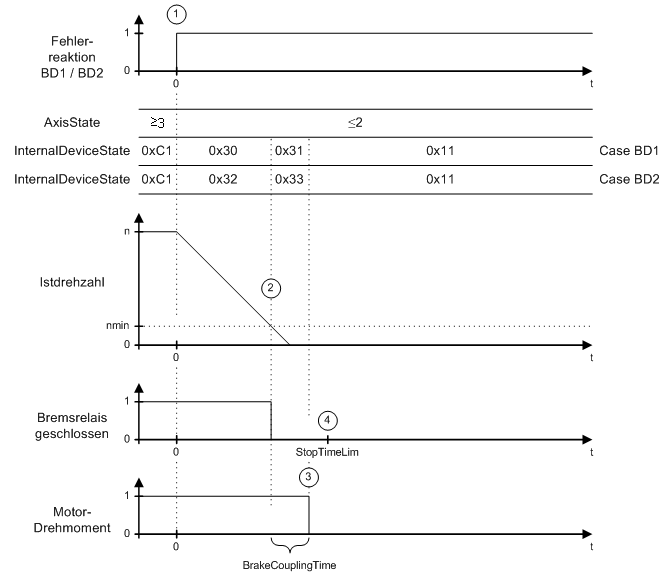

# Ramping down Within the Maximum Ramp-down Time

Ramping down Within the Maximum Ramp-down Time

General

In the case of an error with reaction BD1 (1), the axis ramps down at maximum current ([MaxDrive­PeakCurrent](../General_2/General_2-6.htm#XREF_D_SE_0071528_1)). In the case of an error with reaction BD2 (1), the axis ramps down according to the parameters [ControllerStopDec](../General_2/General_2-10.htm#XREF_D_SE_0071532_1) and [ControllerStopJerk](../General_2/General_2-11.htm#XREF_D_SE_0071533_1). As soon as the actual speed becomes lower than the speed threshold (actual speed < nmin) (2), the brake relay is released. The axis comes to a standstill before expiry of the maximum ramp-down time (parameter StopTimeLim) (4). After expiry of the brake coupling time (parameter BrakeCouplingTime) (3), the motor is switched to a torque-free state.

Time diagram for reaction BD1 / BD2 (ramping down within the max. ramp down time)

EIO0000003545.00

© 2018 Schneider Electric. All rights reserved.