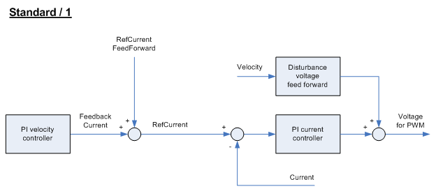
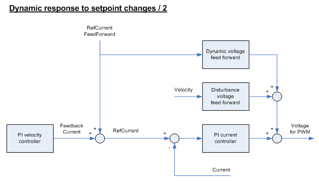
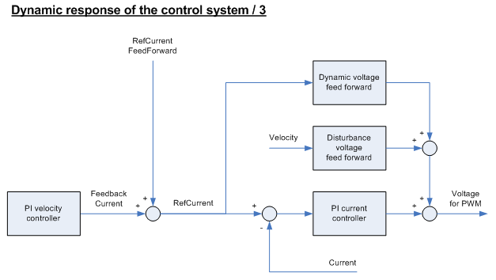

# VoltageFeedForwardMode

VoltageFeedForwardMode

General

|  |  |
| --- | --- |
| Type | EF |
| Offline editable | Yes |
| Devices supporting the parameter | Lexium LXM52 Drive, Lexium LXM52 Linear Drive,  Lexium LXM62 Drive, Lexium LXM62 Linear Drive,  Lexium ILM62 Drive Module |
| Traceable | – |
| FW version: (drive) | V01.34.01.00 or higher |
| FPGA version: (drive) | XX/06/XXXX/00/XX or higher |

Functional Description

With the VoltageFeedForwardMode, the dynamic of the voltage feed forward is set. The voltage feed forward calculates parallel to the current controller a proportion of the voltage that shall be controlled. Using reference values enables quick passage.

With the connection of a differential proportion, the dynamic of the current control can be increased significantly. However, this amplifies faults detected, which is why the control may not work properly. This depends on the amount of the present faults detected.

| Value | Meaning |
| --- | --- |
| not valid / 0  (till V4.4 and lower) | – |
| Compatibility / 0  (from V5.0 and higher) | This is the behavior with the lowest dynamic.  This mode is only intended for Lexium LXM62 Standard Plus and Lexium LXM62 Advanced Plus to be 100 % backward compatible with Lexium LXM62 Standard. In addition to the current controller, only voltage feed forward to compensate velocity disturbances (disturbance voltage feed forward). The voltage that is induced by the EMF (ElectroMagnetic Force) is compensated. |
| Standard / 1 | In addition to the current controller, only a voltage feed forward is available to compensate for velocity disturbances (disturbance voltage feed forward). The voltage - induced by the EMF (electromagnetic force) - is compensated.  For Lexium LXM62 Standard Plus and Lexium LXM62 Advanced Plus there is an addition decoupling network to minimize the mutual influence of the two current components (Iq and Id). |
| Dynamic response to setpoint changes / 2 | For the voltage feed forward, the current feed forward is used (in addition to mode 1), which is calculated based on reference values. The dynamic of the higher-level control loops (speed controller and position controller) remains nearly unmodified. |
| Dynamic behavior of the control loop / 3 | For the voltage feed forward, the overall reference current is used (in addition to mode 1), which also contains the [FeedbackCurrent](../RefActualValues/RefActualValues-18.htm#XREF_D_SE_0071520_1) from the velocity controller (PI velocity controller). Thus, the dynamic of the higher-level control loops (speed of rotation controller and position controller) is increased. In this case, the speed controller parameters [Vel\_P\_Gain](ControlLoop_2-4.htm#XREF_D_SE_0071565_1) and [Vel\_I\_Gain](ControlLoop_2-5.htm#XREF_D_SE_0071566_1) can be operated up to maximum values of 250 %. |

This parameter has no effect for asynchronous motors in open-loop V / f mode ([ControlMode](../../../../../../api/crossBook?lang=en-US&virtualBookName=PD.Parameter.LXM52Drive&topicID=D_SE_0071561_1) = open-loop control / 1).

In order to achieve greater dynamics, certain boundary conditions must be complied with:

oThe noise in reference values must be sufficiently low (modes 2 and 3). This must be checked for physical (external) master encoders. In the case of virtual master encoders or reference value generators which are not based on actual values, there are no limitations to the running smoothness when using this mode.

oThe noise in the actual velocity must be sufficiently low (only mode 3). The higher the resolution of the encoder, the lower the noise in the actual velocity.

Due to differentiating in the dynamic voltage feed forward, in individual cases, it must be determined whether the amplification of the noise is acceptable.

The figures show the processing of the signals in the different modes of VoltageFeedFor­wardMode. In each mode, the current controller (PI current control) and the voltage feedforward works for disturbance compensation (Disturbance voltage feedforward) in parallel. In addition, in modes 2 and 3, the dynamic voltage feedforward (Dynamic voltage feedforward) is used for processing the input value proportional and differential. It responds quickly to the modification. The difference between mode 2 and 3 lies in the input variable of the dynamic voltage feed forward.

Mode 2 is only used in combination with flexible current feed forward deployable. Currently, there are no reference value generators available that support this mode beyond this. Thus, the use of this mode without flexible feed forward usually does not reduce the tracking deviation.

EIO0000003545.00

© 2018 Schneider Electric. All rights reserved.