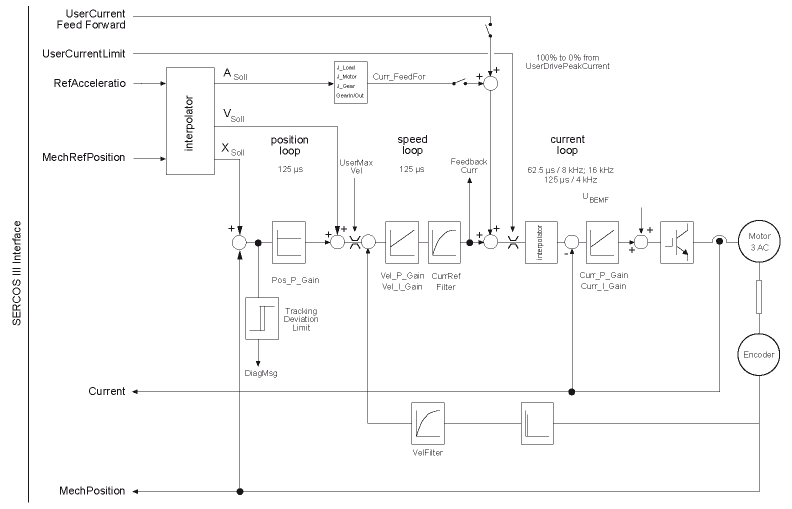

# Control Loop

Control Loop

General

The controller in the Lexium LXM52 Linear Drive or Lexium LXM62 Linear Drive is a cascade controller including:

oA current control loop

oA speed control loop

oA position control loop

At power stage frequencies of 8 kHz and 16 kHz, the current control loop works with a cycle time of 62.5 µs as well as at a power stage frequency of 4 kHz with a cycle time of 125 µs.

The current controller is implemented as PI controller and can be parameterized using the parameters Curr\_P\_Gain and Curr\_I\_Gain. The current control loop is self-optimizing. Using data from the motor nameplate, it automatically adapts to suit the motor. Therefore, as a rule the default setting can be used. A voltage feed forward (U\_BEMF) is applied to the output of the current controller which however cannot be parameterized.

The speed loop works with a cycle time of 125 µs and can be parameterized using the parameters Vel\_P\_Gain, Vel\_I\_Gain, VelFilter, and CurrRefFilter. The actual speed is calculated by differentiation from the actual position. The velocity controller is realized as PI controller. Using the parameters Vel\_P\_Gain and Vel\_I\_Gain, the proportional (P) and integral (I) gain of the controller is parameterized. The moment of inertia has to be parameterized correctly using the parameters J\_Load, GearIn, GearOut, and J\_Gear so that the correct controller gain can be set internally. If the moment of inertia has been parameterized correctly, most mechanical equipment can be operated with default controller parameters. However, as a rule the parameters have to be optimized in order to minimize tracking deviation. Using the filters VelFilter and CurrRefFilter it is possible to dampen high-frequency vibrations (resonances) which can occur between motor and the mechanical equipment or within the mechanical equipment. These two filter parameters are parameterized with the same values. The higher the filters are parameterized, the stronger is the damping effect on high-frequency vibrations and the lower are the dynamics of the control loop.

The position control loop works with a cycle time of 125 µs and can be parameterized using the parameter Pos\_P\_Gain. The most mechanical equipment can be operated using the default settings. However, as a rule the parameter has to be optimized in order to minimize tracking deviation.

As input quantities for the controller the MechRefPosition and RefAcceleration are transferred via the Sercos III interface in the real-time channel with the defined Sercos cycle time (SercosCycle). Before these values are applied to the controller, they are interpolated. Furthermore, the target velocity (Vtarget) is calculated from the two transferred quantities. The quantities are interpolated to 125 µs from the Sercos cycle time.

The value for the current feed forward (CurrFeedForward) is calculated from the acceleration. The moment of inertia with the parameters J\_Load, GearIn, GearOut, and J\_Gear is included into this calculation.

The quantities CurrFeedForward and Vref are feed forward values which enable a direct, quick passage of the reference values to the controller. The command action of the controller is optimized and the tracking deviation reduced.

Another interpolator interpolates the reference current value from 125 µs to 62.5 µs if the power stage frequency is 8 kHz or 16 kHz. At 4 kHz, no interpolation is required since the current controller works with 125 µs as well.

The reference current can be dynamically limited by using UserCurrentLimit. UserCurren­tLimit is parameterized as a percentage of UserDrivePeakCurrent and transferred via the real-time channel of the Sercos III interface in each cycle.

The speed of rotation is limited by UserMaxVel, with 110 % of UserMaxVel being allowed as limitation value so that occurring control deviations can be compensated also at maximum speed.

The tracking deviation is the difference between MechRefPosition and MechPosition. The tracking deviation is compared to the parameter TrackingDeviationLimit. If this limit value is exceeded, a diagnostic message (DiagMsg) is triggered.

The actual position (MechPosition) and the current (Current) are transferred as output values to the controller via the real-time channel. At the moment, the FeedbackCurrent can only be read out via the Sercos parameter channel.

Servo amplifier controller structure

What Is in This Chapter?

This chapter contains the following topics:

o[Pos\_P\_Gain](ControlLoop_2-2.htm#XREF_D_SE_0071563_1)

o[TrackingDeviationLimit](ControlLoop_2-3.htm#XREF_D_SE_0071564_1)

o[Vel\_P\_Gain](ControlLoop_2-4.htm#XREF_D_SE_0071565_1)

o[Vel\_I\_Gain](ControlLoop_2-5.htm#XREF_D_SE_0071566_1)

o[VelFilter](ControlLoop_2-6.htm#XREF_D_SE_0071567_1)

o[CurrRefFilter](ControlLoop_2-7.htm#XREF_D_SE_0071570_1)

o[NotchFilterDamping](ControlLoop_2-8.htm#XREF_D_SE_0071571_1)

o[NotchFilterFrequency](ControlLoop_2-9.htm#XREF_D_SE_0071572_1)

o[NotchFilterBandwidth](ControlLoop_2-10.htm#XREF_D_SE_0071577_1)

o[VoltageFeedForwardMode](ControlLoop_2-11.htm#XREF_D_SE_0071578_1)

o[Curr\_P\_Gain](ControlLoop_2-12.htm#XREF_D_SE_0071573_1)

o[Curr\_I\_Gain](ControlLoop_2-13.htm#XREF_D_SE_0071574_1)

o[PowerStageFrequency](ControlLoop_2-14.htm#XREF_D_SE_0071575_1)

EIO0000003545.00

© 2018 Schneider Electric. All rights reserved.