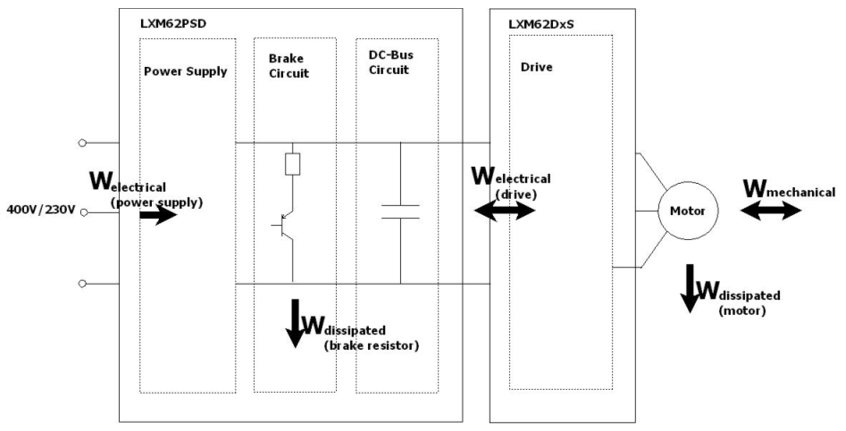

# Energy Measurement

Energy Measurement

General

Correct sizing is an important requirement for a cost-effective operation and construction of a machine. An insufficient dimensioning of the drive system (Servo drive and motor) leads to power loss and therefore to an inefficient entire system. If the parameters of the Motion controller are not set exactly, the power loss increases. The motion profile that is carried out by the drive system affects the energy efficiency of the system also.

To optimize the system, a quantitative description of the energy flow is necessary. This could be realized by using external additional equipment but this would lead to additional costs and requirements on special trained personnel. The easiest way to define the energy flow in the drive system is a direct energy measurement in the system - without additional costs and personnel requirements. The monitoring of the energy gives information on the efficiency of the machine. The automatic energy measurement allows an optimization of the machine which leads to a higher energy efficiency.

Basic Principle of the Energy Measurement

The following wiring diagram displays the energy values that are measured in the servo amplifier and the power supply:

In the Lexium 52, the following energy types are determined:

oThe electrical energy Welectrical (power supply) (see parameter [ElectricalEnergyPowerSupply](EnergyMeasurement_2-6.htm#XREF_D_SE_0071862_1)) that was received by the device

oThe thermal energy loss in the braking resistor Wdissipated (brake resistor) (see parameter [DissipatedEnergyPowerSupply](EnergyMeasurement_2-7.htm#XREF_D_SE_0071863_1))

oThe electrical energy Welectrical (drive) (see parameter [ElectricalEnergyDrive](EnergyMeasurement_2-3.htm#XREF_D_SE_0071859_1)) that was received by the drive from the DC bus

oThe thermal energy loss in the motor winding Wdissipated (motor) (see parameter [DissipatedEnergyDrive](EnergyMeasurement_2-4.htm#XREF_D_SE_0071860_1))

oThe mechanical energy Wmechanical (see parameter [MechanicalEnergy](EnergyMeasurement_2-5.htm#XREF_D_SE_0071861_1)) delivered respectively received by the motor

In the servo amplifier Lexium 62, the following energy types are determined:

oThe electrical energy Welectrical (drive) (see parameter [ElectricalEnergyDrive](EnergyMeasurement_2-3.htm#XREF_D_SE_0071859_1)) that was received by the drive from the DC bus

oThe thermal energy loss in the motor winding Wdissipated (motor) (see parameter [DissipatedEnergyDrive](EnergyMeasurement_2-4.htm#XREF_D_SE_0071860_1))

oThe mechanical energy Wmechanical (see parameter [MechanicalEnergy](EnergyMeasurement_2-5.htm#XREF_D_SE_0071861_1)) delivered respectively received by the motor

In the Lexium 62 ILM drive, the following energy types are determined:

oThe electrical energy Welectrical (drive) (see parameter [ElectricalEnergyDrive](EnergyMeasurement_2-3.htm#XREF_D_SE_0071859_1)) that was received by the drive from the DC bus

oThe thermal energy loss in the motor winding Wdissipated (motor) (see parameter [DissipatedEnergyDrive](EnergyMeasurement_2-4.htm#XREF_D_SE_0071860_1))

oThe mechanical energy Wmechanical (see parameter [MechanicalEnergy](EnergyMeasurement_2-5.htm#XREF_D_SE_0071861_1)) delivered respectively received by the motor

In the PacDrive LMC600, the following energy types are determined:

oThe electrical energy Welectrical (power supply) (see parameter [ElectricalEnergyPowerSupply](EnergyMeasurement_2-6.htm#XREF_D_SE_0071862_1)) that was received by the device

oThe thermal energy loss in the braking resistor Wdissipated (brake resistor) (see parameter [Dissipat­edEnergyPowerSupply](EnergyMeasurement_2-7.htm#XREF_D_SE_0071863_1)) that was received by the device

The calculation of the energy values is based on the respective, current power values. To determine the current power values, low scan times are used so that the values that are measured in this short time period can be viewed as constant. The respective power values result then by integrating the measured values.

The energy measurement is performed automatically (in the power supply and the drives). During operation, the energy values are regularly saved remanent. The saved values remain even if the device is switched off. When switching on the power supply again, the energy measurement is continued. This way you can monitor the energy flow of the machine.

With the parameter [EnergyMeasurementEnableSet](EnergyMeasurement_2-2.htm#XREF_D_SE_0071858_1), the energy measurement can be stopped by a user or application and restarted again.

Accuracy of the Energy Measurement

The accuracy of the energy measurement depends on the velocity and the torque of the drive. With increasing velocity and increasing torque, the measurement accuracy increases as well. With a torque close to zero (for example, a drive with a constant rotation speed in idle) the electrical or mechanical power can show an incorrect preceding sign due to measurement inaccuracies. The modification of the energy has an incorrect preceding sign also, this means, the energy decreases further even though no energy is being fed back. The higher the torque, the smaller is the relative error.

On the electrical power, an incorrect preceding sign can also occur if on minor mechanical losses (for example, by minor friction) the controller becomes instable. Because of the instability, the real (active) power can become much higher than the real (active) power. The measured electrical power from which the electrical energy is being calculated only contains the real (active) power. In the measured signals (current and voltage), both parts (active and real power) are contained. Because of the high real (active) power, a relatively high measuring error occurs which corrupts the result of the real (active) power.

The accuracy of the energy measurement in the power unit depends on the DC bus current. With an increasing DC bus current the measuring accuracy increases.

What Is in This Chapter?

This chapter contains the following topics:

o[EnergyMeasurementEnableSet](EnergyMeasurement_2-2.htm#XREF_D_SE_0071858_1)

o[ElectricalEnergyDrive](EnergyMeasurement_2-3.htm#XREF_D_SE_0071859_1)

o[DissipatedEnergyDrive](EnergyMeasurement_2-4.htm#XREF_D_SE_0071860_1)

o[MechanicalEnergy](EnergyMeasurement_2-5.htm#XREF_D_SE_0071861_1)

o[ElectricalEnergyPowerSupply](EnergyMeasurement_2-6.htm#XREF_D_SE_0071862_1)

o[DissipatedEnergyPowerSupply](EnergyMeasurement_2-7.htm#XREF_D_SE_0071863_1)

EIO0000003545.00

© 2018 Schneider Electric. All rights reserved.