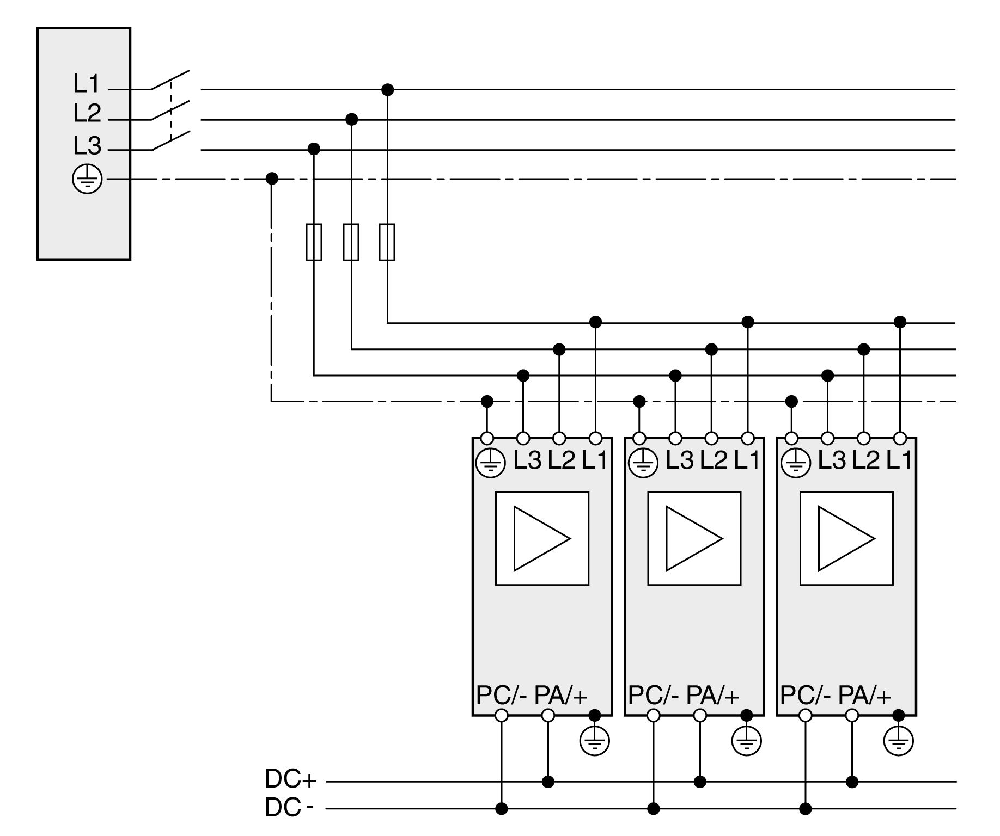
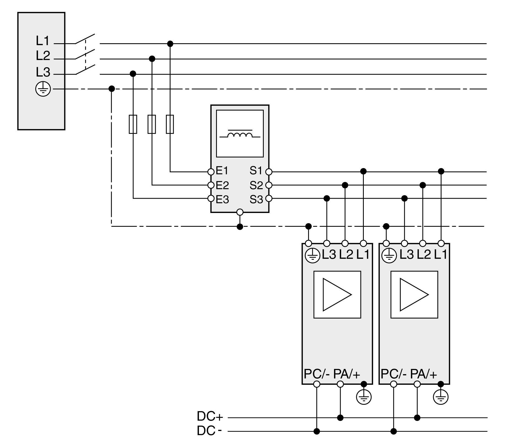
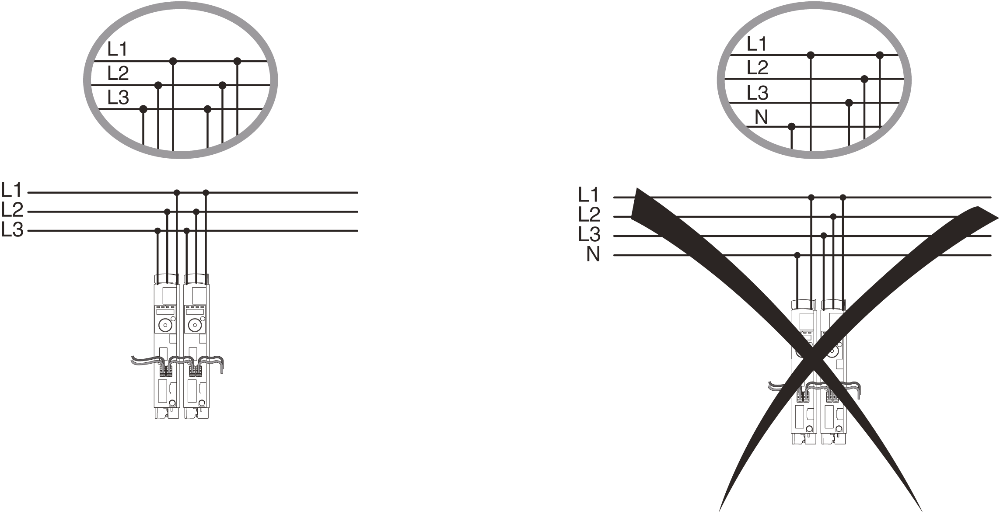

# Parallel Connection DC Bus

Parallel Connection DC Bus

General

In the case of improper use of the parallel connection of the DC bus, the drive systems can be damaged after a period of time or even immediately.

|  |
| --- |
| Warning_Color.gifWARNING |
| INOPERABLE SYSTEM PARTS AND LOSS OF PROCESS CONTROL |
| oObserve the requirements for using the parallel connection of the DC bus.  oDo not connect in parallel the Lexium 52 to the Lexium 62.  oDo not connect in parallel the Lexium 52 to the ATV32. |
| Failure to follow these instructions can result in death, serious injury, or equipment damage. |

Operating Principle

Thanks to the parallel connection of the DC bus of several devices, the energy efficiency can be improved for some applications. Excess energy that is fed back and is generated during deceleration of the motor is converted into thermal energy without a connection to the DC bus. Energy exchange can be performed by means of a connection of the DC bus to several servo amplifiers. The energy fed back can be used to drive additional motors. In anti-cyclical operation during which a motor is decelerated and another motor simultaneously requires energy, fed back energy can be used effectively.

Firmware Version

A common DC bus requires the devices to have at least the specified firmware version:

| Drive | Version |
| --- | --- |
| Lexium 52 | V01.54.x.x |

Cables for the DC Bus

A cable for the common DC bus must meet the following minimum requirements.

|  |  |
| --- | --- |
| Shield | Shielded at cable lengths of > 20 cm (7.87 in) |
| Twisted pair | Twisted pair at cable lengths of > 20 cm (7.87 in) |
| Cable | Two wires, shielded |
| Maximum cable length between two drives | 3 m (9.84 ft.) |
| Special characteristics | oInsulation must be rated for the DC bus voltage  oConductor cross section according to the calculated current, but at least 2\* 6 mm2 (2\* AWG 10) |

The connection of the fuses for the DC bus must be rated for the total maximum continuous current on the DC bus of all drives connected via the DC bus. Analyze the potentially most critical case in your application (for example EMERGENCY STOP) and select an appropriate conductor cross section.

DC Bus Connection

The DC bus is connected by using a plug and socket connection.

For information on the cable specifications, refer to [Cables for the DC Bus](#XREF_D_SE_0051307_5). Connector kits and pre-assembled cables are available from Schneider Electric.

Single Mains Fuse

A single fuse is sufficient if the total input current of all drives connected via the common DC bus is less than the maximum fuse rating shown in the following table:

| Single mains fuse | Maximum fuse rating |
| --- | --- |
| Lexium 52 | 32 A |

NOTE: A common mains switch must be used to switch on the power stage supplies simultaneously.

The graphic shows a single mains fuse for three-phase drives:

Mains Line Reactor (Choke)

A [mains line reactor (choke)](LXM52HW_LXM62HW_Engineering-16.htm#XREF_D_SE_0051304_1) is required if at least one of the following criteria is met:

oThe output power of the drive is to be increased.

oThe short-circuit current rating (SCCR) of the supplying mains is greater than specified for the drives.

oCurrent harmonics are to be reduced.

If one drive requires a mains line reactor, then all drives connected via the DC bus must be equipped with mains line reactors.

The mains line reactor for several drives with a common AC fuse must be rated in such a way that the nominal current of the mains line reactor is greater than the total of the input current of the drives.

The fuse rating of the fuse upstream of the mains line reactor must not be greater than the nominal current of the mains line reactor.

The following graphic shows the wiring of drives with common AC fuse and a mains line reactor (example shows three-phase drives):

Mains Filter

The emission depends on the length of the motor cables. If the required limit value is not reached with the internal mains filter, you must use an external mains filter.

Observe the [limit values](LXM52HW_LXM62HW_Engineering-15.htm#XREF_D_SE_0051303_2) for the mains filter.

The mains filter for several drives with a common AC fuse must be rated in such a way that the nominal current of the external mains filter is greater than the total of the input current of the drives.

The fuse rating of the fuse upstream of the external mains filter must not be greater than the nominal current of the external mains filter.

Mount the external mains filter in such a way that the lines from the mains filter to the drives are as short as possible. For EMC ([Electromagnetic Compatibility](LXM52HW_LXM62HW_Engineering-2.htm#XREF_D_SE_0051291_1)) reasons, route the cables from the mains filter to the drives separately from the line to the mains filter.

External three-phase mains filters do not have a neutral conductor connection; they are only approved for three-phase devices.

The following graphic shows the wiring of an external mains filter (example shows three-phase drives):

Mains Line Reactor and External Mains Filter

If a mains line reactor and an external mains line reactor are required, the mains line reactor and external mains filter must be arranged according to the following illustrations for EMC reasons.

The following graphic shows the wiring of drives with common mains fuse, mains line reactor, and mains filter (example shows three-phase drives):

Installation

|  |
| --- |
| NOTICE |
| DESTRUCTION DUE TO INCORRECT OPERATION |
| Verify that the power stage supplies of the drives connected via a common DC bus are switched on simultaneously. |
| Failure to follow these instructions can result in equipment damage. |

The following graphics show the specifications for drives with mains supply:

EIO0000003768.00

© 2018 Schneider Electric. All rights reserved.