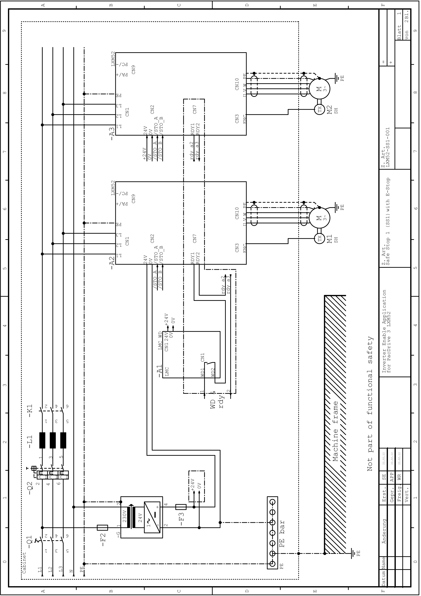

# Application Proposals

Application Proposals

Safe Stop Category 1 (SS1)

There is one application proposal to implement the safe stop of category 1 (SS1):

oLXM52-SS1-001: Inverter Enable circuit for PacDrive 3 Safe Stop 1 (SS1) with a protection circuit and 2-channel switch-off

Notes on Application Proposals - General

oAll application proposals provide for a protected /STO\_A or /STO\_B wiring (control cabinet IP54) from the safety switch device to the Lexium 52, as faults need to be ruled out.

oProtection against automatic restart is ensured by the external safety switch device.

oIf potential errors cannot be ruled out, a diagnostic can optionally be provided for the 2-channel variant. This must be realized internally and is not shown in the application proposal.

Notes on Application Proposals - Notes to LXM52-SS1-001

The mains contactor K1 in this circuit proposal is not necessary for functional safety purposes. It is, however, used in the application proposal for the device protection.

Application proposal for the control circuit (drawing number LXM52-SS1-001)

Application proposal for the load cycle (drawing number LXM52-SS1-001)

EIO0000003768.00

© 2018 Schneider Electric. All rights reserved.