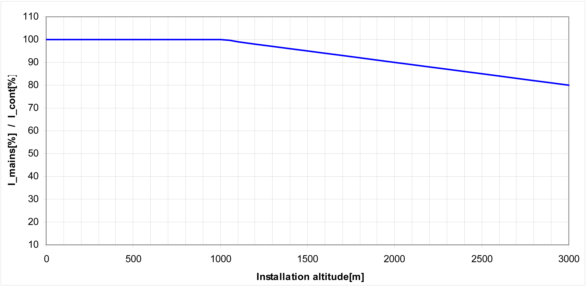

# Special Conditions

Special Conditions

Low Air Pressure

General

If the installation altitude exceeds the specified rated installation altitude, the performance of the entire system is reduced.

Power reduction at increased installation altitude:

NOTE: Multiply the values with the nominal current at 40 °C (104 °F) in order to calculate the maximum continous current value, depending on the required installation altitude.

NOTE: From a height of 1000 m, the maximum permissible ambient temperature is 45 °C (113 °F).

NOTE: From a height of 2000 m, the maximum permissible ambient temperature is 40 °C (104 °F) and the overvoltage category II must be observed.

EIO0000003768.00

© 2018 Schneider Electric. All rights reserved.