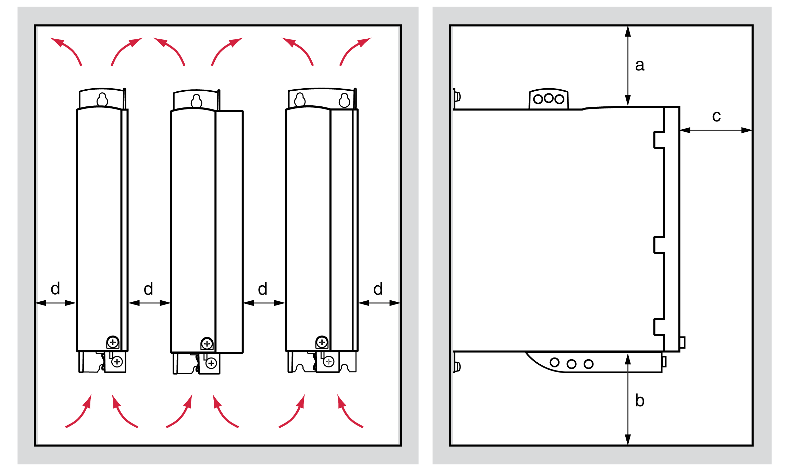
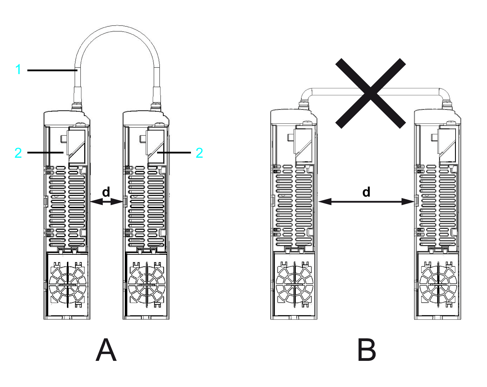

# Preparing the Control Cabinet

Preparing the Control Cabinet

Overview

|  |
| --- |
| Danger_Color.gifDANGER |
| INCORRECT OR UNAVAILABLE GROUNDING |
| Remove paint across a large surface at the installation points before installing the devices (bare metal connection). |
| Failure to follow these instructions will result in death or serious injury. |

| Step | Action |
| --- | --- |
| 1 | If necessary to maintain and respect the maximum ambient operating temperature, install additional fan in the control cabinet. |
| 2 | Do not block the fan air inlet of the product. |

Assembly Distances, Ventilation

Keep a distance of at least 100 mm (3.94 in) above and below the devices.

Assembly distances and air circulation.

| Distance | Air circulation |
| --- | --- |
| a ≥ 100 mm (3.94 in) | Clearance above the device. |
| b ≥ 100 mm (3.94 in) | Clearance below the device. |
| c ≥ 60 mm (2.36 in) | Clearance in front of the device. |
| d ≥ 0 mm (0 in)(1) | Clearance between the devices |
| (1) Select the distance d so that the Sercos cables are not under tension (see following figure). | |

|  |
| --- |
| NOTICE |
| UNSUCCESSFUL OR INTERMITTENT SERCOS COMMUNICATIONS |
| oSelect the space between two devices (distance d in the drawing above) so that the Sercos cables are not under tension.  oUse an identical value for the space above the device (distance a in the drawing above) for all drives that are mounted in the control cabinet in the same row.  oOnly use cables and accessory parts from Schneider Electric. |
| Failure to follow these instructions can result in equipment damage. |

Sercos cabling

1   Sercos cable

2   Lexium 52

A   Correct assembling: The distance d between the two Lexium 52 is selected such that the Sercos cables are not under tension.

B   Incorrect assembling: Excessive distance d between the two Lexium 52, whereby the Sercos cable is under tension.

Dimensions for the Mounting Hole

| Step | Action |
| --- | --- |
| 1 | Take the dimensions from the dimensional drawings in order to calculate the distances between several devices. |
| 2 | Observe tolerances as well as distances to the cable channels and adjacent control cabinet series. |

Dimensional drawing 1

Dimensional drawing 2

Dimensions

| Parameter | Value | | | |
| --- | --- | --- | --- | --- |
| Lexium 52... | U60 | D12  D18 | D30 | D72 |
| Figure | Dimensional drawing 1 | Dimensional drawing 1 | Dimensional drawing 2 | Dimensional drawing 2 |
| B | 48 ±1 mm (1.89 ±0.04 in) | | 68 ±1 mm (1.89 ±0.04 in) | 108 ±1 mm (1.89 ±0.04 in) |
| T | 225 mm (8.86 in) | | | |
| H | 270 mm (10.63 in) | | | 274 mm (10.79 in) |
| e | 24 mm (0.94 in) | | 13 mm (0.51 in) | |
| E | – | | 42 mm (1.65 in) | 82 mm (3.23 in) |
| F | 258 mm (10.16 in) | | | |
| f | 7.5 mm (0.30 in) | | | |
| a | 20 mm (0.79 in) | | | 24 mm (0.95 in) |
| h | 230 mm (9.06 in) | | | |
| c | 20 mm (0.79 in) | | | |
| X required clearance | 60 mm (2.36 in) | | | |
| Y required clearance | 100 mm (3.94 in) | | | |
| Z required clearance | 100 mm (3.94 in) | | | |
| Cooling type | Convection (1) | Fan 40 mm (1.57 in) | Fan 60 mm (2.36 in) | Fan 80 mm (3.15 in) |
| (1) >1 m/s | | | | |

The connection cables of the device have to lead upward and downward.

In order to ensure sufficient air circulation and a cable routing without kinks, the following distances must be kept:

oAt least 100 mm (3.94 in) of clearance are required above the device.

oAt least 100 mm (3.94 in) of clearance are required below the device.

oAt least 60 mm (2.36 in) of clearance are required in front of the device.

EIO0000003768.00

© 2018 Schneider Electric. All rights reserved.