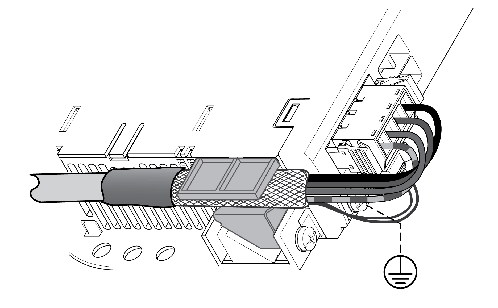

# Motor Cable and External Shield Connection

Motor Cable and External Shield Connection

Procedure

| Step | Action |
| --- | --- |
| 1 | Connect the motor phases and protective ground conductor to [CN10](../LMC100HW_Integrated_Communication_Ports/LMC100HW_Integrated_Communication_Ports-3.htm#XREF_D_SE_0051866_20). Verify that the connections U, V, W and PE (protective ground/earth) match at the motor and the device.  Note the [tightening torque specified for the terminal screws](../LMC100HW_Integrated_Communication_Ports/LMC100HW_Integrated_Communication_Ports-2.htm#XREF_D_SE_0051865_1). |
| 2 | Connect the conductors for holding brake and temperature to [CN11](../LMC100HW_Integrated_Communication_Ports/LMC100HW_Integrated_Communication_Ports-3.htm#XREF_D_SE_0051866_21). |
| 3 | Verify that the connector locks snap in properly at the housing. |
| 4 | Connect the cable shield to the shield clamp (large surface area contact). |

EIO0000003768.00

© 2018 Schneider Electric. All rights reserved.