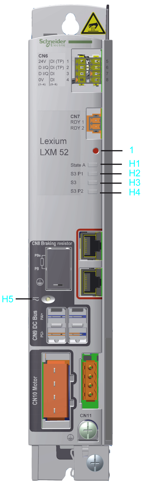

# Indicators and Control Elements

Indicators and Control Elements

Indicators and Control Elements

Overview

The display of the Lexium 52 consists of four LED indicators that are used to display status information.

1   Reset button

H1   State A LED indicator

H2   S3 P1 LED indicator for the status of port 1 of the Sercos III communication

H3   S3 LED indicator for the Sercos III communication

H4   S3 P2 LED indicator for the status of port 2 of the Sercos III communication

H5   DC Bus LED indicator

Reset Button

Press the reset button to reset and reboot the Lexium 52.

State A LED Indicator

| LED indicator color / status | Description | Instructions / information for the user |
| --- | --- | --- |
| Off | Device is not energized or is otherwise inoperable. | oVerify the power supply.  oReplace device. |
| Flashing green (4 Hz, 125 ms) | Initialization of the device (firmware boot process, compatibility verification of the hardware, updating the firmware) | oWaiting until initialization is complete. |
| Flashing slowly green (2 Hz, 250 ms) | Identification of the device | oIf necessary, identify the device via EcoStruxure Machine Expert as defined by the controller configuration. |
| Steady green | Device has been initialized and waits for the configuration. | oConfigure device as active.  oConfigure device as inactive.  oConfigure device for the execution of motions. |
| Steady red | A non-recoverable error has been detected requiring user intervention:  oWatchdog  oFirmware  oChecksum  oInternal error detected | oPower off / on (power reset)  oIf this condition persists, replace the device. |
| Flashing slowly red (2 Hz, 250 ms) | A general error has been detected. | oThe configuration shows the detected error  oReset error detected in the EcoStruxure Machine Expert Logic Builder menu Online > Reset diagnostic messages of controller.  oOtherwise restart device. |

Port LED Indicators

| LED indicator color / status | Description |
| --- | --- |
| Off | No cable connected |
| Steady orange | Cable connected, no Sercos communication |
| Steady green | Cable connected, active Sercos communication |

S3 LED Indicator

| LED indicator color / status | Description | Instructions / information for the user |
| --- | --- | --- |
| Off | The device is not energized or is otherwise inoperable, or there is no communication due to an interrupted or separated connection. | Sercos boot-up or hot swap |
| Steady green | Active Sercos connection without an error detected in the CP4. | – |
| Flashing green (4 Hz, 125 ms) | The device is in loopback mode.  Loopback describes the situation in which the Sercos telegrams have to be sent back on the same port on which they were received.  Possible causes:  oLine topology or  oSercos loop break | Workaround:  oClose ring.  Reset condition:  oAcknowledge the detected error in the EcoStruxure Machine Expert Logic Builder menu Online > Reset diagnostic messages of controller.  oSwitch from CP0 to CP1 alternatively.  NOTE: If during phase CP1 a line topology or ring break was detected (device in loopback mode), the LED indicator condition does not change. |
| Steady red | Sercos diagnostic class 1 (DC1) error has been detected on port 1 and/or port 2. | Reset condition:  oAcknowledge the detected error in the EcoStruxure Machine Expert Logic Builder menu Online > Reset diagnostic messages of controller. |
| Flashing red / green (4 Hz, 125 ms) | Communication error has been detected.  Possible causes:  oImproper functioning of the telegram  oCRC error detected | Reset condition:  oThe configuration shows which error has been detected.  oAcknowledge the detected error in the EcoStruxure Machine Expert Logic Builder menu Online > Reset diagnostic messages of controller. |
| Steady orange | The device is in a communications phase CP0 up to and including CP3 or HP0 up to and including HP2. Sercos telegrams are received. | – |
| Flashing orange (4 Hz, 125 ms) | Device identification | NOTE: The identified device is also displayed by the axis state LED indicator on the drive. |

DC Bus LED Indicator

| LED indicator color / status | Description | Information |
| --- | --- | --- |
| Off | DC bus supply inactive | – |
| Steady red | DC bus supply active | – |

The DC Bus LED is not an indicator for the absence of DC bus voltage.

EIO0000003768.00

© 2018 Schneider Electric. All rights reserved.