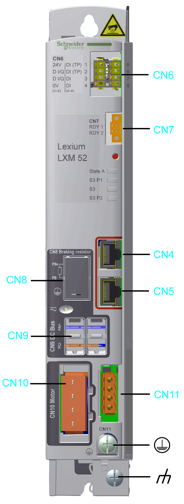

# Electrical Connections Overview

Electrical Connections Overview

Top Side

| Connection | Meaning | Connection cross-section [mm2] / [AWG] | Tightening torque [Nm] / [lbf in] |
| --- | --- | --- | --- |
| CN1 | Mains connection | 0.75...5.3 / 18...10(1) | 0.68 / 6.0 |
| 0.75...10 / 18...8(2) | 1.81 / 16.02 |
| CN2 | 24 V control supply and safety function STO | 0.5...2.5 / 20...14 | – |
| CN3 | Motor encoder | – | – |
| (1) These values apply to LXM52DU60C, LXM52DD12C, LXM52DD18C, LXM52DD30C.  (2) These values apply to LXM52DD72C. | | | |

Front Panel

| Connection | Meaning | Connection cross-section [mm2] / [AWG] | Tightening torque [Nm] / [lbf in] |
| --- | --- | --- | --- |
| CN4 | Sercos, port 1 | – | – |
| CN5 | Sercos, port 2 | – | – |
| CN6 | Digital inputs/outputs | 0.25...1.5 / 24...16 | – |
| CN7 | Ready | 0.2...1.5 / 24...16 | – |
| CN8 | External braking resistor | 0.75...3.3 / 18...12 | 0.51 / 4.5 |
| CN9 | DC bus connection for parallel operation | Use the prefabricated cables VW3M7101R01. | – |
| CN10 | Motor phases | 0.75...5.3 / 18...10(1) | 0.68 / 6.0 |
| 0.75...10 / 18...8(2) | 0.68 / 6.0 |
| CN11 | Holding brake / motor temperature | 0.75...2.5 / 18...14 | – |
| G-SE-0004529.1.gif-high.gif | Protective conductor(3) | min. 10 / 6 | 3.5 / 31.0 |
| G-SE-0042088.1.gif-high.gif | Shield connection motor cable | Locking screw for the shield terminal(4) | – |
| (1) These values apply for the LXM52DU60C, LXM52DD12C, LXM52DD18C, LXM52DD30C.  (2) These values apply for the LXM52DD72C.  (3) Connect the ground connection of the device to the ground neutral point of the system.  (4) Attach the cable shield across a large surface in the shield terminal. | | | |

EIO0000003768.00

© 2018 Schneider Electric. All rights reserved.