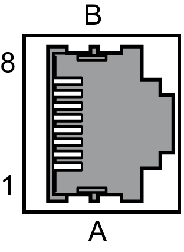
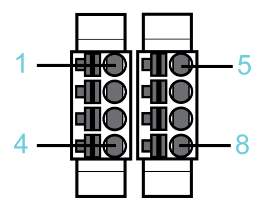
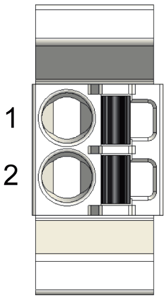
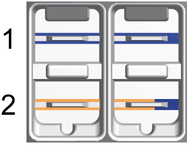

# Connection Details

Connection Details

CN1 - Mains Connection (Power Stage Supply)

The Lexium 52 is supplied with voltage via the power connection. The rated voltage is 208...480 V.

Electrical connection - mains connection (power stage supply)

| Pin | Designation | Meaning |
| --- | --- | --- |
| 1 | G-SE-0004529.2.gif-high.gif | Protective ground conductor |
| 2 | L1 | External conductor L1 |
| 3 | L2 | External conductor L2 |
| 4 | L3 | External conductor L3 |

CN2 - Connection for 24 V Control Supply and Safety Function STO

The 24 V input supplies the internal logic assemblies as well as the holding brakes of the complete axis group, connected to the axis modules.

CN2 Connection for 24 V control supply and safety function STO

| Pin | Designation | Meaning |
| --- | --- | --- |
| 1 | STO\_A | InverterEnable signal A |
| 2 | STO\_B | InverterEnable signal B |
| 3 | 24 V | Supply voltage Lexium 52 - Input |
| 4 | 0V | Supply voltage Lexium 52 - Input |
| 5 | STO\_A | Inverter enable signal A, jumpered with pin 1 |
| 6 | STO\_B | Inverter enable signal B, jumpered with pin 2 |
| 7 | 24 V | Supply voltage for optional external holding brake - output, jumpered with pin 3. |
| 8 | 0V | Supply voltage for optional external holding brake - output, jumpered with pin 4. |

NOTE: The maximum terminal current is 16 A. Note the maximum permissible terminal current when connecting several Lexium 52.

CN3 - Motor Encoder

At the motor encoder connection, the measuring system, which records the axis position, is connected.

CN3 - motor encoder

| Pin | Designation | Meaning |
| --- | --- | --- |
| 1 | Cos | Cosine track axis A/B |
| 2 | RefCos | Reference signal cosine axis A/B |
| 3 | Sin | Sine track axis A/B |
| 4 | RS485+ | Positive RS-485 signal axis A/B |
| 5 | RS485- | Negative RS-485 signal axis A/B |
| 6 | RefSin | Reference signal sine axis A/B |
| 7 | N.C. | Reserved |
| 8 | N.C. | Reserved |
| A | P10V | Supply voltage encoder A/B |
| B | GND | Mass A/B |

NOTE: By usage of the 5 V encoder adapter it is also possible to connect encoder with 5 V supply voltage to the drive.

CN4/CN5 - Sercos

The Sercos connection is used for communication between the controller and the drive.

Electrical connection - Sercos

| Pin | Designation | Meaning |
| --- | --- | --- |
| 1.1 | Eth0\_Tx+ | Positive transmission signal |
| 1.2 | Eth0\_Tx- | Negative transmission signal |
| 1.3 | Eth0\_Rx+ | Positive receiver signal |
| 1.4 | N.C. | Reserved |
| 1.5 | N.C. | Reserved |
| 1.6 | Eth0\_Rx- | Negative receiver signal |
| 1.7 | N.C. | Reserved |
| 1.8 | N.C. | Reserved |
| 2.1 | Eth1\_Tx+ | Positive transmission signal |
| 2.2 | Eth1\_Tx- | Negative transmission signal |
| 2.3 | Eth1\_Rx+ | Positive receiver signal |
| 2.4 | N.C. | Reserved |
| 2.5 | N.C. | Reserved |
| 2.6 | Eth1\_Rx- | Negative receiver signal |
| 2.7 | N.C. | Reserved |
| 2.8 | N.C. | Reserved |

CN6 - Digital Inputs / Outputs

CN6 - digital inputs / outputs

| Pin | Designation | Meaning |
| --- | --- | --- |
| 1 | 24 V | 24 V |
| 2 | D I/Q | Digital input 4 / digital output 0 |
| 3 | D I/Q | Digital input 5 / output 1 |
| 4 | 0 V | 0 V |
| 5 | DI (TP) | Digital input 0 / TP 0 |
| 6 | DI (TP) | Digital input 1 / TP 1 |
| 7 | DI | Digital input 2 |
| 8 | DI | Digital input 3 |

CN7 - Ready Relay Output

When the drive is ready for operation, the Ready contact is activated.

Electrical connection - Ready relay output

| Pin | Designation | Meaning | Note |
| --- | --- | --- | --- |
| 1 | RDY1 | Ready contact | Potential-free contact |
| 2 | RDY2 | Ready contact | Potential-free contact |

CN8 - Connection External Braking Resistor

If the internal braking resistor is not sufficient, you can connect an external braking resistor to this connection.

Electrical connection - external braking resistor

| Pin | Designation | Meaning |
| --- | --- | --- |
| 1 | PBe | Connection for external resistor |
| 2 | PB | Connection for external resistor |
| 3 | G-SE-0004529.2.gif-high.gif | Protective ground conductor |

For further information, refer to:

oThe [technical data specified for external braking resistors](../LMC100HW_Technical_Data/LMC100HW_Technical_Data-4.htm#XREF_D_SE_0051520_2).

oThe configuration of parameters within the parameter group ExternalBrakingResistor in EcoStruxure Machine Expert. (See the EcoStruxure Machine Expert Online Help, section Drive Systems and Motors --> Lexium 52 stand-alone drive system and motors --> Lexium 52 device objects and parameters -->Lexium LXM52 Drive --> External Braking Resistor.)

oFor further information about the available external braking resistors see catalogue "PacDrive 3 automation solution Lexium 52 stand-alone servo drive" at Schneider Electric website.

CN9 - Connection for DC Bus Connection

DC buses can be connected via this connection.

Electrical connection - DC bus connection

| Pin | Designation | Meaning |
| --- | --- | --- |
| 1 | PA/+ | Positive connection for DC bus |
| 2 | PC/- | Negative connection for DC bus |

CN10 - Connection for the Motor Phases

The motor signals U, V, and W supply the motor with the required energy.

Electrical connection - holding brake motor, temperature motor

| Motor cable(1) | | Motor connectors | Meaning |
| --- | --- | --- | --- |
| Label of cable core | Color of cable core | Label |
| 1 | Black | U | Motor phase U |
| 2 | Black | V | Motor phase V |
| 3 | Black | W | Motor phase W |
| – | Green/Yellow | G-SE-0004529.2.gif-high.gif | Protective conductor protective earth ground |
| (1) Order numbers: VW3E1143Rxxx, VW3E1144Rxxx, VW3E1145Rxxx | | | |

The insulation-stripped length of the wires of the motor connector is 15 mm (0.59 in.). The maximum length of the motor supply cable is 75 m (246.06 ft).

CN11 - Holding Brake Motor, Temperature Motor

The temperature signals are connected to a temperature sensor to measure the temperature of the motor. The holding brake output supplies the holding brake in the motor with the required energy.

The device monitors the motor phases for:

oShort circuit between the motor phases.

oShort circuit between the motor phases and ground.

Short circuits between the motor phases and the DC bus, the braking resistor, or the holding brake wires are not detected.

Electrical connection - motor phases

| Motor cable(1) | | Motor connectors | Meaning |
| --- | --- | --- | --- |
| Label of cable core | Color of cable core | Label |
| 5 | Black | 1  ϑ− | Temperature negative signal |
| 6 | Black | ϑ+ | Temperature positive signal |
| 7 | Black | BR- | Holding brake negative connection (2) |
| 8 | Black | BR+ | Holding brake positive connection (2) |
| (1) Order numbers: VW3E1143Rxxx, VW3E1144Rxxx, VW3E1145Rxxx  (2) The maximum terminal current is 1.7 A. | | | |

The insulation-stripped length of the wires of the motor connector is 15 mm (0.59 in.). The maximum length of the motor supply cable is 75 m (246.06 ft).

EIO0000003768.00

© 2018 Schneider Electric. All rights reserved.