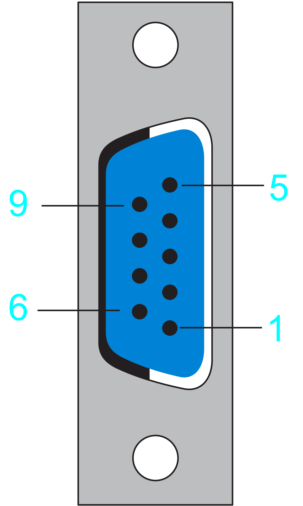
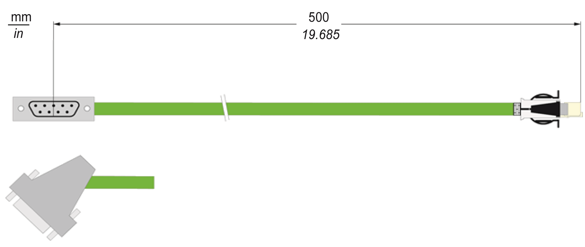

# Electrical Connections and Dimensions

Electrical Connections and Dimensions

RJ45 Connector - 5V Encoder Adapter Input

The RJ45 connector is connected to the connection CN3 of the drive. Pin assignment of the RJ45 connector is identical to the pin assignment for the connection CN3 of the drive.

D-Sub 9-Pin Female Connector - 5V Encoder Adapter Output

The D-Sub 9-pin female connector is connected to the D-Sub 9-pin male connector of the encoder cable (user furnished).

Electrical connection D-Sub 9-pin female connector

| Pin | Designation | Description | Range |
| --- | --- | --- | --- |
| 1 | SIN | Positive sine signal | 1 Vpp ±0.1 V |
| 2 | Ref\_Sin | Negative sine signal | Offset 2.5 ±0.3 V |
| 3 | COS | Positive cosine signal | 1 Vpp ±0.1 V |
| 4 | Ref\_Cos | Negative cosine signal | Offset 2.5 ±0.3 V |
| 5 | RS485+ | Positive RS-485 signal | – |
| 6 | P5V | 5 V encoder supply voltage | 5 V ±1% / Iout\_max=250 mA |
| 7 | P10V | 10 V encoder supply voltage | 10 V ±5% / Iout\_max=125 mA |
| 8 | RS485- | Negative RS-485 signal | – |
| 9 | GND | Encoder return | 0 V |

D-Sub 9-Pin Male Connector - Encoder Cable Pre-Assembled by the Customer

View mating side

View soldering side

Electrical connection D-Sub 9-pin male connector

| Pin | Designation | Description | Range |
| --- | --- | --- | --- |
| 1 | SIN | Positive sine signal | 1 Vpp ±0.1 V |
| 2 | Ref\_Sin | Negative sine signal | Offset 2.5 ±0.3 V |
| 3 | COS | Positive cosine signal | 1 Vpp ±0.1 V |
| 4 | Ref\_Cos | Negative cosine signal | Offset 2.5 ±0.3 V |
| 5 | N.C. | Reserved | – |
| 6 | P5V | 5 V encoder supply voltage | 5 V ±1% / Iout\_max=250 mA |
| 7 | P10V | 10 V encoder supply voltage | 10 V ±5% / Iout\_max=125 mA |
| 8 | N.C. | Reserved | – |
| 9 | GND | Encoder return | 0 V |

Dimensions

Dimensions 5V Encoder Adapter:

EIO0000003768.00

© 2018 Schneider Electric. All rights reserved.