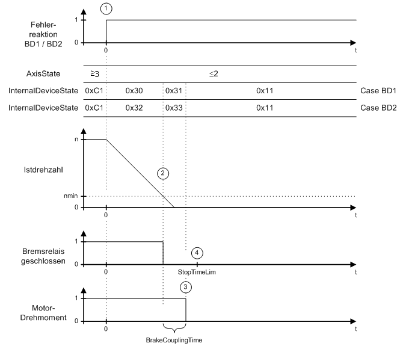

# Ramping down Within the Maximum Ramp-down Time

## General

In the case of an error with reaction BD1 (1), the axis ramps down at maximum current (*[MaxDrivePeakCurrent](../../../../../api/crossBook?lang=en-US&virtualBookName=PD.Parameter.LXM62Drive&topicID=D_SE_0071528)*). In the case of an error with reaction BD2 (1), the axis ramps down according to the parameters *[ControllerStopDec](../../../../../api/crossBook?lang=en-US&virtualBookName=PD.Parameter.LXM62Drive&topicID=D_SE_0071532)* and *[ControllerStopJerk](../../../../../api/crossBook?lang=en-US&virtualBookName=PD.Parameter.LXM62Drive&topicID=D_SE_0071533)*. As soon as the actual speed becomes lower than the speed threshold (actual speed < nmin) (2), the brake relay is released. The axis comes to a standstill before expiry of the maximum ramp-down time (parameter StopTimeLim) (4). After expiry of the brake coupling time (parameter BrakeCouplingTime) (3), the motor is switched to a torque-free state.

Time diagram for reaction BD1 / BD2 (ramping down within the max. ramp down time)

EIO0000003553.01

© 2021

Schneider Electric.

All rights reserved.