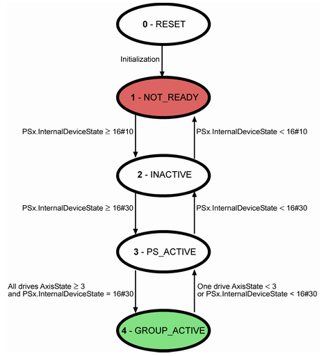

# GroupState

## General

|  |  |
| --- | --- |
| Type | AD |
| Devices supporting the parameter | Lexium LXM62 Power Supply |
| Traceable | Yes |

## Functional Description

Displays the operating state of the power supply and the connected drives (also refer to InternalDeviceState).

GroupState and GroupReady parameters

**y-States:**

0 - RESET

1 - NOT\_READY

2 - INACTIVE

3 - PS\_ACTIVE

4 - GROUP\_ACTIVE

| Value | Data type | Meaning |
| --- | --- | --- |
| Initialization / 0 | DINT | – |
| not ready / 1 | DINT | * Waiting for Sercos phase 4 ([16#01](D-SE-0071488.html#D-SE-0071488)) * Waiting for PSx ready = TRUE (see also Ready) * Waiting for the drives ready = TRUE (see also Ready) * Waiting for HW Enable on = TRUE * Waiting for *[Inverter Enable](../../../../../api/crossBook?lang=en-US&virtualBookName=PD.Parameter.LXM62Drive&topicID=D_SE_0071480)* (only LXM 62 PSD) on = TRUE * Waiting for DC bus voltage ([16#04](D-SE-0071488.html#D-SE-0071488)) * Waiting for mains phases active (see also PhaseCheckMode) |
| inactive / 2 | DINT | * Waiting for PowerSupplyCheck ([16#30](D-SE-0071488.html#D-SE-0071488))   NOTE: Only possible if (PSx = real) or (PSx = virtual and the drives = virtual) |
| active / 3 | DINT | * Waiting for the drives ControllerEnable (AxisState ≥ 3) |
| Group active / 4 | DINT | Power supply and the drives are active. |

EIO0000003553.01

© 2021

Schneider Electric.

All rights reserved.