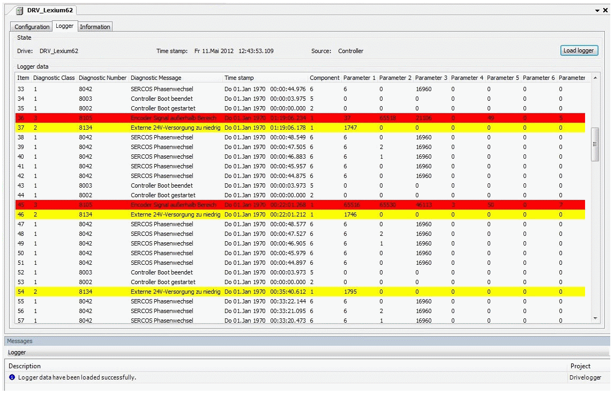

# General

## Procedure

| Step | Action |
| --- | --- |
| 1 | Double-click the desired drive in the Device view to open the register card Logger. |
| 2 | Select the register card Logger. |

## Logger (Example)

Different information on the log entries is displayed in the Logger table.

|  |  |
| --- | --- |
| Designation | Description |
| Status information in the bar above the table. | Information on the selected Drive (for example the DRV\_Lexium62), the Time stamp, and the Source (controller). |
| [Load logger] | Button to load the Logger. |
| Item | Item number of the log entry. |
| Diagnostic Class | Diagnostic class of the log entry.   * 1 = No error (transparent) * 2 = Warning (yellow) * 3 = Error (red) |
| Diagnostic Number | Diagnostic number of the log entry.  If a log entry is selected, then the appropriate online help is displayed based on the diagnostic number via [F1] (or via the corresponding entry in the context menu). |
| Diagnostic Message | Short error description. |
| Time stamp | Time stamp of the log entry. |
| Component | Name of the drive. |
| Parameter 1 to Parameter 7 | System internal information for the problem analysis by the customer service. |

## Time Stamp

The current date and time is not saved in the drives.

This information only exists in the controller and is sent to the drives in the Sercos phase 3.

If an entry takes place in the Logger of the drive before this time, then the date and time cannot be saved for this message.

In this case, the elapsed time since switching on the device is displayed in the column Time stamp (for example, 00:00:10.450 means 10 seconds and 450 milliseconds since switching on the device). The initial date is January 1, 1970.

## Parameter 1 to 7

The columns Parameter 1 to Parameter 7 contain system internal information.

The customer service can use this information for the problem analysis.

The meaning of the information depends on the respective message.

EIO0000003553.01

© 2021

Schneider Electric.

All rights reserved.