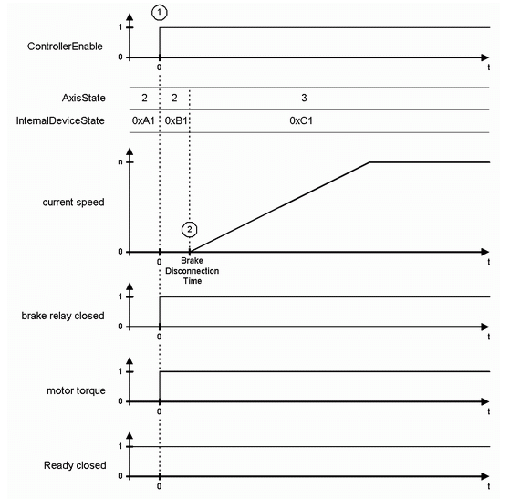

# Switching On the Enabling

## General

If no diagnostic message is present, the DC bus is loaded and the object parameter PowerSupplyCheckSet of the corresponding PowerSupply is true, then AxisState is 2 and InternalDeviceState is 0xA1. In this case the drive is ready to get ControllerEnable set. When switching on ControllerEnableSet (1), the brake is released and the motor torque is turned on. After the BrakeDisconnectionTime has lapsed (default value: 100 ms) (2), the AxisState switches to 3 and the travel orders can be sent to the drive.

Time diagram for switching on the enabling

EIO0000003549.02

© 2021

Schneider Electric.

All rights reserved.