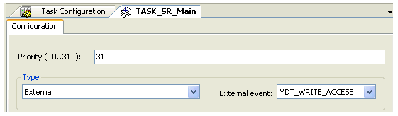

# TrackingDeviation

## General

|  |  |
| --- | --- |
| Type | AF |
| Devices supporting the parameter | Lexium LXM52 Drive, Lexium LXM52 Linear Drive,  Lexium LXM62 Drive, Lexium LXM62 Linear Drive,  Lexium ILM62 Drive Module,  Sercos Drive |
| Traceable | Yes |

## Functional Description

TrackingDeviation indicates the dead time compensated deviation (tracking deviation) between MechRefPosition and MechPosition in units. It is taken at the drive shaft (gear box output side) (see [Ref-Actual Values](../../../../../api/crossBook?lang=en-US&virtualBookName=D-SE-0071489.html#D-SE-0071489)). Coordinate displacement with SetPos (*[FC\_SetposDual()](../../PD.Lib.SystemInterface&topicID=D_SE_0085315)*, *[FC\_SetposGroup()](../../../../../api/crossBook?lang=en-US&virtualBookName=PD.Lib.SystemInterface&topicID=D_SE_0085317)*, *[FC\_SetposSingle()](../../../../../api/crossBook?lang=en-US&virtualBookName=PD.Lib.SystemInterface&topicID=D_SE_0085319)*) does not affect this parameter. The parameter Direction must be taken into account when interpreting TrackingDeviation.

The value of TrackingDeviation is calculated one time per Sercos cycle (*[CycleTime](../../../../../api/crossBook?lang=en-US&virtualBookName=PD.Parameter.LMCEco&topicID=D_SE_0073362)*)

Relative to the drive shaft, the TrackingDeviation is delayed by the time ShaftDelay. Thus, a tracking deviation is represented which is delayed to the drive shaft by the time ShaftDelay. Usually, the tracking deviation calculated in accelerating phases is too high. An acceleration-proportional error is calculated in the tracking deviation during the dead time compensation.

NOTE: The parameter is only available without any constraints for the **cyclic** type tasks.

## Restrictions

On tasks of the External type, the consistency of the RefPosition and the position by the calculation of the TrackingDeviation cannot be provided in every case. An additional, unidentifiable dead time of a Sercos cycle can occur. This leads to a detected velocity-dependent error. When using an External event-driven task, use the External event MDT\_WRITE\_ACCESS to help have a consistent access and to help provide an accurate TrackingDeviation value.

NOTE: The parameter value is calculated using the parameters that are transferred from the slave to the master via the real-time channel of the Sercos. If the Sercos bus is not in phase 4, then a default value is indicated here. If the Sercos bus is in phase 4 (operating phase), then the parameter value is calculated and indicated. This parameter has no meaning for asynchronous motors without encoder (in open-loop V / f control mode, ControlMode = open-loop control / 1).

Usage with machine encoder: When a machine encoder is used, this parameter can be calculated either with the position of the motor encoder or with the position of the machine encoder. This depends on the object parameter EncoderMode. If the machine encoder is used for position control, the position of the machine encoder is used for the calculation; otherwise, the position of the motor encoder is used for the calculation.

EIO0000003549.02

© 2021

Schneider Electric.

All rights reserved.