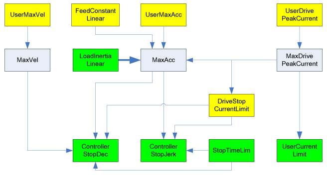

# DriveStopCurrentLimit

## General

The DriveStopCurrentLimit parameter is used for the limitation of the peak current during a [device reaction](../../../../../api/crossBook?lang=en-US&virtualBookName=PD.Diagnostic&topicID=D_SE_0063389) BD1 or BD2 in the drive. If for this parameter, a value between 10% and 100% of MaxDrivePeakCurrent is entered, then this value is used as peak current during the drive reaction best possible stop (BD1) or user-defined stop (BD2).

The value zero disables this function. Then the drive is stopped with MaxDrivePeakCurrent. No additional limit is active during BD1 and BD2.

The parameter is written to the drive during phase up of the Sercos bus (Phase 0 -> 4).

The magnetizing current (asynchronous motors) is not limited (more information see Current parameter).

NOTE: A modified parameter value is only transferred with a new Sercos phase up (phase 0 -> 4).

This parameter modifies the limits of the parameters ControllerStopDec and ControllerStopJerk. The corresponding stop profile is modified especially when the parameters ControllerStopDec or ControllerStopJerk are set to zero. This is because of the limited current during the stop profile that leads to a reduced acceleration.

The following graphic indicates the dependency with other object parameters for rotary drives:

The following graphic indicates the dependency with other object parameters for linear drives:

**Example:**

Entering J\_Load has a direct impact on the parameter MaxAcc. A revision of MaxAcc only has an impact on ControllerStopDec if,

* a Sercos phase up takes place or
* the parameter ControllerStopDec is modified.

EIO0000003549.02

© 2021

Schneider Electric.

All rights reserved.