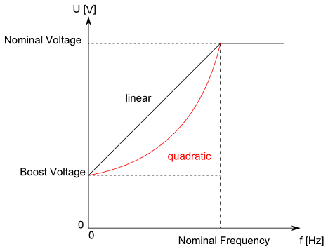

# VF\_Characteristic

## General

|  |  |
| --- | --- |
| Type | ES |
| Offline editable | Yes |
| Devices supporting the parameter | Lexium LXM52 Drive,  Lexium LXM62 Drive |
| Traceable | Yes |

## Functional Description

With the parameter VF\_Characteristic, the characteristic curve can be selected for the controlled operation of asynchronous motors (ControlMode = open-loop control / 1).

| Value | Data type | Meaning |
| --- | --- | --- |
| linear / 0 | DINT | Linear characteristic curve:  The torque is constant in the entire speed range. |
| quadratic / 1 | DINT | Quadratic characteristic curve:  With a quadratic characteristic curve, the torque is reduced in the lower speed range. This is useful in the case of applications, in which a higher moment is required with an increasing speed of rotation (for example, pumps and fans). The drive works more energy-efficiently in the lower range of speeds. |

The figure indicates the two different characteristic curves. The frequency is represented on the X axis and the output voltage of the servo amplifier on the Y axis. The frequency is determined by the desired rotation speed of the drive. The voltage cannot be increased beyond the nominal frequency. The drive then bypasses the field weakening operation. The characteristic curve does not begin at 0 V, but with a voltage offset (see BoostVoltage). This parameter is only used in open-loop controlled operation.

NOTE: The parameter value is transferred from the master to the slave via the parameter channel of the Sercos at every access. Typically, this takes about 10 ms. However, times up to 1 s may be realized if large amounts of data are transferred on the parameter channel.

EIO0000003549.02

© 2021

Schneider Electric.

All rights reserved.