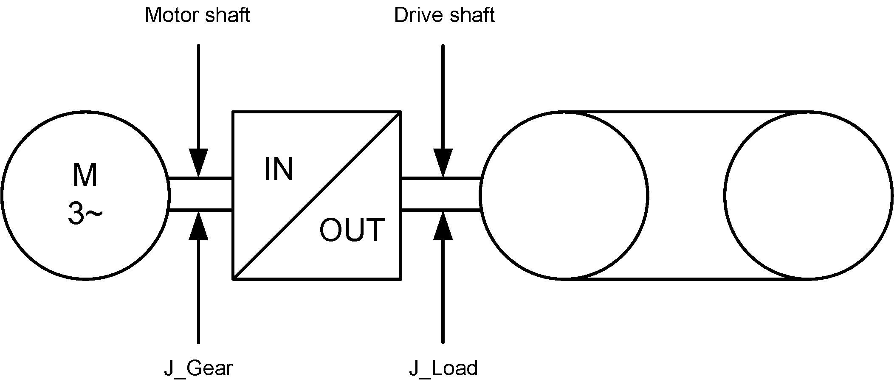

# GearOut

## General

|  |  |
| --- | --- |
| Type | EF |
| Offline editable | Yes |
| Devices supporting the parameter | Lexium LXM52 Drive,  Lexium LXM62 Drive,  Lexium ILM62 Drive Module,  LXM62 Safety Module, ILM62 Safety Module |
| Traceable | Yes |

## Functional Description

GearIn and GearOut are used to enter a gear factor between motor and load. GearOut indicates the number of teeth at the gear output (OUT) on the machine side.

Parameters GearIn and GearOut of the drive:

i = load gear (RevsMotorshaft/RevsDriveshaft) = GearOut/GearIn

See also calculation of adjustable values for the J\_Load parameter.

**Example:** i = 10 -> GearIn = 1, GearOut = 10

NOTE: Modifications to the parameter are only applied during the Sercos phase up (communication phase 0 => communication phase 4).

The following graphic indicates the dependency with other object parameters for rotary drives:

**Example:**

Entering J\_Load has a direct impact on the parameter MaxAcc. A revision of MaxAcc only has an impact on ControllerStopDec if,

* a Sercos phase up takes place or
* the parameter ControllerStopDec is modified.

EIO0000003549.02

© 2021

Schneider Electric.

All rights reserved.