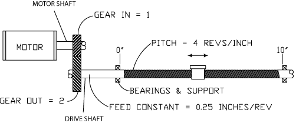

# FeedConstant

## General

|  |  |
| --- | --- |
| Type | EF |
| Offline editable | Yes |
| Devices supporting the parameter | Lexium LXM52 Drive,  Lexium LXM62 Drive,  Lexium ILM62 Drive Module,  Sercos Drive,  Virt. Master Encoder,  SinCos Encoder Input  Incremental Encoder Input  Log. encoder,  Encoder network (Synchronization encoder output, Synchronization encoder input)  C2C Encoder Input, C2C Encoder Output,  LXM62 Safety Module,  ILM62 Safety Module |
| Traceable | Yes |

## Functional Description

The parameter is used to enter the feed constant. The feed constant defines in which units the position information is calculated. As units, for example, millimeters, degrees, and inches can be defined. The defined unit is also used for velocity (Velocity in unit/s) and acceleration (Acceleration in units/s2).

The feed constant is the path (in units) which was covered by one rotation of the drive shaft.

NOTE: Modifications to the parameter are only applied during the Sercos phase up (communication phase 0 => communication phase 4).

Parameters GearIn and GearOut of the drive

## Examples

* If a toothed belt covers, for example, 120 mm per drive shaft revolution, then 120 is entered in the FeedConstant. One unit thus is one mm.
* If a disc covers, for example, 360 degrees per drive shaft revolution, then 360 is entered in the FeedConstant. One unit is one degree.

The following example for an installation indicates how the parameters FeedConstant, GearIn, and GearOut are to be defined.

Example installation for the parameters FeedConstant, GearIn, GearOut

The ball screw spindle has a thread pitch of 0.25 inch per drive shaft revolution. The FeedConstant is therefore 0.25 and defines the units as inches.

The units for velocity and acceleration are thus inches/s and inches/s2.

The units for position, velocity, and acceleration are defined by the following parameters:

* FeedConstant = 0.25
* GearIn = 1
* GearOut = 2

## Dependency With Other Parameters

The following graphic indicates the dependency with other object parameters for rotary drives:

**Example:**

Entering J\_Load has a direct impact on the parameter MaxAcc. A revision of MaxAcc only has an impact on ControllerStopDec if,

* a Sercos phase up takes place or
* the parameter ControllerStopDec is modified.

EIO0000003549.02

© 2021

Schneider Electric.

All rights reserved.