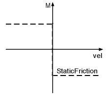

# StaticFriction

## General

|  |  |
| --- | --- |
| Type | ES |
| Offline editable | Yes |
| Devices supporting the parameter | Lexium LXM52 Drive,  Lexium LXM62 Drive,  Lexium ILM62 Drive Module |
| Traceable | Yes |

## Functional Description

The parameter is used to enter the static rotation direction-dependent friction on the drive shaft (gear box output side) in Newton meter [Nm]. The static friction is a constant moment that works in the opposite direction of the motor velocity. At standstill, this moment is zero. The state of StaticFriction depends on the reference velocity.

NOTE: The parameter is supported from V1.33.xx.00.

Effect of StaticFriction

NOTE: The parameter value is transferred from the master to the slave via the parameter channel of the Sercos at every access. Typically, this takes about 10 ms. However, times up to 1 s may be realized if large amounts of data are transferred on the parameter channel.

NOTE: This parameter can be determined as of firmware version V01.35.x.0 by using the AutoTune automatic controller optimization.

This parameter has no effect for asynchronous motors in open-loop V / f mode (ControlMode = open-loop control / 1).

EIO0000003549.02

© 2021

Schneider Electric.

All rights reserved.