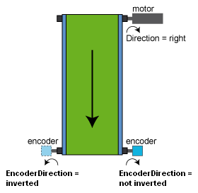

# EncoderDirection

## General

|  |  |
| --- | --- |
| Type | EF |
| Devices supporting the parameter | Machine Encoder Input |
| Traceable | Yes |

## Functional Description

This parameter is used to select the rotating direction of the encoder in comparison with the rotating direction of the motor.

EncoderDirection parameter using the example of the conveyor belt for rotary drives

| Value | Meaning |
| --- | --- |
| 0 / inverted | The machine encoder shaft moves in the opposite direction of the motor shaft (if the motor shaft moves clockwise, the encoder shaft moves counterclockwise). |
| 1 / not inverted | The machine encoder shaft moves in the same direction as the motor shaft (if the motor shaft moves clockwise, then the encoder shaft also moves clockwise). |

The rotation direction is taken into account when calculating the parameters EncoderPosition, Position, MechPosition, and ShaftMechPosition. The EncoderPosition is also between 0 and the converted EncoderRange of the load side, by inverted / 0. The Position is positive.

NOTE: Modifications to the parameter are only applied during the Sercos phase up (communication phase 0 => communication phase 4).

EIO0000003549.02

© 2021

Schneider Electric.

All rights reserved.