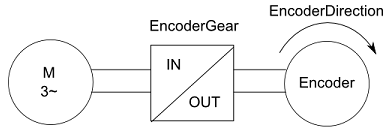

# EncoderGearOut

## General

|  |  |
| --- | --- |
| Type | EF |
| Devices supporting the parameter | Machine Encoder Input |
| Traceable | Yes |

| WARNING | |
| --- | --- |
|  | UNINTENDED MOTOR MOVEMENT: INVALID PARAMETERIZATION, OR INCORRECTLY CALCULATED COMMUTATION OF THE MOTOR  * Do not use this function unless you are technically qualified and properly trained personnel, capable of accessing the consequences of its use. * Ensure that no one is in the area of operation during the startup. * Ensure that the parameters EncoderGearOut and EncoderGearIn correspond to the mechanical transmission between the motor and the encoder.  Failure to follow these instructions can result in death, serious injury, or equipment damage. |

## Functional Description

The EncoderGearIn / EncoderGearOut parameters describe a gear factor between motor and encoder. This gear factor can be different from the gear factor between motor and load (parameter GearIn / GearOut).

The parameter EncoderGearOut indicates the number of teeth on the machine encoder side.

NOTE: Modifications to the parameter are only applied during the Sercos phase up (communication phase 0 => communication phase 4).

EIO0000003549.02

© 2021

Schneider Electric.

All rights reserved.