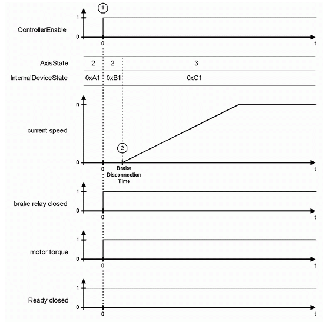

# General

General

If no diagnostic message is present, the DC bus is loaded and the object parameter PowerSup­plyCheckSet of the corresponding PowerSupply is true, then AxisState is 2 and [InternalDeviceState](../State_2/State_2-16.htm#XREF_D_SE_0071488_1) is 0xA1. In this case the drive is ready to get [ControllerEnable](../State_2/State_2-9.htm#XREF_D_SE_0071477_1) set. When switching on ControllerEnableSet (1), the brake is released and the motor torque is turned on. After the [BrakeDisconnectionTime](../Motor_2/Motor_2-15.htm#XREF_D_SE_0071792_1) has lapsed (default value: 100 ms) (2), the AxisState switches to 3 and the travel orders can be sent to the drive.

Time diagram for switching on the enabling

