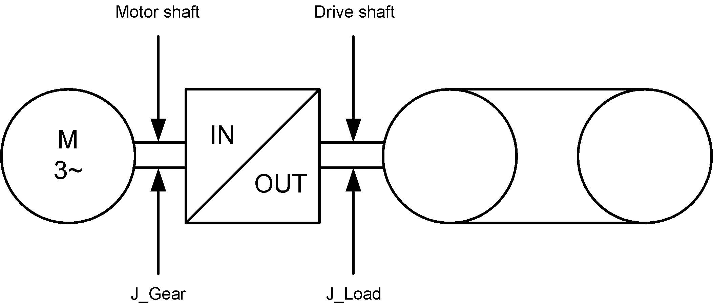

# Functional Description

Functional Description

Velocity represents the velocity, which is derived from the actual position [MechPosition](RefActualValues-8.htm#XREF_D_SE_0071499_1), in units per second. It is taken from the drive shaft (gear box output side). The [YOffsetVelocity](../YOffsetGenerator_2/YOffsetGenerator_2-6.htm#XREF_D_SE_0071852_1) from the Y offset generator is taken into account (see [Ref-Actual Values](RefActualValues-1.htm#XREF_D_SE_0071489_1)).

Coordinate displacement with SetPos ([FC\_SetposDual()](../../../../../../api/crossBook?lang=en-US&virtualBookName=PD.Lib.SystemInterface&topicID=D_SE_0085315_1), [FC\_SetposGroup()](../../../../../../api/crossBook?lang=en-US&virtualBookName=PD.Lib.SystemInterface&topicID=D_SE_0085317_1), [FC\_SetposSingle()](../../../../../../api/crossBook?lang=en-US&virtualBookName=PD.Lib.SystemInterface&topicID=D_SE_0085319_1)) does not affect this parameter. The parameter [Direction](../../../../../../api/crossBook?lang=en-US&virtualBookName=Mechanic_2/Mechanic_2-2.htm#XREF_D_SE_0071840_1) must be taken into account when interpreting Velocity. The value of Velocity is calculated once per Sercos cycle ([CycleTime](../../../PD.Parameter.LMCEco&topicID=D_SE_0073362_1)).

The following is defined: VelDelay = [ShaftDelay](../../../../../../api/crossBook?lang=en-US&virtualBookName=RefActualValues-9.htm#XREF_D_SE_0071500_1) + ([CycleTime](../../../PD.Parameter.LMCEco&topicID=D_SE_0073362_1)/2)

In relation to the actual position on the drive shaft, the Velocity is delayed by the VelDelay time. Therefore, a velocity including YOffsetVelocity is represented that is delayed to the drive shaft by the ShaftDelay time.

The actual speed is calculated by forming the difference from two position values. If a gear is present at the motor, it is taken into account when calculating and displaying the velocity.

NOTE: The parameter value is calculated using the parameters that are transferred from the slave to the master via the real-time channel of the Sercos. If the Sercos bus is not in phase 4, then a default value is indicated here. If the Sercos bus is in phase 4 (operating phase), then the parameter value is calculated and indicated. This parameter has no meaning for asynchronous motors without encoder (in open-loop V / f control mode, [ControlMode](../../../../../../api/crossBook?lang=en-US&virtualBookName=PD.Parameter.LXM52Drive&topicID=D_SE_0071561_1) = open-loop control / 1).

Usage with machine encoder: When a machine encoder is used, this parameter can be calculated either with the position of the motor encoder or with the position of the machine encoder. This depends on the object parameter EncoderMode. If the machine encoder is used for position control, the position of the machine encoder is used for the calculation; otherwise, the position of the motor encoder is used for the calculation.