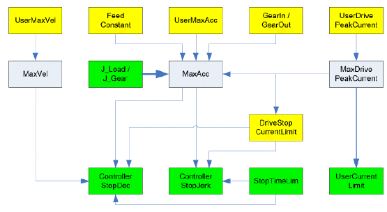

# Functional Description

Functional Description

The parameter is used to set the maximum acceleration on the drive shaft (gear box outside) and is specified in [units/seconds].

By real axes, it is possible to limit the value of [MaxAcc](General_2-4.htm#XREF_D_SE_0071526_1) via this parameter.

By virtual axes, the maximum value for the acceleration can be set independently from the default value via this parameter.

If UserMaxAcc is set to 0, then the parameter MaxAcc is automatically determined by the system.

NOTE: Modifications to the parameter are only applied during the Sercos phase up (communication phase 0 => communication phase 4).

The following graphic indicates the dependency with other object parameters for rotary drives:

The following graphic indicates the dependency with other object parameters for linear drives:

Yellow parameters are input parameters, whose values are taken into account by the Sercos phase up. Green parameters are input parameters, whose values are taken into account immediately. Gray parameters are output parameters. Thick arrows show that a parameter makes an impact on another parameter immediately by the input. Thin arrows show that a parameter does not have an impact until the next Sercos phase up or when the dependent parameter is entered. The arrow indicates the effective direction of the dependency.

Example:

Entering J\_Load has a direct impact on the parameter MaxAcc. A revision of MaxAcc only has an impact on ControllerStopDec if,

oa Sercos phase up takes place or

othe parameter ControllerStopDec is modified.