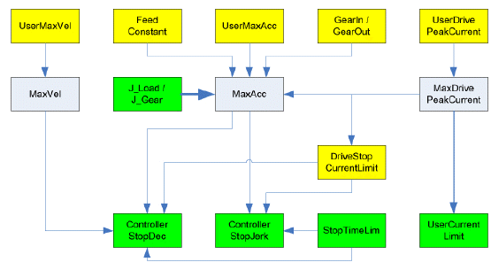

# Difference Between ControllerStop and User-Defined Stop

Difference Between ControllerStop and User-Defined Stop

Compared to the user-defined stop, you can access reference values of the drive (reference position and reference acceleration) with ControllerStop; otherwise, the profile for stopping the drive is the same if the UserDefinedStopMode parameter is set to Start with reference values/ 1. By default the UserDefinedStopMode parameter is set to Start with actual values/ 0. The user-defined stop in the drive is parameterized in the PacController like the ControllerStop function using the [ControllerStopDec](General_2-10.htm#XREF_D_SE_0071532_1) and [ControllerStopJerk](#XREF_D_SE_0071533_1) parameter.

NOTE: Since the device Sercos Drive does not support the parameter StopTimeLim, the maximum value of StopTimeLim is assumed for the minimum value for the calculation formula above. This value is 10000 ms.

NOTE: The parameter value is transferred from the master to the slave via the parameter channel of the Sercos at every access. Typically, this takes about 10 ms. However, times up to 1 s may be realized if large amounts of data are transferred on the parameter channel.

The following graphic indicates the dependency with other object parameters for rotary drives:

The following graphic indicates the dependency with other object parameters for linear drives:

Yellow parameters are input parameters, whose values are taken into account by the Sercos phase up. Green parameters are input parameters, whose values are taken into account immediately. Gray parameters are output parameters. Thick arrows show that a parameter makes an impact on another parameter immediately by the input. Thin arrows show that a parameter does not have an impact until the next Sercos phase up or when the dependent parameter is entered. The arrow indicates the effective direction of the dependency.

Example:

Entering J\_Load has a direct impact on the parameter MaxAcc. A revision of MaxAcc only has an impact on ControllerStopDec if,

oa Sercos phase up takes place or

othe parameter ControllerStopDec is modified.