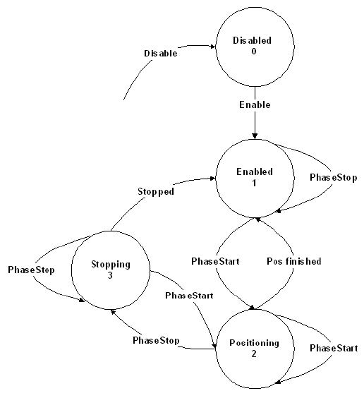

# Functional Description

Functional Description

The parameter represents the status of the position generator.

| Value | Data type | Meaning |
| --- | --- | --- |
| disabled / 0 | DINT | The position generator is disabled. |
| enabled / 1 | DINT | The position generator is enabled. |
| positioning / 2 | DINT | YOffset generator is in process. |
| stopping / 3 | DINT | YOffset generator is stopping. |

YOffsetState

