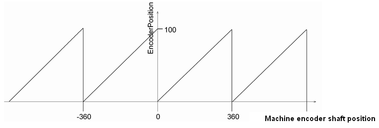

# Example

Example

FeedConstant = 100 units/revolution

GearIn = GearOut (no gear box)

EncoderRange = 1 revolution (single turn)

Diagram for the parameter EncoderPosition

NOTE: The parameter value is calculated taking into account the parameters that are transferred from the slave to the master via the real-time channel of the Sercos. If the Sercos bus is not in phase 4, then a default value is indicated here. If the Sercos bus is in phase 4 (operating phase), then the parameter value is calculated and indicated. This parameter has no meaning if no MachineEncoder is connected to the drive.