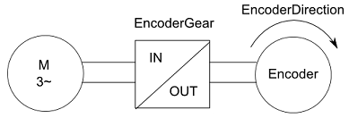

# Functional Description

Functional Description

The EncoderGearIn / [EncoderGearOut](../../../../../../api/crossBook?lang=en-US&virtualBookName=EncoderGearOut/EncoderGearOut.htm#XREF_D_SE_0089984_1) parameters describe a gear factor between machine encoder and load. This gear factor can be different from the gear factor between motor and load (parameter [GearIn](../../../PD.Parameter.LXM62Drive&topicID=D_SE_0071811_1) / [GearOut](../../../../../../api/crossBook?lang=en-US&virtualBookName=PD.Parameter.LXM62Drive&topicID=D_SE_0071838_1)).

The parameter EncoderGearIn indicates the number of teeth on the load side.

NOTE: Modifications to the parameter are only applied during the Sercos phase up (communication phase 0 => communication phase 4).