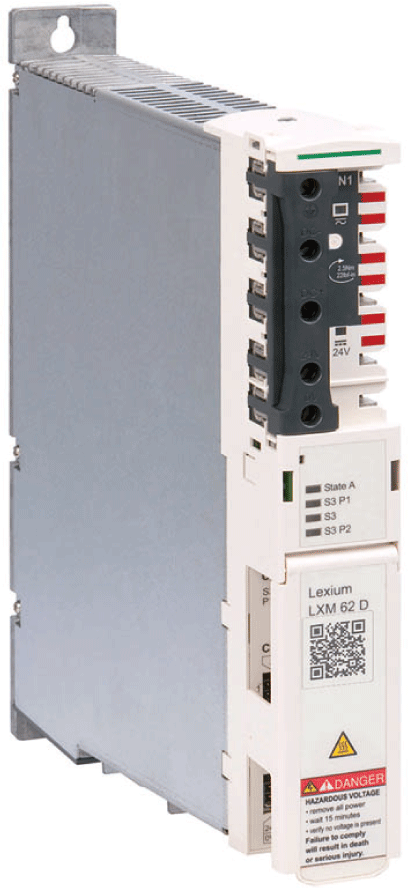

# QR Code - Description

## QR Code

The QR-Code is on the front flap. When scanning the code, the following information is provided:

* Commercial reference of the drive
* Serial number (SN: xxxxxxxxxx)
* Date of manufacture (DOM: dd.mm.yyyy)
* Hardware revision (for example RS: 01)

EIO0000003738.02

© 2021

Schneider Electric.

All rights reserved.