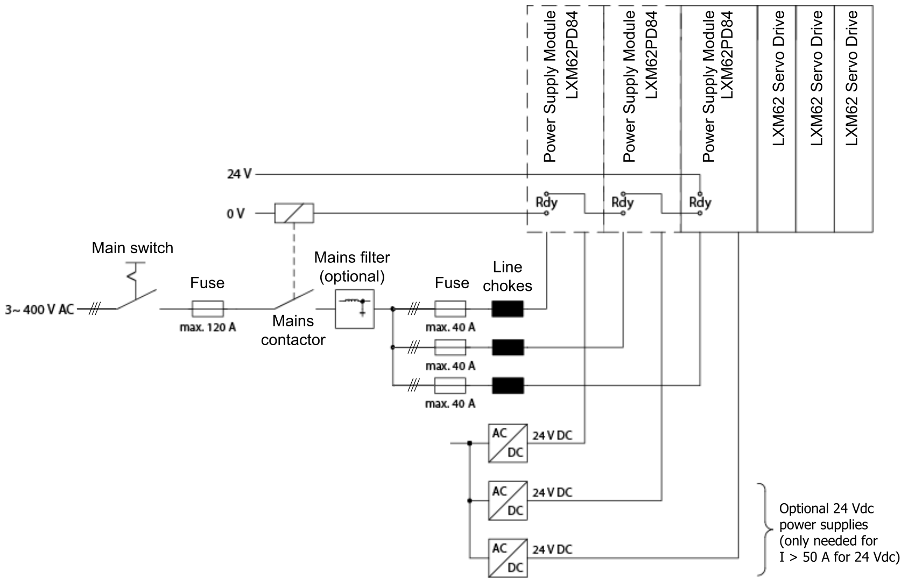

# Parallel Connection of Several Lexium 62 Power Supplies (LXM62PD84A11000)

## Overview

If DC bus currents are required that go beyond the rating of one Lexium 62 Power Supply, up to 3 Lexium 62 Power Supply modules of type LXM62PD84A11000 can be connected in parallel.

Using a parallel connection of several Lexium 62 Power Supplies (LXM62PD84A11000), the available DC bus current and thus the power can be increased.

The maximum DC Bus capacity which can be connected can also be increased by a parallel connection of Lexium 62 Power Supply devices. The overall DC Bus capacity which can be driven by a single Lexium 62 Power Supply (including the internal DC Bus capacity of the Lexium 62 Power Supply) is 12.5 mF. The additional capacity for a second and each further parallel connected LXM62PD84A11000 amount to 9.4 mF each.

Parallel connection of up to 3 Lexium 62 Power Supplies (LXM62PD84A11000)

No fuses are required for the 24 Vdc supply inputs, if appropriate 24 Vdc power supply units are used which ensure that the output current remains below 50 A.

Power data for parallel connection:

| Number of Lexium 62 Power Supply LXM62PD84 | DC bus current | | Continuous output power at 400 Vac mains input | Permissible DC bus capacity |
| --- | --- | --- | --- | --- |
| Continuous current | Peak current |
| 1 | 42.0 A | 84.0 A | 22.1 kW | 12.5 mF(1) |
| 2 | 73.9 A | 147.0 A | 38.9 kW | 21.9 mF(1) |
| 3 | 110.9 A | 189.0 A | 58.4 kW | 31.3 mF(1) |
| **(1)** Overall sum of DC bus capacities of the devices connected to Lexium 62 Power Supply modules including the DC bus capacity of the Lexium 62 Power Supply modules themselves. | | | | |

NOTE: A maximum of up to three Lexium 62 Power Supply modules of type LXM62PD84A11000 may be connected in parallel, in order not to overload the Bus Bar Module.

| DANGER | |
| --- | --- |
|  | FIRE, ELECTRIC SHOCK OR ARC FLASH  * Do not install more than three Lexium 62 Power Supply modules on the same DC Bus. * The maximum continuous current at any point of the DC link and 24V/0V connection must not exceed 120 A.  Failure to follow these instructions will result in death or serious injury. |

NOTE: To calculate the maximum DC Bus current of your particular Lexium 62 Drive System, refer to [*Calculation of Worst-Case Continuous Current*](D-SE-0064352.html#D-SE-0064352__D-SE-0064352.4). If you exceed 120 A in your calculation, you need to add current-limiting fuses to the DC Bus. For further information, refer to [*External Fuse*](D-SE-0064352.html#D-SE-0064352__D-SE-0064352.5).

The parallel connection of several Lexium 62 Power Supplies of type LXM62PD20A11000 is not permitted.

Also, a mixed parallel operation of the Lexium 62 Power Supply of type LXM62PD20A11000 and Lexium 62 Power Supply of type LXM62PD84A11000 is not allowed.

## Application - Mains Lines Reactor

Each Lexium 62 Power Supply (LXM62PD84A11000) must be supplied via an independent mains lines reactor. Among other reasons, the mains lines reactor provides a more uniform distribution of the load among the individual Lexium 62 Power Supply (LXM62PD84A11000).

The lines reactors must be of the same type to ensure that the load is distributed equally on the individual Lexium 62 Power Supply modules.

The mains lines reactor must be protected against overload.

## Application - Mains Contactor / Ready

If a Lexium 62 Power Supply (LXM62PD84A11000) shows an error, it must be ensured that all Lexium 62 Power Supplies (LXM62PD84A11000) connected in parallel are simultaneously disconnected from the mains.

Therefore, the Ready signals of the Lexium 62 Power Supply (LXM62PD84A11000) must be connected in series and led to a common mains contactor.

In addition, it is necessary to apply line voltage to all power supplies simultaneously. The mains contactor helps ensure that all Lexium 62 Power Supply modules involved are simultaneously supplied with energy.

If you do not apply and remove line voltage to the power supplies together, you may overload the power supply system.

| WARNING | |
| --- | --- |
|  | OVERLOADED POWER SUPPLY  * Ensure that all power supplies are simultaneously supplied with line voltage in a multi-power supply installation. * Ensure that all power supplies are de-energized simultaneously.  Failure to follow these instructions can result in death, serious injury, or equipment damage. |

## Application - 24 V Power Supply

For machines with a 24 V supply up to 50 A, it is sufficient to use one power supply unit that is connected to any Lexium 62 Power Supply (LXM62PD84A11000).

The 24 V input is limited to 50 A per Lexium 62 Power Supply (LXM62PD84A11000).

The current per Lexium 62 Power Supply (LXM62PD84A11000) must be limited to 50 A. This can be performed, for instance, by using appropriate power supply units, which reduce the output voltage upon reaching the power limit.

A parallel connection must be approved by the power supply unit manufacturer. The overall current must not exceed 120 A.

Do not use passive power supply units with fuses for a parallel connection. They are not appropriate for a current limitation to less than 50 A since these switch off the current instead of reducing the voltage. Thus, a uniform distribution of the load is not possible with these types of power supply units.

EIO0000003738.02

© 2021

Schneider Electric.

All rights reserved.