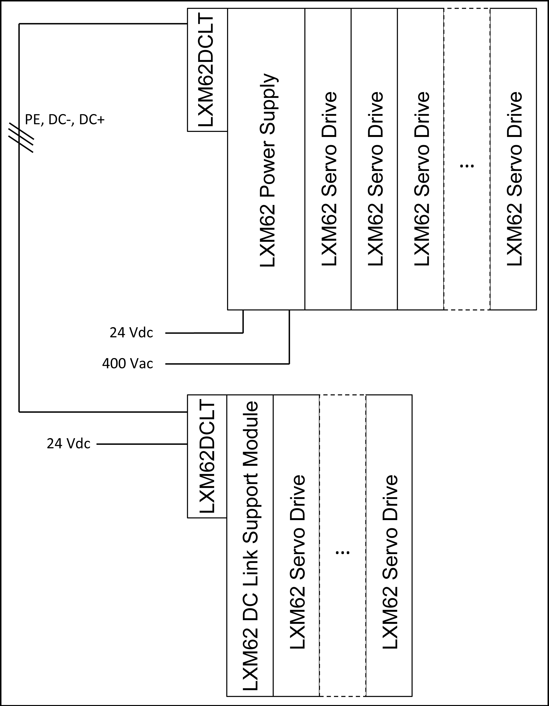
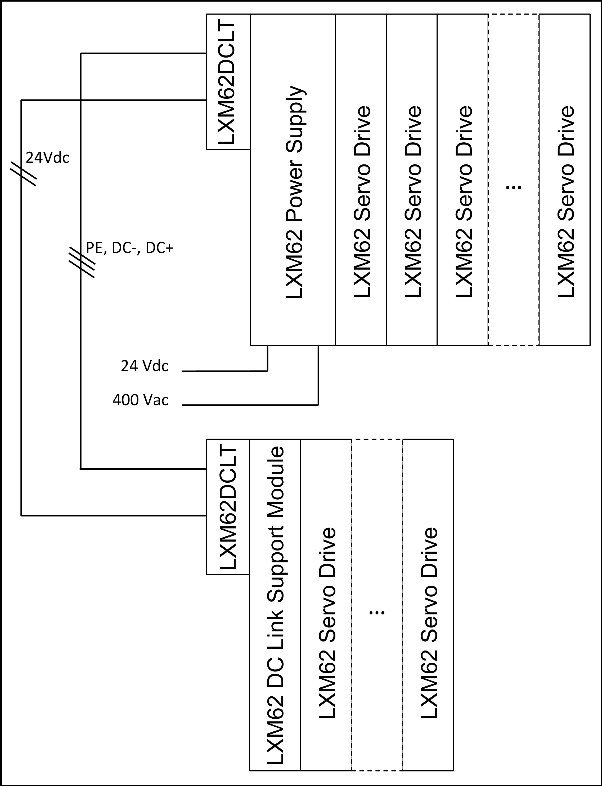
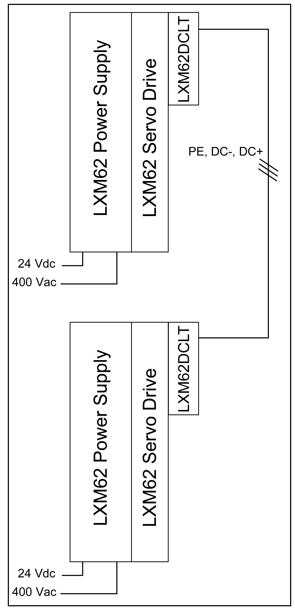
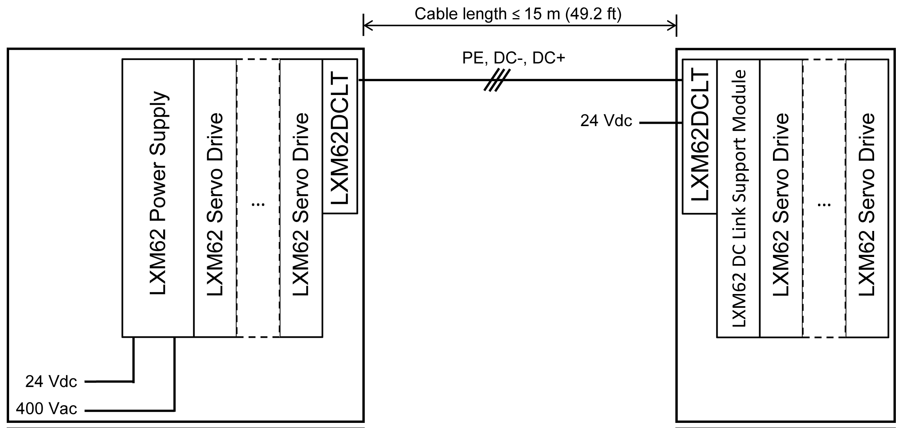
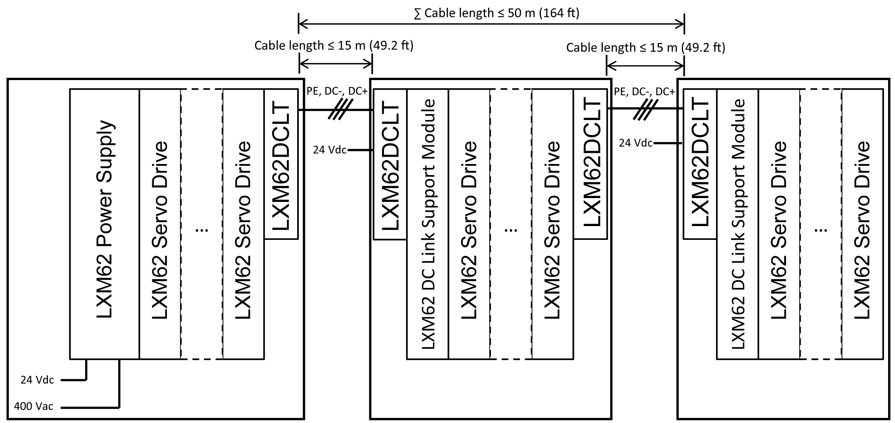
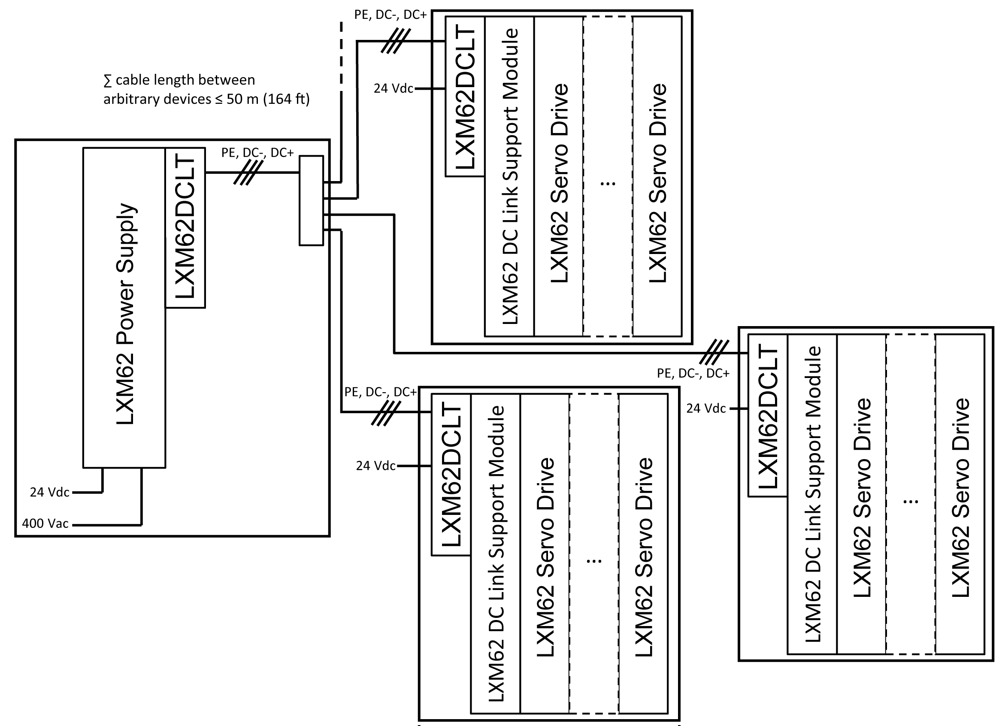
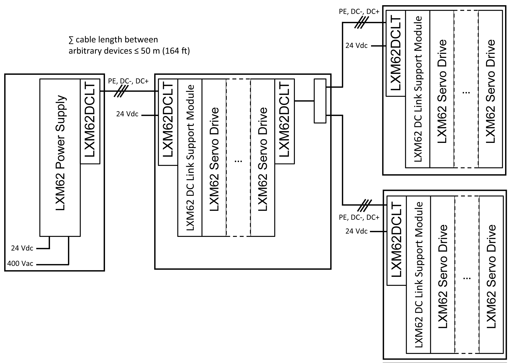

# Wiring with Lexium 62 DC Link Terminal

## Overview

Wiring with Lexium 62 DC Link Terminal allows the connection of the bus bar modules of several rows of:

* Lexium 62 devices that are not directly adjacent within the same control cabinet, or
* Lexium 62 devices that are located in separate control cabinets.

When wiring with Lexium 62 DC Link Terminal, rows without power supply unit are supplied by rows with power supply units.

A row or device island is a combination of the following Lexium 62 devices which are directly connected via the bus bar module:

* Lexium 62 Power Supply
* Lexium 62 Servo Drive
* Lexium 62 DC Link Support Module
* Lexium 62 Connection Module

NOTE: Wiring with Lexium 62 DC Link Terminal is subject to electrical restrictions. Refer to the admissible topologies and to the [electrical restrictions](#D-SE-0061461__D-SE-0061461.11).

## Topologies for Wiring with Lexium 62 DC Link Terminal

The seven topologies presented hereafter include Lexium 62 DC Link Support Modules. However, a Lexium 62 DC Link Support Module is only mandatory for longer [cable lengths](#D-SE-0061461__D-SE-0061461.11) or if a Single Drive LXM62DC13 is present in a row without Lexium 62 Power Supply.

NOTE: Each device island without its own Lexium 62 Power Supply requires the 24 V supply from the Lexium 62 DC Link Terminal.

NOTE:

* Wiring with Lexium 62 DC Link Terminal does not support ring topologies.
* Wiring with Lexium 62 DC Link Terminal supports a maximum of six rows or device islands.
* The 24 V and 0 V can be distributed via the Lexium 62 DC Link Terminal over several device islands.
* Instead of distributing the 24 V over several rows, an external 24 V supply can also be connected directly to the Lexium 62 DC Link Terminal for rows without Lexium 62 Power Supply modules.

| DANGER | |
| --- | --- |
|  | FIRE, ELECTRIC SHOCK OR ARC FLASH  Use the Lexium 62 DC Link Terminal to link Lexium 62 devices only.  Failure to follow these instructions will result in death or serious injury. |

## Topology 1: Coupling of Two (or More) Rows in Control Cabinet with a Separate 24 V Supply

**LXM62DCLT:** Lexium 62 DC Link Terminal

The 24 V and 0 V terminals always have to be mounted to the Bus Bar Module, even if no wire is connected to the terminals.

| DANGER | |
| --- | --- |
|  | ELECTRIC SHOCK  * Always install the full complement of the five connectors and the retaining bracket of the Lexium 62 DC Link Terminal. * Always wire at least the PE, DC- and DC+ terminals out of the 5 installed connectors.  Failure to follow these instructions will result in death or serious injury. |

## Topology 2: Coupling of Two (or More) Rows in a Control Cabinet Without a Separate 24 V Supply

**LXM62DCLT:** Lexium 62 DC Link Terminal

## Topology 3: Coupling of Two Power Supplies

**LXM62DCLT:** Lexium 62 DC Link Terminal

NOTE:

* The Lexium 62 Power Supply modules are connected in [parallel](D-SE-0052483.html#D-SE-0052483).
* The Lexium 62 Power Supply modules must be located in the same control cabinet.

## Topology 4: Coupling of Two Control Cabinets

**LXM62DCLT:** Lexium 62 DC Link Terminal

## Topology 5: Coupling of More Than Two Control Cabinets in Line Topology

**LXM62DCLT:** Lexium 62 DC Link Terminal

NOTE:

* The Lexium 62 Power Supply modules must be located in the same control cabinet.
* Up to 6 Lexium 62 device islands are allowed in this topology.

## Topology 6: Coupling of More Than Two Control Cabinets in Star Topology

**LXM62DCLT:** Lexium 62 DC Link Terminal

NOTE:

* The Lexium 62 Power Supply modules must be located in the same control cabinet.
* Up to 6 Lexium 62 device islands are allowed in this topology.
* External terminals (for example, for cap rail) are necessary to realize star connections.
* The maximum cable length of one single connection between any Lexium 62 device island and the nearest Lexium 62 device island is 15 m (49.2 ft).

## Topology 7: Coupling of More Than Two Control Cabinets in Mixed Line and Star Topology

**LXM62DCLT:** Lexium 62 DC Link Terminal

NOTE:

* The Lexium 62 Power Supply modules must be located in the same control cabinet.
* Up to 6 Lexium 62 device islands are allowed in this topology.
* External terminals (for example, for cap rail) are necessary to realize star connections.

## Electrical Restrictions for Wiring with Lexium 62 DC Link Terminal

| Criteria | Description |
| --- | --- |
| Absolute cable length limits | * The maximum cable length of one single connection between any Lexium 62 device island and the nearest Lexium 62 device island is 15 m (49.2 ft). * The maximum overall cable length between one Lexium 62 device and any other Lexium 62 device connected using the wiring via Lexium 62 DC Link Terminal is 50 meters (164 ft). |
| Lexium 62 DC Link Support Module | A Lexium 62 DC Link Support Module must be installed per row without Lexium 62 Power Supply if:   * the overall cable length between the row and the next row with a Lexium 62 Power Supply or Lexium 62 DC Link Support Module is longer than 3 m (9.84 ft.) * a Lexium 62 drive of type LXM62DC13 is present in the row.  NOTE: More than one Lexium 62 DC Link Support Module may be necessary in this case.   NOTE: The overall cable length means the sum of single wiring connections with Lexium 62 DC Link Terminal. |
| Power supply | * The Lexium 62 Power Supply modules which are connected via Lexium 62 DC Link Terminal must be located within one control cabinet. * The mains supply of the Lexium 62 Power Supply modules which are connected via Lexium 62 DC Link Terminal must be operated using the same mains contactor. |
| Single Drive LXM62DC13 | * The drives of type Single Drive LXM62DC13 have to be used in combination with a Lexium 62 Power Supply or a Lexium 62 DC Link Support Module in the same row. * In a row without Lexium 62 Power Supply, one Lexium 62 DC Link Support Module has to be installed per Single Drive LXM62DC13. |
| Cable/wire cross section | * The ampacity of the Lexium 62 DC Link Terminal depends on the usage of suitable cables/wires and on the installation method of the cables/wires. * When using smaller cable/wire cross-sections, and if the system is able to drive permanently a larger current than permitted for [cable/wire cross-sections](D-SE-0061590.html#D-SE-0061590__D-SE-0061590.2), external fuses for current limiting must be integrated into the connection via Lexium 62 DC Link Terminal. |

| DANGER | |
| --- | --- |
|  | FIRE HAZARD  * Do not exceed an overall cable length of 3 m (9.84 ft) between any row without Lexium 62 DC Link Support Module or Lexium 62 Power Supply module and the next row with a Lexium 62 Power Supply module or Lexium 62 DC Link Support Module. * Install a Lexium 62 DC Link Support Module for each drive of type LXM62DC13 in rows without Lexium 62 Power Supply module. * Install all Lexium 62 Power Supply modules with linked DC Bus in the same control cabinet sharing the same mains contactor.  Failure to follow these instructions will result in death or serious injury. |

| DANGER | |
| --- | --- |
|  | FIRE, ELECTRIC SHOCK OR ARC FLASH  * Do not install more than three Lexium 62 Power Supply modules on the same DC Bus. * The maximum continuous current at any point of the DC link and 24V/0V connection must not exceed 120 A.  Failure to follow these instructions will result in death or serious injury. |

| DANGER | |
| --- | --- |
|  | IMPROPER WIRING BETWEEN CONTROL CABINETS CAUSES ELECTRIC SHOCK  * Only use appropriate and certified cables according to the applicable standards. * Only use the cables with the appropriate cross-sections. * Do not use individual wires outside the control cabinet; use cables only. * Observe the bending radius of the cable/wire specification of the manufacturer. * Thoroughly verify the cables/wires for defects and/or damages after the installation. * Use cable ducts and other appropriate measures outside of the control cabinet protecting the cables/wires from damage and mechanical stress. * Remove insulation accurately according to the stripping length of the cable conductor.  Failure to follow these instructions will result in death or serious injury. |

| WARNING | |
| --- | --- |
|  | HIGH ELECTROMAGNETIC RADIATION  * Do not exceed a cable length of 15 m (49.2 ft) for single connections using Lexium 62 DC Link Terminal. * Do not exceed an overall cable length of 50 meters (164 ft) between one Lexium 62 device and any other Lexium 62 device connected via a Lexium 62 DC Link Terminal.  Failure to follow these instructions can result in death, serious injury, or equipment damage. |

EIO0000003738.02

© 2021

Schneider Electric.

All rights reserved.