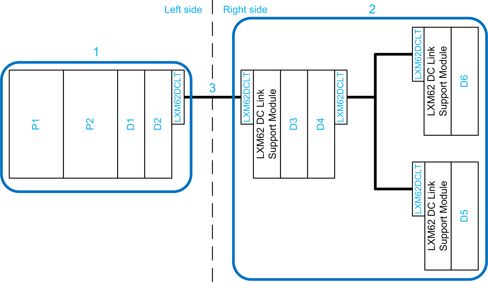
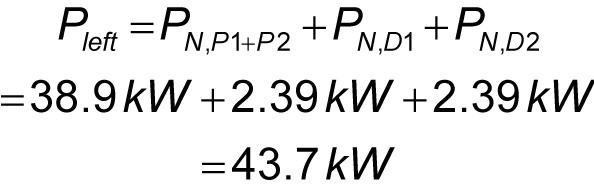
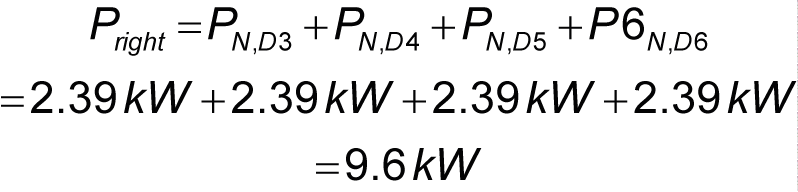
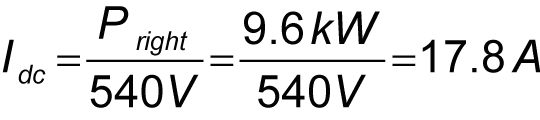

# Cable Selection Guidelines for Wiring With Lexium 62 DC Link Terminal

## General Requirements

The cable selection for wiring with Lexium 62 DC Link Terminal mainly depends on the continuous current. The cables must either be rated according to the worst-case continuous current or an additional external fuse must be integrated. In addition, the cable must also be chosen according to the necessary voltage isolation.

The current rating of cables and thus the cable selection also depends on environmental parameters:

* Allowed cable temperature.
* Ambient temperature and the grouping factor.
* Installation method.

Local and international regulations have to be applied.

| DANGER | |
| --- | --- |
|  | IMPROPER WIRING BETWEEN CONTROL CABINETS CAUSES ELECTRIC SHOCK  * Only use appropriate and certified cables according to the applicable standards. * Only use the cables with the appropriate cross-sections. * Do not use individual wires outside the control cabinet; use cables only. * Observe the bending radius of the cable/wire specification of the manufacturer. * Thoroughly verify the cables/wires for defects and/or damages after the installation. * Use cable ducts and other appropriate measures outside of the control cabinet protecting the cables/wires from damage and mechanical stress. * Remove insulation accurately according to the stripping length of the cable conductor.  Failure to follow these instructions will result in death or serious injury. |

## Calculation of Worst-Case Continuous Current

**Calculation of the worst-case 24 V/0 V continuous current**

If no external fuses are installed within a 24 V/0 V wiring connection using Lexium 62 DC Link Terminals, then the cable for each single 24 V/0 V connection must be rated for the worst-case continuous current. The latter is given by the sum of the rated currents of the connected 24 V power supply modules.

NOTE: If the worst-case continuous 24 V/0 V current is larger than 120 A, then it is mandatory to install external fuses within the 24 V/0 V wiring connection to limit the continuous current to 120 A or less.

**Calculation of the worst-case DC+/DC- continuous current**

If no external fuses are installed within a DC+/DC- wiring connection using Lexium 62 DC Link Terminals, then the cable for each single DC+/DC- connection must be rated for the worst-case continuous current.

NOTE: If the worst-case continuous DC+/DC- current is larger than 120 A, then it is mandatory to install external fuses within the DC+/DC- wiring connection to limit the continuous current to 120 A or less.

The maximum continuous DC circuit current over the wiring connection can be computed as follows:

* Look up the nominal power for each motor-drive combination in the system (nominal power of a motor-drive combination is the minimum of the nominal power values of the drive and of the motor) and for the Lexium 62 Power Supply modules.

  NOTE: Always use the values for 400 Vac nominal mains voltage, even if the machine is installed at 480 Vac.
* Sum up the nominal power values of the motor-drive combinations and the Lexium 62 Power Supply modules in the system which are installed to the left of the Lexium 62 DC Link Terminal wiring connection. (In case several Lexium 62 Power Supply modules are connected in parallel, consult the table [*Power data for parallel connection*](D-SE-0052483.html#D-SE-0052483__D-SE-0052483.2) for the resulting overall continuous output power rating of the parallel connected Lexium 62 Power Supply modules).
* Sum up the nominal power values of the motor-drive combinations and the Lexium 62 Power Supply modules in the system which are installed to the right of the Lexium 62 DC Link Terminal wiring connection. (In case several Lexium 62 Power Supply modules are connected in parallel, consult the table [*Power data for parallel connection*](D-SE-0052483.html#D-SE-0052483__D-SE-0052483.2) for the resulting overall continuous output power rating of the parallel connected Lexium 62 Power Supply modules).
* Take the minimum value of these two nominal power sums (to obtain the maximum continuous power generated by motor-drive combinations and Lexium 62 Power Supply modules which could be transferred over the Lexium 62 DC Link Terminal wiring connection).
* Divide this maximum continuous power by 540 V (equals the DC bus voltage at 400 Vac mains) to obtain the maximum continuous DC circuit current for the wiring connection.

  NOTE: Even if the system is supplied with 480 Vac, the DC bus voltage 540 V corresponding to 400 Vac must be used for the calculation, provided that also the continuous power values corresponding to 400 Vac are applied.

## Example for Continuous DC+/DC- Current Rating Calculation

Consider the Lexium 62 Drive System configuration outlined below.

Assume that:

* The Lexium 62 Power Supply modules P1 and P2 are connected in parallel and they are supplied with 400 Vac.
* The Lexium 62 drives are operated at the PWM frequency 8 kHz.
* The system is rated for a maximum ambient temperature of 40 °C (104 °F).

**1** Lexium 62 drive islands to the left of Lexium 62 DC Link Terminal wiring connection

**2** Lexium 62 drive islands to the right of Lexium 62 DC Link Terminal wiring connection

**3** Lexium 62 DC Link Terminal wiring connection for which continuous DC+/DC- current rating is calculated

**LXM62DCLT** Lexium 62 DC Link Terminal

| Reference | Drive | Continuous Drive Power  PN, LXM62D or  PN, LXM62P | Motor | Continuous Motor Power  PN, Mot | Continuous power of drive-motor combination or parallel connected Lexium 62 Power Supply modules |
| --- | --- | --- | --- | --- | --- |
| P1+P2 | LXM62PD84 | N/A | N/A | N/A | 38.9 kW (1) |
| D1 | LXM62DD27E | 3.4 kW(2) | SH31003P | 2.39 kW(3) | 2.39 kW(4) |
| D2 | LXM62DD27E | 3.4 kW(2) | SH31003P | 2.39 kW(3) | 2.39 kW(4) |
| D3 | LXM62DD27E | 3.4 kW(2) | SH31003P | 2.39 kW(3) | 2.39 kW(4) |
| D4 | LXM62DD27E | 3.4 kW(2) | SH31003P | 2.39 kW(3) | 2.39 kW(4) |
| D5 | LXM62DD27E | 3.4 kW(2) | SH31003P | 2.39 kW(3) | 2.39 kW(4) |
| D6 | LXM62DD27E | 3.4 kW(2) | SH31003P | 2.39 kW(3) | 2.39 kW(4) |
| **(1)** See [*Power data for parallel connection*](D-SE-0052483.html#D-SE-0052483__D-SE-0052483.2)  **(2)** See [*Technical Data Single Drive*](D-SE-0051822.html#D-SE-0051822__D-SE-0051822.2)  **(3)** See [*SH3 Servo Motor - User Guide*](../../../../../api/crossBook?lang=en-US&virtualBookName=sh3motug&topicID=D_SE_0062567)  **(4)** The continuous power of a motor-drive combination is the minimum of the continuous drive power and the continuous motor power. | | | | | |

The continuous power sum to the left of the Lexium 62 DC Link Terminal wiring connection is:

The continuous power sum to the right of the Lexium 62 DC Link Terminal wiring connection is:

The maximum continuous power to the right side is lower than the power to the left side of the Lexium 62 DC Link Terminal wiring connection. So, the DC+/DC- wires of the Lexium 62 DC Link Terminal wiring connection can be rated for the maximum continuous power to the right side. The maximum continuous DC+/DC- current over the Lexium 62 DC Link Terminal wiring connection is then:

Thus, in this example, external fuses within the DC+/DC- connection of the Lexium 62 DC Link Terminal wiring connection can be omitted if the corresponding DC+/DC- cable/wire installation is rated for at least 17.8 A.

NOTE: If the resulting continuous DC+/DC- current is greater than 120 A, an external fuse within the DC+/DC- connection is mandatory to limit the current to 120 A or less.

## External Fuse

The cross section of the wires (DC+, DC-, 0 V, 24 V) of a Lexium 62 DC Link Terminal wiring connection can be reduced if they are protected by external fuses. The DC+/DC- fuses must be rated for 1000 Vdc and the 0 V/24 V fuses must be rated for 30 Vdc. The fuses must provide a protection against short circuits and overload (gR, gN, or gG). The DC rating is important because a fuse which only has an AC rating is not able to protect the circuit.

Use one fuse per current carrying conductor (DC+, DC-, 0 V, 24 V). If the worst-case continuous current of any current carrying conductor (DC+, DC-, 0 V, 24 V) is greater than 120 A, install external fuses to limit the continuous current to 120 A or less. Do not install a fuse on the PE conductor.

## Isolation Voltage Requirements

**Required cable voltage isolation for wiring using Lexium 62 DC Link Terminal:**

PE / DC- / DC+ / 24 V / 0 V wire: 1000 Vdc (>700 Vac)

EIO0000003738.02

© 2021

Schneider Electric.

All rights reserved.