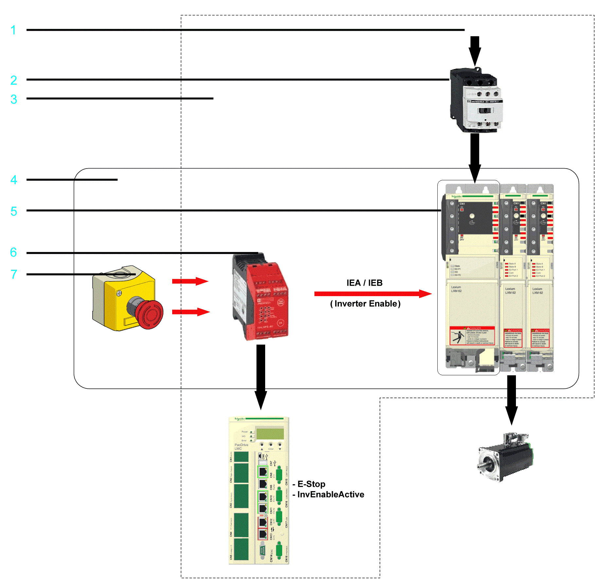
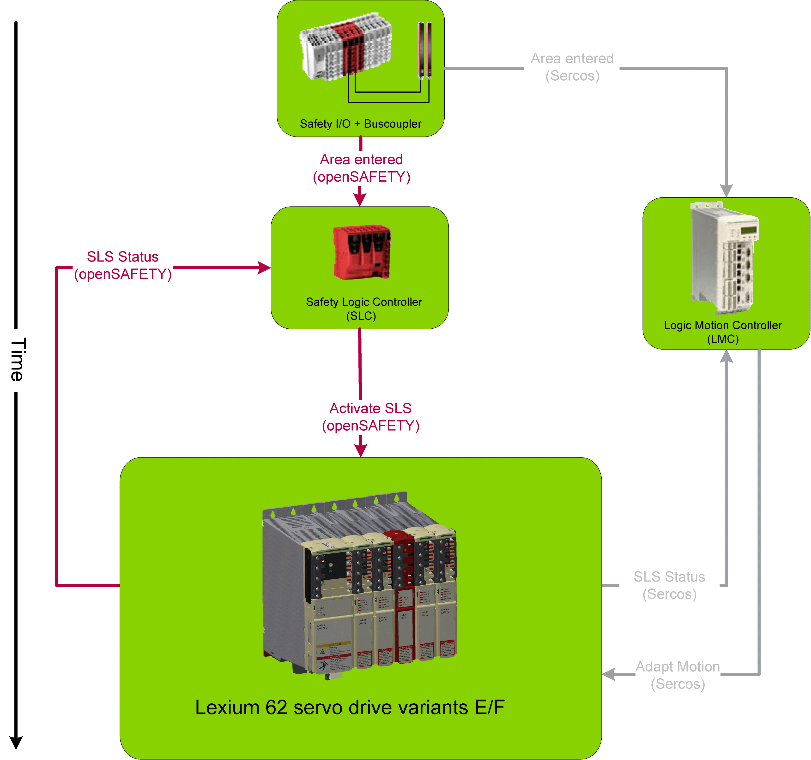

# Inverter Enable Function

## Functional Description

With the Inverter Enable function (IE), you can bring drives to a defined safe stop.

This Inverter Enable function relates to the components

* Single Drive
* Double Drive

In the sense of the relevant standards, the requirements of the stop category 0 (Safe Torque Off, STO) and stop category 1 (Safe Stop 1, SS1) can be met. Both categories lead to a torque-free motor while SS1 takes this state after a predefined time. As a result of the hazard and risk analysis, it may be necessary to choose an additional brake as a safety-related option (for example, for hanging loads).

With the Lexium 62 variants E/F, it is also possible to realize extended safety functions such as Safely Limited Speed (SLS) in connection with the Safety Logic Controller TM5CSLC•00FS and the associated EcoStruxure Machine Expert - Safety software.

## Scope of Operation (Designated Safety Function)

The Lexium 62 Servo Drives are available in the Inverter Enable two-channel variants C/D/G. The variants C/D/G were developed to execute the Inverter Enable function according to SIL 3 or PL e. For this purpose, there must be a two-channel connection. Thus, the device variants C/D/G have the additional connection **CN11**.

Reaching SIL 3 / PL e / Category 4 is limited to 100 axes per safety function.

The variants C/D/G may be connected in a single-channel configuration. The second contact, in this case is jumpered. For this purpose, a separate application proposal is provided (For further information, refer to [*Application Proposal – Variants C/D/G Single-Channel Jumpered*](D-SE-0052493.html#D-SE-0052493)).

The two-channel variants C/D/G can be connected under different conditions in which certain potential errors can be ruled out. If a potential error cannot be ruled out, additional measures are required (test pulses or diagnostic).

As a result, there are the following additional application proposals for a pure two-channel application:

* [*Application proposal variants C/D/G two-channel with protected wiring*](D-SE-0052496.html#D-SE-0052496)
* [*Application proposal variants C/D/G two-channel with test pulses*](D-SE-0052494.html#D-SE-0052494)
* [*Application proposal variants C/D/G two-channel with external, non-safety-related diagnostic*](D-SE-0052495.html#D-SE-0052495)

Since the variants C/D/G can be connected in a single-channel or a two-channel configuration, it results in a combination of the applications. To verify this application for the correct connection, a test procedure is provided.

## Operating Principle

* After the emergency stop device is activated, a controlled ramp down takes place for the drive.
* In the process, the DC bus voltage increases until the braking resistor is switched on.
* In the braking resistor, the energy which is fed back from the motor is converted to heat.
* The K1 power circuit breaker and/or the Inverter Enable signal must remain energized until the drive stops.
* At the latest after the normal ramp down time, the Inverter Enable signal is switched off by the delayed contacts of K3.
* After this, the drive is in a defined safe stop.

Inverter Enable block diagram:

**1** 3 Phase (AC)

**2** Mains Contactor K1

**3** IP54 (control cabinet) or higher

**4** Part of the safety function

**5** Power supply of the Lexium 62 Drive System (**not** part of the safety function)

**6** Safety-related switching device K3

**7** Emergency stop button

## Defined Safe State

Inverter Enable is synonymous with "Safe Torque Off (STO)" according to IEC 61800-5-2. This torque-free state is automatically entered when errors are detected and is therefore the defined safe state of the drive.

## Mode of Operation

The safety-related circuit with InverterEnable was developed to minimize wear on the mains contactor. When the stop or the emergency stop button is activated, the mains contactor is not switched off. The defined safe stop is achieved by removing the “InverterEnable” for the opto-couple in the power stage. Thus, the PWM signals cannot control the power stage so that a startup of the drives is prevented (pulse pattern lock).

You can use the Inverter Enable function to implement the control function “Stopping in case of emergency” (EN 60204-1) for stop categories 0 and 1. Use an appropriate external safety-related circuit to prevent the unintended restart of the drive after a stop, as required in the machine directive.

## Stop Category 0

In stop category 0 (Safe Torque Off, STO), the drive coasts to a stop (provided there are no external forces operating to the contrary). The STO safety-related function is intended to help prevent an unintended start-up, not stop a motor, and therefore corresponds to an unassisted stop in accordance with IEC 60204-1.

In circumstances where external influences are present, the coast down time depends on physical properties of the components used (such as weight, torque, friction, and so on), and additional measures such as mechanical brakes may be necessary to help prevent any hazard from materializing. That is to say, if this means a hazard to your personnel or equipment, you must take appropriate measures (refer to [*Hazard and Risk Analysis*](D-SE-0051312.html#D-SE-0051312__D-SE-0051312.3)).

| WARNING | |
| --- | --- |
|  | UNINTENDED EQUIPMENT OPERATION  * Make certain that no hazards can arise for persons or material during the coast down period of the axis/machine. * Do not enter the zone of operation during the coast down period. * Ensure that no other persons can access the zone of operation during the coast down period. * Use appropriate safety interlocks where personnel and/or equipment hazards exist.  Failure to follow these instructions can result in death, serious injury, or equipment damage. |

## Stop Category 1

For stops of category 1 (Safe Stop 1, SS1) you can request a controlled stop via the Logic Motion Controller. The controlled stop by the Logic Motion Controller is not safety-relevant, nor monitored, and does not perform as defined in the case of a power outage or if an error is detected. The final switch off in the defined safe state is accomplished by switching off the Inverter Enable input. This has to be implemented by using an external safety-related switching device with safety-related delay (refer to [application proposal](D-SE-0052491.html#D-SE-0052491)).

Independent of the safety function, the detectable errors not affecting the safety function are recognized by the controller, thus avoiding the drive from starting by switching off the mains contactor. Contactor K2 prevents the mains contactor from being switched on.

## Execute Muting

To execute muting, determine the muting reaction time for switching off, that is, without the Inverter Enable function, within the application. Should a response time be required because of the risk assessment of the machine, the total response time of the machine has to be taken into account. That is to say, the components related to the safety functions from the sensor to the drive shaft or the driven mechanics have to be considered. The determined reaction time must correspond to the results of the hazard and risk analysis.

| WARNING | |
| --- | --- |
|  | UNINTENDED EQUIPMENT OPERATION  * Verify that the maximum response time corresponds to your risk analysis. * Be sure that your risk analysis includes an evaluation for the maximum response time. * Validate the overall function with regard to the maximum response time and thoroughly test the application.  Failure to follow these instructions can result in death, serious injury, or equipment damage. |

Proceed as follows to disable the Inverter Enable function:

Supply the IEA or IEB input constantly with 24 Vdc to deactivate the Inverter Enable function.

The axes without Inverter Enable function become torque-free via the mains contactor and come to a stop. For further information, refer to [*Stop Category 0*](#D-SE-0051313__D-SE-0051313.7).

## Extended Safety-Related Functions - Operating Principle

The safety concept is based upon the general consideration that the required safety-related travel movement is performed by the controller and the drive. The safety system monitors the correct execution of the motion, and if it is not respected the safety system initiates the required fall-back level (for example the defined safe state).

An example for Safe Limited Speed (SLS) is as follows:

A light curtain is connected to a safety-related digital input. As soon as a person enters the protected zone passing the light curtain, the corresponding information is transmitted to the Safety Logic Controller (SLC) and the Logic Motion Controller (LMC) via the Sercos bus. After that the Logic Motion Controller initiates an adequate travel movement, for example by using decelerating and then moving slowly. After an adjustable delay time, this slow movement is monitored by Lexium 62 variants E/F. Upon exceeding an adjustable threshold value (for example, high velocity), the required fall-back level is entered, for example, the defined safe state.

Application of safety-related function SLS:

## Extended Safety-Related Functions - Inverter Enable via Hardware Input

The Lexium 62 variants E/F have been primarily developed to realize the extended safety functions. They are equipped with the hardware input for the Inverter Enable 2-channel on connector **CN11**. The connector **CN6** also supports the Inverter Enable 1-channel for the variants C/D/G. However, only this Inverter Enable 2-channel function must be used for the Lexium 62 variants E/F. The device still needs to be configured and parameterized by using the software. If it is hardwired, the Safe Torque Off (STO) function can be triggered via the Inverter Enable inputs IEA/IEB or the Sercos bus. The Lexium 62 Drive System Safety Module can be configured to ignore the hardware input. In this case, the Safe Torque Off (STO) function can only be activated upon a request over the Sercos bus. Otherwise, if the hardware input is not ignored then both requests (hardware input and Sercos bus) are verified and the Safe Torque Off (STO) function is triggered if one or both requests are active. The default configuration takes into account the hardware input.

| DANGER | |
| --- | --- |
|  | INADEQUATE SAFETY FUNCTION  Do not use 1-channel Inverter Enable wiring with Lexium 62 variants E/F.  Failure to follow these instructions will result in death or serious injury. |

## Extended Safety-Related Functions - Defined Safe State

The defined safe state of the device is characterized by the following features:

* The drive is torque-free, which is equivalent to Safe Torque Off (STO) according to IEC 61800-5-2.
* There is no safety-related communication from the drive via the Sercos bus.

This state is automatically entered when errors are detected.

## Validity of the Safety Case

The safety case for the Inverter Enable function of the Lexium 62 Drive System is identified and defined by the standards listed in [*Safety Standards*](D-SE-0051320.html#D-SE-0051320). The safety case of the Lexium 62 Drive System Inverter Enable function applies to the following hardware codes, which can be found examining the appropriate software object in the [*EcoStruxure Machine Expert - Progamming Guide*](D-SE-0052336.1.html#D-SE-0052336.1__D-SE-0052336.9):

Servo Drives

| Drive | Hardware code |
| --- | --- |
| LXM62DU60C | xxxxxxxxxxx1xxx, xxxxxxxxxxx2xxx, xxxxxxxxxxx3xxx, xxxxxxxxxxx4xxx, xxxxxxxxxxx5xxxxx, xxxxxxxxxxx6xxxxx, xxxxxxxxxxx7xxxxx |
| LXM62DD15C | xxxxxxxxxxx1xxx, xxxxxxxxxxx2xxx, xxxxxxxxxxx3xxx, xxxxxxxxxxx4xxx, xxxxxxxxxxx5xxxxx, xxxxxxxxxxx6xxxxx, xxxxxxxxxxx7xxxxx |
| LXM62DD27C | xxxxxxxxxxx1xxx, xxxxxxxxxxx2xxx, xxxxxxxxxxx3xxx, xxxxxxxxxxx4xxx, xxxxxxxxxxx5xxxxx, xxxxxxxxxxx6xxxxx, xxxxxxxxxxx7xxxxx |
| LXM62DD45C | xxxxxxxxxxx1xxx, xxxxxxxxxxx2xxx, xxxxxxxxxxx3xxx, xxxxxxxxxxx4xxx, xxxxxxxxxxx5xxxxx, xxxxxxxxxxx6xxxxx, xxxxxxxxxxx7xxxxx |
| LXM62DC13C | xxxxxxxxxxxxxxx1xxx, xxxxxxxxxxxxxxx2xxx, xxxxxxxxxxxxxxx3xxx, xxxxxxxxxxxxxxx4xxx, xxxxxxxxxxxxxxx5xxx |
| LXM62DU60D | xxxxxxxxxxx1xxx, xxxxxxxxxxx2xxx, xxxxxxxxxxx3xxx, xxxxxxxxxxx4xxx, xxxxxxxxxxx5xxxxx, xxxxxxxxxxx6xxxxx, xxxxxxxxxxx7xxxxx |
| LXM62DD15D | xxxxxxxxxxx1xxx, xxxxxxxxxxx2xxx, xxxxxxxxxxx3xxx, xxxxxxxxxxx4xxx, xxxxxxxxxxx5xxxxx, xxxxxxxxxxx6xxxxx, xxxxxxxxxxx7xxxxx |
| LXM62DD27D | xxxxxxxxxxx1xxx, xxxxxxxxxxx2xxx, xxxxxxxxxxx3xxx, xxxxxxxxxxx4xxx, xxxxxxxxxxx5xxxxx, xxxxxxxxxxx6xxxxx, xxxxxxxxxxx7xxxxx |

Advanced Servo Drives

| Drive | Hardware code |
| --- | --- |
| LXM62DU60G | xxxxxxxxxxxx5xxxxx, xxxxxxxxxxx6xxxxx, xxxxxxxxxxx7xxxxx |
| LXM62DD15G | xxxxxxxxxxxx5xxxxx, xxxxxxxxxxx6xxxxx, xxxxxxxxxxx7xxxxx |
| LXM62DD27G | xxxxxxxxxxxx5xxxxx, xxxxxxxxxxx6xxxxx, xxxxxxxxxxx7xxxxx |
| LXM62DD45G | xxxxxxxxxxxx5xxxxx, xxxxxxxxxxx6xxxxx, xxxxxxxxxxx7xxxxx |
| LXM62DC13G | xxxxxxxxxxx5xxxxx |

Servo Drives with Embedded Safety

| Drive | Hardware code |
| --- | --- |
| LXM62DU60E | 01xxxxxxxxx11xx, 01xxxxxxxxx21xx, 01xxxxxxxxx31xx , 10xxxxxxxxx41xxxxx, 10xxxxxxxxx51xxxxx |
| LXM62DD15E | 01xxxxxxxxx11xx, 01xxxxxxxxx21xx, 01xxxxxxxxx31xx , 10xxxxxxxxx41xxxxx, 10xxxxxxxxx51xxxxx |
| LXM62DD27E | 01xxxxxxxxx11xx, 01xxxxxxxxx21xx, 01xxxxxxxxx31xx , 10xxxxxxxxx41xxxxx, 10xxxxxxxxx51xxxxx |
| LXM62DD45E | 01xxxxxxxxx11xx, 01xxxxxxxxx21xx, 01xxxxxxxxx31xx , 10xxxxxxxxx41xxxxx, 10xxxxxxxxx51xxxxx |
| LXM62DC13E | 01xxxxxxxxxxxxx11xx, 01xxxxxxxxxxxxx21xx, 02xxxxxxxxxxxxx31xx, 10xxxxxxxxxxxxx41xxxx |
| LXM62DU60F | 01xxxxxxxxx21xx, 01xxxxxxxxx31xx , 10xxxxxxxxx41xxxxx, 10xxxxxxxxx51xxxxx |
| LXM62DD15F | 01xxxxxxxxxxxxx11xx, 01xxxxxxxxxxxxx21xx, 02xxxxxxxxxxxxx31xx, 10xxxxxxxxxxxxx41xxxx |
| LXM62DD27F | 01xxxxxxxxxxxxx11xx, 01xxxxxxxxxxxxx21xx, 02xxxxxxxxxxxxx31xx, 10xxxxxxxxxxxxx41xxxx |

For additional information, contact your Schneider Electric representative.

## Interface and Control

The Inverter Enable function is operated via the switching thresholds of the Inverter Enable input (IEA for axis A and IEB for axis B).

* Maximum downtime: 500 µs at UIEX > 20 V with dynamic control
* Maximum test pulse ratio: 1 Hz
* STO active: -3 V ≤ UIEX ≤ 5 V
* Power stage active: 18 V ≤ UIEX ≤ 30 V

For further information on the technical data and electrical connections, refer to the chapter [*Technical Data*](D-SE-0049402.html#D-SE-0049402).

EIO0000003738.02

© 2021

Schneider Electric.

All rights reserved.