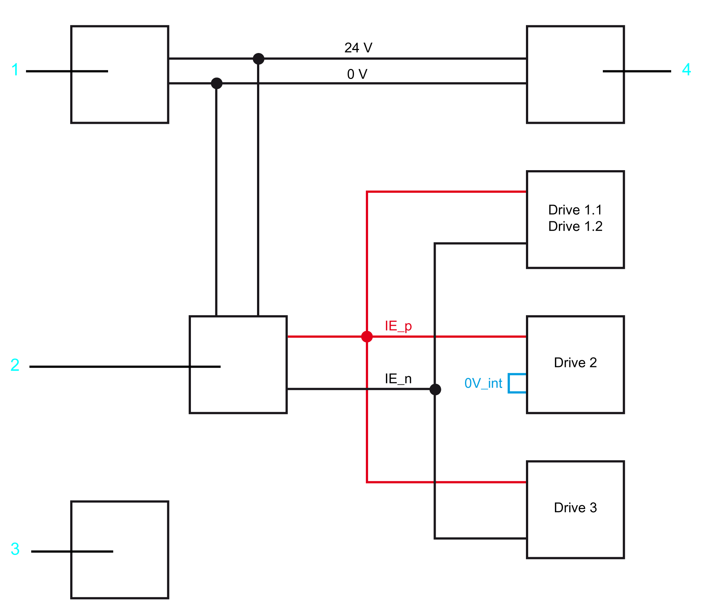
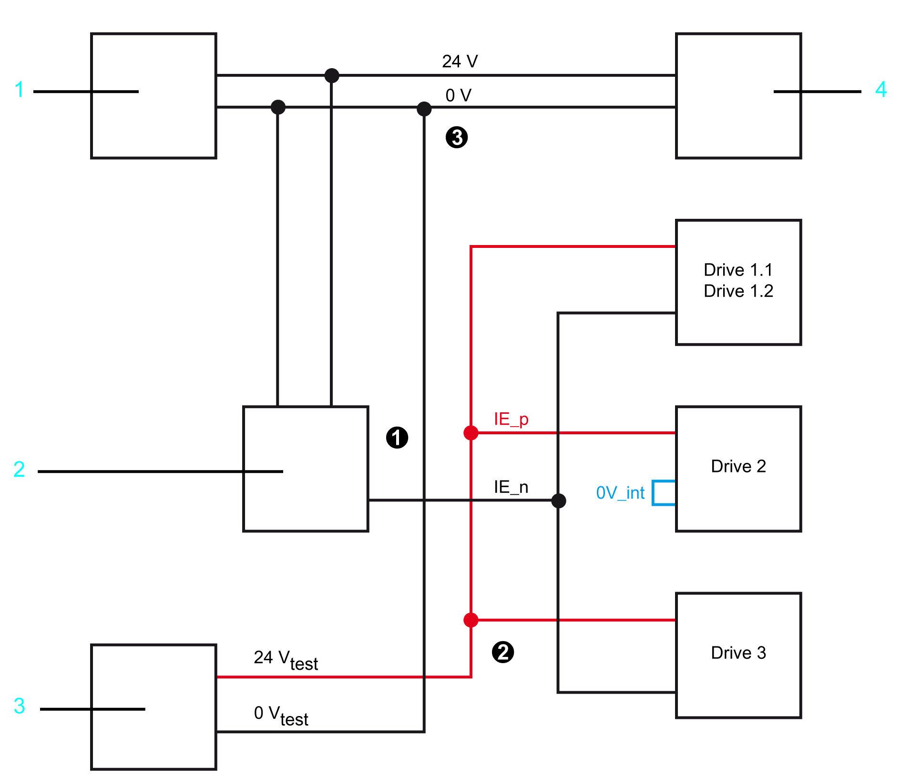
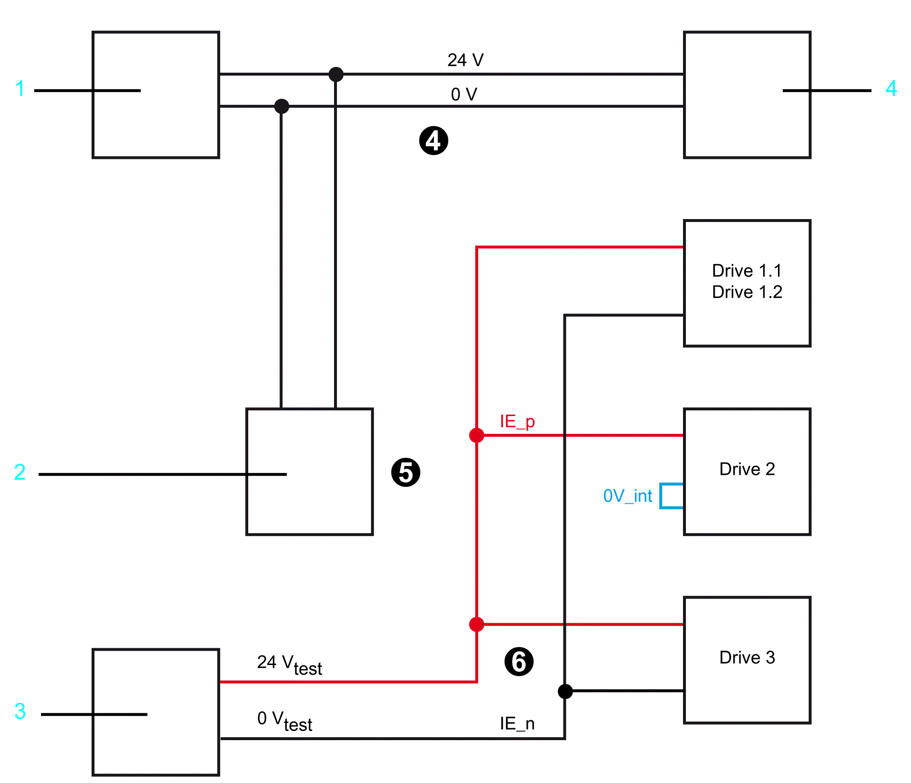

# Setup, Installation, and Maintenance - Wiring Verification

## Overview

For mixed applications for the Lexium 62 variants C/D/G and Lexium 62 variants E/F with a two-channel Inverter Enable connection ([*Application proposal variants C/D/G single-channel jumpered*](D-SE-0052493.html#D-SE-0052493)  and [*Application proposal variants C/D/G two-channel with protected wiring*](D-SE-0052496.html#D-SE-0052496)) for the Lexium 62 variants C/D/G with a two-channel Inverter Enable connection, a verification of the wiring has to be performed as follows.

## Determine Status of Inverter Enable in EcoStruxure Machine Expert Logic Builder

The state of the Inverter Enable input is displayed in the EcoStruxure Machine Expert Logic Builder. This can be used to determine if the drives are correctly wired 1-channel or 2-channel.

**1** 24 V power supply unit

**2** Safety-related switching device

**3** 24 V external power supply unit

**4** Lexium 62 Power Supply

## Measuring Procedure

| Step | Action |
| --- | --- |
| 1 | Wire Inverter Enable channels and connect the connectors to the drives. |
| 2 | Disconnect the IE\_p connection (24 V) for the drives on the safety-related switching device (see **step 1** in the following graphic). |
| 3 | Connect the disconnected IE\_p connection (24 V) to an external 24 V power supply unit (see **step 2** in the following graphic). |
| 4 | The negative pole of the Lexium 62 Power Supply has to be connected to the 0 V of the drives (Connector **CN5** PIN 1 of the Lexium 62 Power Supply (see **step 3** in the following graphic)). |

Verifying the 1-channel wiring

**1** 24 V power supply unit

**2** Safety-related switching device

**3** 24 V external power supply unit

**4** Lexium 62 Power Supply

| Step | Action |
| --- | --- |
| 5 | Verify the IE (Inverter Enable) state of every individual drive in EcoStruxure Machine Expert Logic Builder.  Result: In this case, only the 1-channel drives may be active. |
| 6 | Record the status values in a table. If necessary, screenshots can also be created in EcoStruxure Machine Expert Logic Builder. |

Example: 1-channel variant

| Drive | Connection | Expected status | Displayed status |
| --- | --- | --- | --- |
| 1.1 | 2-channel | Off / 0 |  |
| 1.2 | 2-channel | Off / 0 |  |
| 2 | 1-channel | On / 1 |  |
| 3 | 2-channel | Off / 0 |  |
| This table is used as an example for the documentation and it is mandatory for it to be filled out.  In the column "Displayed status" the result, readable in EcoStruxure Machine Expert Logic Builder, has to be entered. | | | |

| Step | Action |
| --- | --- |
| 7 | Remove the 0 V connection between the Lexium 62 Power Supply and the external power supply unit (see **step 4** in the following graphic). |
| 8 | Disconnect the IE\_n connection (0 V) for the 2-channel drives on the safety-related switching device (see **step 5** in the following graphic). |
| 9 | Connect the disconnected IE\_n connection (0 V) to the external 24 V power supply unit (see **step 6** in the following graphic). |

Verifying the 2-channel wiring

**1** 24 V power supply unit

**2** Safety-related switching device

**3** 24 V external power supply unit

**4** Lexium 62 Power Supply

| Step | Action |
| --- | --- |
| 1 | Verify the IE (Inverter Enable) status of every individual drive in EcoStruxure Machine Expert Logic Builder.  Result: In this case, only the 2-channel drives may be active. |
| 2 | Record the status values in a table. If necessary, screenshots can also be created in EcoStruxure Machine Expert Logic Builder. |

Example: 2-channel variant

| Drive | Connection | Expected status | Displayed status |
| --- | --- | --- | --- |
| 1.1 | 2-channel | On / 1 |  |
| 1.2 | 2-channel | On / 1 |  |
| 2 | 1-channel | Off / 0 |  |
| 3 | 2-channel | On / 1 |  |
| This table is used as an example for the documentation and it is mandatory for it to be filled out.  In the column "Displayed status" the result, readable in EcoStruxure Machine Expert Logic Builder, has to be entered. | | | |

| Step | Action |
| --- | --- |
| 3 | Connect the IE\_n connection to the protective switching device again. |
| 4 | Connect the IE\_p connection (24 V) to the protective switching device. |

NOTE: The machine manufacturer must keep the tables with the documents on the machine for documentation purposes.

NOTE: Verify the wiring every time a safety-related component is replaced.

EIO0000003738.02

© 2021

Schneider Electric.

All rights reserved.