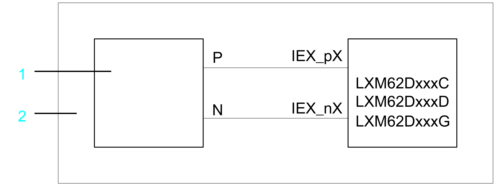
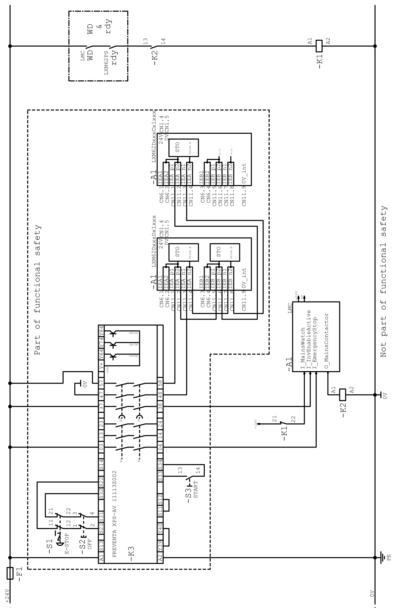
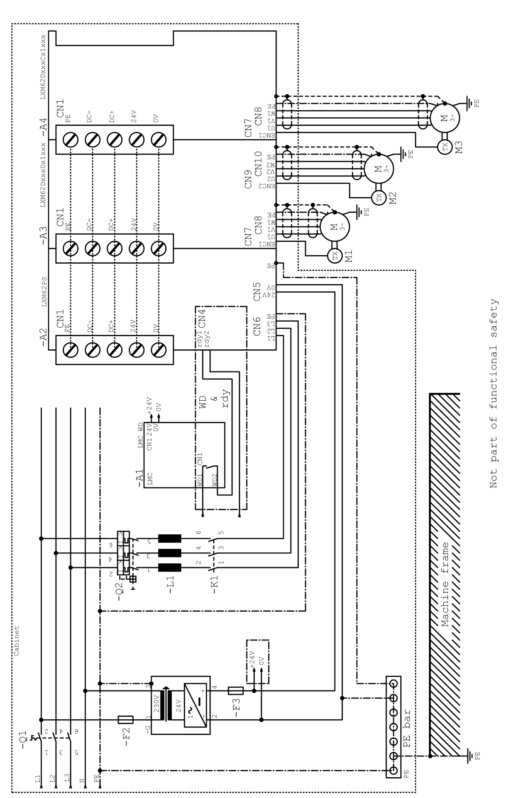

# Application Proposal for the Variants C/D/G Two-Channel with Protected Wiring

## Overview

**1** Safety-related switching device

**2** Control cabinet

## Safe Stop of Category 1 (SS1)

There is one application proposal to implement the defined safe stop of category 1 (SS1):

* APP‑111011‑001: Inverter Enable circuit for Logic Motion Controller Safe Stop 1 (SS1) with a protection circuit and two-channel interruption

## Notes Concerning the Application Proposal - General

* The application proposal provides for a protected IEA/IEB wiring (control cabinet IP54) from the safety-related switching device to the Lexium 62, in order to help exclude potential wiring issues.
* Protection against automatic restart is provided by the external safety-related switching device.
* If potential errors cannot be ruled out, a diagnostic can optionally be provided for the two-channel variants. This must be realized externally and is not shown in the application proposal.

## Notes Concerning the Application Proposal - Notes on APP‑111011‑001

The mains contactor K1 in this circuit proposal is not necessary for functional safety purposes. However, it is used in the application proposal for the device protection of power supplies or Lexium 62 Servo Drives.

Application proposal for the control circuit (drawing number APP‑111011‑001)

Application proposal for the load cycle (drawing number APP‑111011‑001)

EIO0000003738.02

© 2021

Schneider Electric.

All rights reserved.