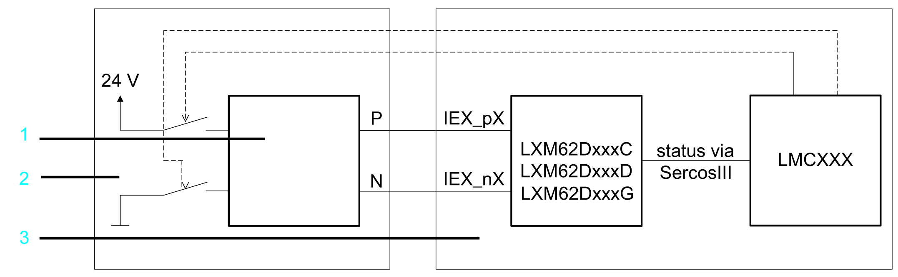

# Application Proposal for the Variants C/D/G Two-Channel with External, Non-Safety-Related Diagnostic

## Overview

Application proposal Lexium 62 variants C/D/G two-channel with external, non-safety‑related diagnostic (back‑reading)

**1** Safety-related switching device

**2** Control cabinet 1

**3** Control cabinet 2

EIO0000003738.02

© 2021

Schneider Electric.

All rights reserved.