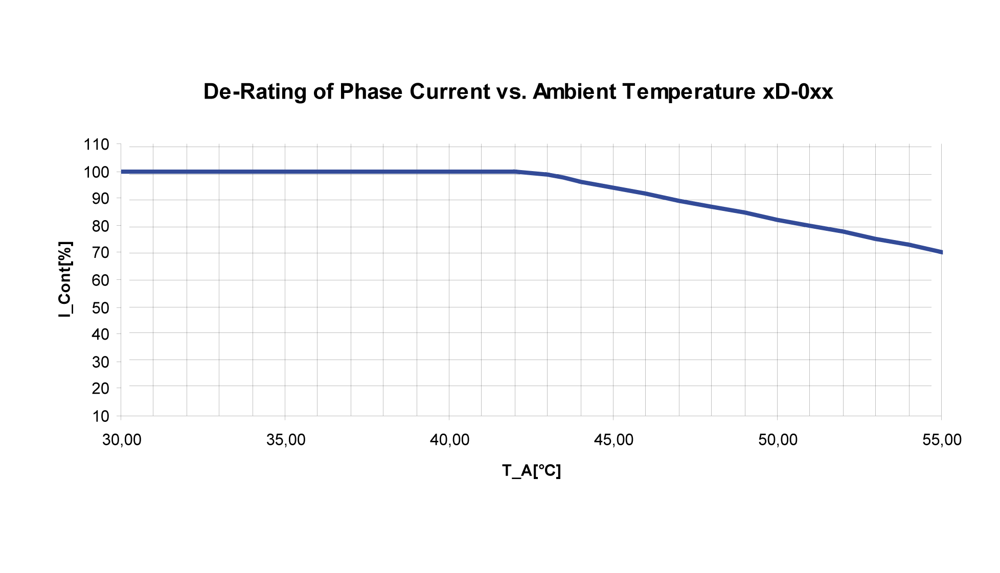
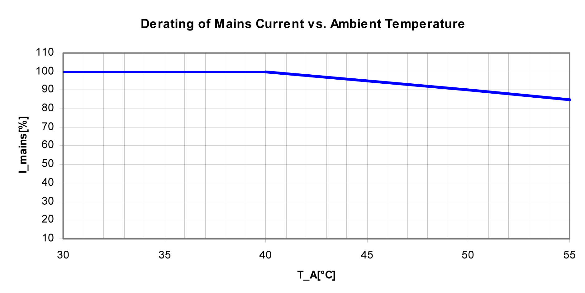

# Increased Ambient Temperature

## Lexium 62 Servo Drive

If the ambient temperature exceeds 40 °C (104 °F), then the output power of the system is reduced.

Power reduction upon a change in the ambient temperature (Lexium 62 Servo Drive)

For further information on the rated and peak currents at variable ambient temperatures, refer to [*Mechanical and Electrical Data - Single Drive*](D-SE-0051822.html#D-SE-0051822) and [*Mechanical and Electrical Data - Double Drive*](D-SE-0051803.html#D-SE-0051803).

## Lexium 62 Power Supply

Power reduction at a change of the ambient temperature (Power Supply)

EIO0000003738.02

© 2021

Schneider Electric.

All rights reserved.