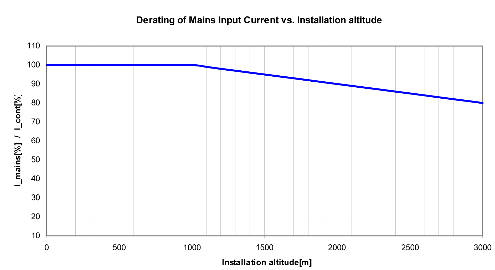

# Low Air Pressure

## General

If the installation altitude exceeds the specified rated installation altitude, the performance of the entire system is reduced.

Power reduction by increasing installation altitude:

NOTE: Multiply the values with the nominal current at 40 °C (104 °F) in order to calculate the maximum continous current value, depending on the required installation altitude.

EIO0000003738.02

© 2021

Schneider Electric.

All rights reserved.