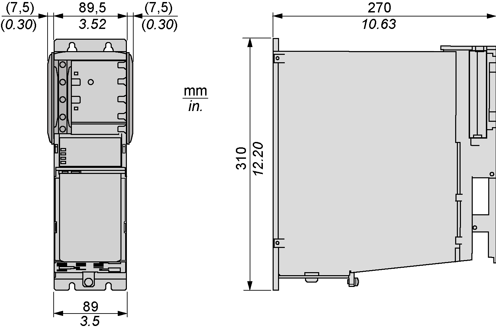
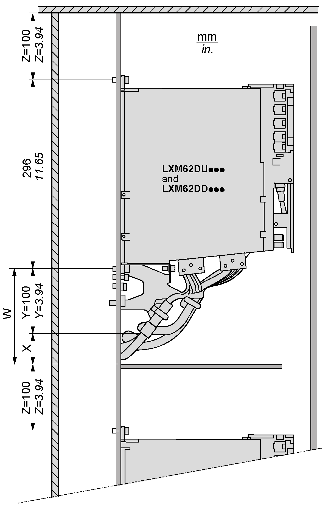
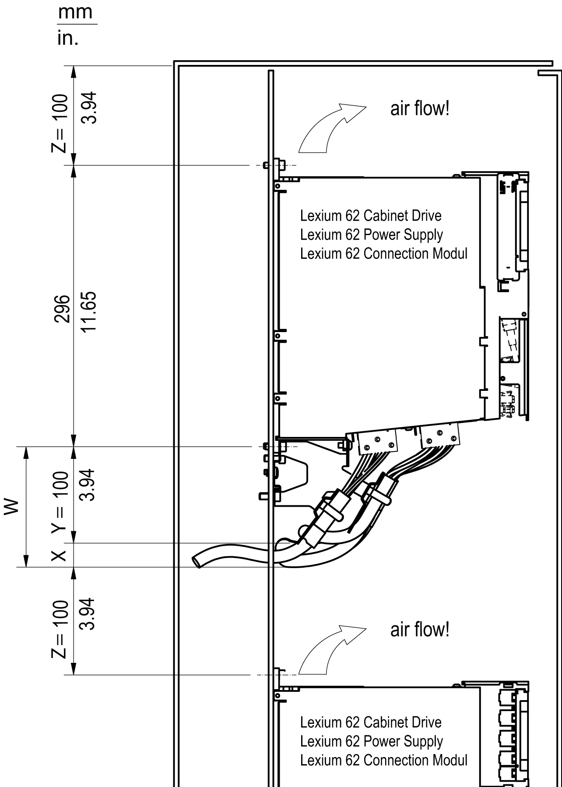
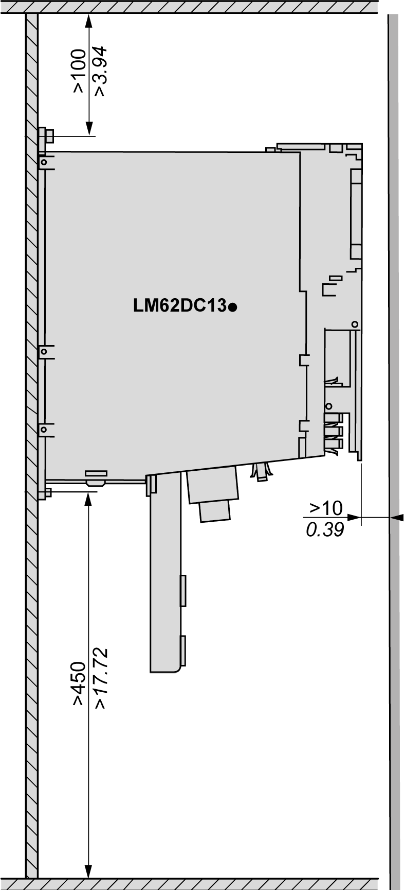

# Preparing the Control Cabinet

## Overview

| DANGER | |
| --- | --- |
|  | INCORRECT OR UNAVAILABLE GROUNDING  Remove paint across a large surface at the installation points before installing the devices (bare metal connection).  Failure to follow these instructions will result in death or serious injury. |

| Step | Action |
| --- | --- |
| 1 | If necessary to maintain and respect the maximum ambient operating temperature, install additional fan in the control cabinet. |
| 2 | Do not block the fan air inlet of the product. |
| 3 | Drill mounting holes in the control cabinet in the 45 mm (1.77 in) mounting-grid pattern (±0.2 mm / ±0.01 in). |
| 4 | Observe tolerances as well as distances to the cable channels and adjacent Lexium 62 Servo Drives or other heat producing equipment. |

## Required Distances in the Control Cabinet for the PacDrive LMC Pro/Pro2, Lexium 62 Power Supply, Lexium 62 Servo Drive

Required distances in the control cabinet for the PacDrive LMC Pro/Pro2, Lexium 62 Power Supply, Lexium 62 Servo Drive:

NOTE: For the shield plates (external shield connections), additional holes are required.

## Required Distances in the Control Cabinet for the PacDrive LMC Eco, Lexium 62 Power Supply, Lexium 62 Servo Drive

Required distances in the control cabinet for the PacDrive LMC Eco, Lexium 62 Power Supply, Lexium 62 Servo Drive:

| – | mm | in | Thread |
| --- | --- | --- | --- |
| (1) | 100 (± 0.2) | 3.94 (± 0.01) | M6 |
| (2) | 258 (+ 0.5 / -0) | 10.16 (± 0.02 / -0) | M6 |
| (3) | 22 (± 0.2) | 0.87 (± 0.01) | M5 |
| (4) | 55 (± 0.2) | 2.17 (± 0.01) | M6 |
| (5) | 45 (± 0.2) | 1.77 (± 0.01) | M6 |
| (6) | 296 (+ 0.5 / -0) | 11.65 (± 0.02 / -0) | M6 |

NOTE: For the shield plates (external shield connections), additional holes are required.

## Required Distances in the Control Cabinet for the Power Supply

* Keep a distance of at least 100 mm (3.94 in) above and below the devices.

Required distances in the control cabinet for the Lexium 62 Power Supply:

* Do not lay any cables or cable channels over the servo amplifiers or braking resistor modules.

## Required Distances in the Control Cabinet for Lexium 62 Servo Drive (Excluding LXM62DC13)

Type A: cable routing in cabinet on cable tray or cable channel:

**X** Additional distance between the lower edge of strain relief and upper edge of cable tray or cabinet wall, depending on the diameter and number of cables

**Y** Minimum distance in mm (in), between device and lower edge of strain relief

**Z** Free area of 100 mm (3.94 in) required above device

**W** Minimum distance in mm (in) for cable installation (X+Y)

Type B: cable routing in cabinet behind mounting-backplane:

**X** Additional distance between the lower edge of strain relief and lower edge of cutout on backplane or cabinet wall, depending on the diameter and number of cables

**Y** Minimum distance in mm (in), between device and lower edge of strain relief

**Z** Free area of 100 mm (3.94 in) required above device

**W** Minimum distance in mm (in) for cable installation (X+Y)

## Required Distances in the Control Cabinet for the Single Drive LXM62DC13

| Step | Action |
| --- | --- |
| 1 | Keep a distance of at least 100 mm (3.94 in) above the devices. |
| 2 | Keep a distance of at least 450 mm (17.71 in) below the devices. |

Required distances in the control cabinet for the single drive LXM62DC13:

* Do not lay any cables or cable channels over the servo amplifiers or braking resistor modules.

EIO0000003738.02

© 2021

Schneider Electric.

All rights reserved.