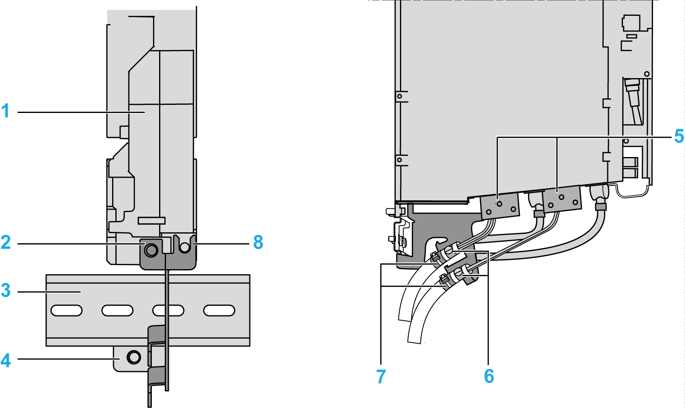

# External Shield Connection on the Drive Module (Excluding LXM62DC13)

## Presentation

**1** Drive module (Lexium 62 Servo Drive)

**2** Mounting holes of the drive module

**3** Cap rail

**4** Position of the lower hole for mounting the shield plate

**5** Motor connectors

**6** Braided shield of the cable in spring clip

**7** Strain relief by using cable ties (Encoder cable can be fixed at this place)

**8** Mounting points on the drive module

## With Cap Rail

| Step | Action |
| --- | --- |
| 1 | Drill holes for mounting the cap rail (**3**) 29.5 mm (1.16 in.) below the lower mounting hole (**2**) (M6) of the drive module (**1**). |
| 2 | Mount the cap rail. |
| 3 | Clamp the shield plate below the cap rail. Then screw down the shield plate into the hole (**2**) and on the drive (**8**). |
| 4 | When mounting the shield plate by using the cap rail, an additional hole (**4**) is not required. |
| 5 | Afterwards, establish the shield connection of the motor cable. For this, press the braided shield of the prefabricated cable into the spring clip (**6**). |
| 6 | Provide for strain relief (**7**) by using cable ties. |

## Without Cap Rail

| Step | Action |
| --- | --- |
| 1 | Starting from the lower mounting hole (M6) of the drive module, move 52.5 mm (2.07 in.) down and 8.5 mm (0.33 in.) to the left and drill an M6 threaded hole (**4**). |
| 2 | Screw the shield plate into the three mounting points (**2**), (**4**) and (**8**). |
| 3 | Afterwards, establish the shield connection of the motor cable. For this, press the braided shield of the prefabricated cable into the spring clip (**6**). |
| 4 | Provide for strain relief (**7**) by using cable ties. |

NOTE: The external shield plate complete with cable ties is included in the accessory kit CSD-1.

EIO0000003738.02

© 2021

Schneider Electric.

All rights reserved.