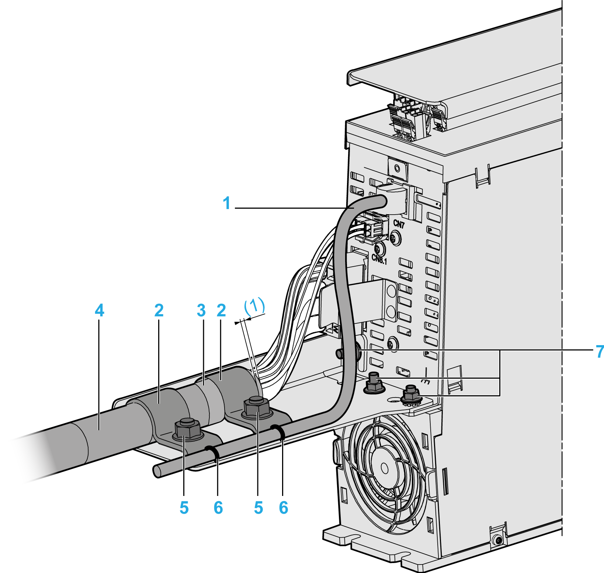

# External Shield Connection on the Drive Module LXM62DC13

## Presentation

**1** Encoder cables

**2** Ground clamp

**3** Braided shield of cable

**4** Motor cables

**5** Bolt on the shield plate

**6** Strain relief via cable ties

**7** Bolt on drive module

**(1)** Braided shield protrusion (at least 5 mm/0.2 in)

## Procedure

To mount the shield plate and to attach the motor/encoder cable, proceed as follows:

| Step | Action |
| --- | --- |
| 1 | Release and remove the screw-nuts M5 on the bolts (**7**). |
| 2 | Fix the shield plate on the bottom side of the drive module, so that the bolts (**7**) are in the corresponding holes of the shielding. |
| 3 | Tighten the bolts (**7**) on the shield plate with the screw nuts M5 (tightening torque: 2.5 Nm / 22 lbf in). |
| 4 | Connect the motor supply cable (**4**) to the shield plate so that the end of the cable sheathing is located in the range of the bolt (**5**). |
| 5 | Place both ground clamps (**2**) over the cable sheathing so that the bolts (**5**) are located in the holes of the ground clamps.   * Use the larger ground clamps ESE23 for motor supply cables with a cable cross section of 10 mm2. * Use the smaller ground clamps ESE19 for motor supply cables with a cable cross section of 4 mm2. |
| 6 | Loosely fix the motor supply cable with both screw-nuts M8 above the two ground clamps (**2**).  **Result**: The motor supply cable can still be moved underneath the ground clamps. |
| 7 | Finally position the motor supply cable, so that the cable sheathing has a protrusion F to the ground clamp (**2**) of at least 5 mm (0.2 in.) and the braided shield of the cable (**3**) is positioned below the first ground clamp (**2**). |
| 8 | Tighten the motor supply cable with both screw nuts M8 above the two ground clamps (**2**) (tightening torque: 6 Nm / 53.10 lbf in). |
| 9 | Connect the encoder cable (**1**) to the shield plate and relief the strain by using cable ties (**6**). |

NOTE: The external shield plate including the ground clamps, M5/M8 screw-nuts and the cable ties are included in the accessory kit "CSD-Kit-LXM62DC13SD".

EIO0000003738.02

© 2021

Schneider Electric.

All rights reserved.