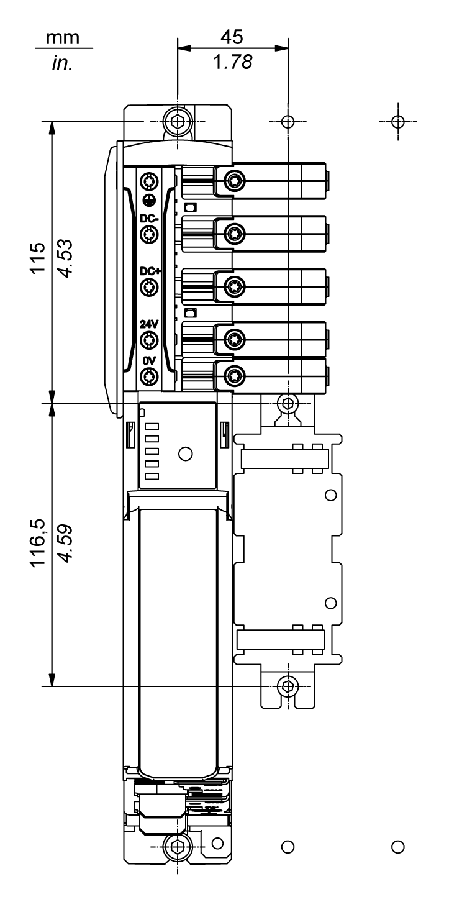

# Strain Relief for Lexium 62 DC Link Terminal Connections

## Overview

When using heavy gauge wires, a strain relief is necessary in order to help reduce the mechanical forces resulting from heavy cables acting on the Lexium 62 DC Link Terminal. The strain relief is supplied with the Lexium 62 DC Link Terminal.

|  |  |
| --- | --- |
| Strain relief to be mounted to the control cabinet wall, which is supplied with Lexium 62 DC Link Terminal. |  |
| Strain relief without optional shield connection terminal block. |  |
| Strain relief with optional shield connection for cables with diameters between 20 mm (0.79 in.) and 35 mm (1.37 in.). |  |

## Mounting the Strain Relief in the Control Cabinet

Two holes are necessary to mount the strain relief in the control cabinet:

To mount the strain relief for the Lexium 62 DC Link Terminal, proceed as follows:

| Step | Action |
| --- | --- |
| 1 | Mount the strain relief (1) to the control cabinet wall using two M5 screws.  Optionally you can mount it on a cap rail. |
| 2 | Secure the wires/cables by using cable ties. |

| DANGER | |
| --- | --- |
|  | ELECTRIC SHOCK  * Ensure that the cable ties are securely holding the wires/cables on the strain relief component. * Ensure that all forces acting on the terminals and connected wires/cables are minimized.  Failure to follow these instructions will result in death or serious injury. |

## Grounding the Optional Shield Connection Terminal Block

The shield connection terminal block allows you to connect the cable shield electrically conducting to PE (Protective Earth/ground) by using the strain relief screwed on the rear wall of the control cabinet.

NOTE: Use a shielded cable for the connection of Lexium 62 device islands which are located in separate control cabinets.

| Step | Action |
| --- | --- |
| 1 | Mount the strain relief to a grounded metal surface. |
| 2 | If you use shielded cable with a cable diameter between 20 mm (0.79 in.) and 35 mm (1.37 in.), ground the cable shield by applying the strain relief with a shield connection terminal block (3). To this end, the cable sheath must be stripped for at least 40 mm (1.57 in.) to clamp the cable shield. |

EIO0000003738.02

© 2021

Schneider Electric.

All rights reserved.