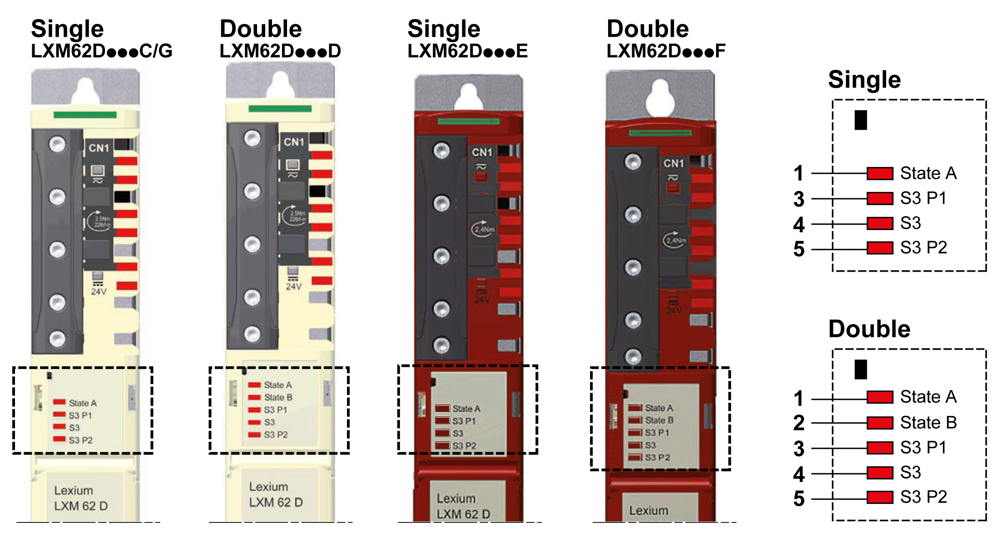

# Indicators of the Lexium 62 Servo Drive

## Overview

The display of the Lexium 62 Servo Drives consists of multi-color LED indicators that are used to display status information.

**1** LED indicator for axis A

**2** LED indicator for axis B (double servo drives only)

**3** LED indicator for the status of the Sercos III communication port 1

**4** LED indicator for the Sercos III communication

**5** LED indicator for the status of the Sercos III communication port 2

## Reset Button

Press the reset button to reset and restart the Lexium 62 Servo Drive.

## State LED Indicators

| LED indicator color / status | Description | Instructions / information for the user |
| --- | --- | --- |
| Off | Device is not energized or is otherwise inoperable. | * Verify the power supply. * Replace device. |
| Flashing slowly green (2 Hz, 250 ms) | Initialization of the device (firmware boot process, compatibility verification of the hardware, updating the firmware) | * Wait until initialization is complete. |
| Flashing green (4 Hz, 125 ms) | Identification of the device | * If necessary, identify the device via EcoStruxure Machine Expert as defined by the controller configuration. |
| Steady green | Device has been initialized and waits for the configuration. | * Configure device as active. * Configure device as inactive. * Configure device for the execution of motions. |
| Steady red | A non-recoverable error has been detected requiring user intervention:   * Watchdog * Firmware * Checksum * Internal error detected | * Cycle power (power reset) * If this condition persists, replace the device. |
| Flashing slowly red (2 Hz, 250 ms) | A general error has been detected. | * The Devices tree in EcoStruxure Machine Expert displays the error detected. * Reset error detected in the EcoStruxure Machine Expert Logic Builder menu Online > Reset diagnostic messages of controller. * Otherwise restart device. |

## S3 P1 and S3 P2 LED Indicators

| LED indicator color / status | Description | Instructions / information for the user |
| --- | --- | --- |
| Off | Possible causes:   * No cable connected * The device is not energized | * Connect the cable. * Verify the power supply. |
| Steady orange | Cable connected, no Sercos communication | – |
| Steady green | Cable connected, active Sercos communication | – |

## S3 LED Indicator

| LED indicator color / status | Description | Instructions / information for the user |
| --- | --- | --- |
| Off | Possible causes:   * The device is not energized or is otherwise inoperable, or * there is no communication due to an interrupted or separated connection. | * Verify the power supply. * Sercos boot-up or hot swap |
| Steady green | Active Sercos connection without an error detected in the CP4. | – |
| Flashing green (4 Hz, 125 ms) | The device is in loopback mode.  Loopback describes the situation in which the Sercos telegrams have to be sent back on the same port on which they were received.  Possible causes:   * Line topology or * Sercos loop break | Workaround:   * Close ring.   Reset condition:   * Acknowledge the detected error in the EcoStruxure Machine Expert Logic Builder menu Online > Reset diagnostic messages of controller. * Switch from CP0 to CP1 alternatively.   NOTE: If during phase CP1 a line topology or ring break was detected (device in loopback mode), the LED indicator condition does not change. |
| Steady red | Sercos diagnostic class 1 (DC1) error has been detected on port 1 and/or port 2. | Reset condition:   * Acknowledge the detected error in the EcoStruxure Machine Expert Logic Builder menu Online > Reset diagnostic messages of controller. |
| Flashing red / green (4 Hz, 125 ms) | Communication error has been detected.  Possible causes:   * Improper functioning of the telegram * CRC error detected | Reset condition:   * The configuration shows which error has been detected. * Acknowledge the detected error in the EcoStruxure Machine Expert Logic Builder menu Online > Reset diagnostic messages of controller. |
| Steady orange | The device is in a communications phase CP0 up to and including CP3. Sercos telegrams are received. | – |
| Flashing orange (4 Hz, 125 ms) | Device identification | NOTE: The identified device is also displayed by the axis state LED indicator on the drive. |

NOTE: The communication phase information is available as follow while in steady orange state:

* Communication phase is CP0: Steady orange
* Communication phase is CP1: One brief green flash followed by steady orange
* Communication phase is CP2: Two brief green flashes followed by steady orange
* Communication phase is CP3: Three brief green flashes followed by steady orange

EIO0000003738.02

© 2021

Schneider Electric.

All rights reserved.