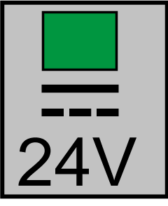

# Bus Bar Module LED Indicators on the Lexium 62 Power Supply, Lexium 62 Servo Drive, and Lexium 62 DC Link Support Module

## Overview

LED indicators on the Bus Bar Module

**1** DC Bus LED indicator

**2** **24V** LED indicator

## DC Bus LED Indicator

| LED indicator color / status | Description | Information |
| --- | --- | --- |
| Off | DC bus supply inactive | – |
| Steady red | DC bus supply active | DC bus voltage ≥ 42.4 Vdc |

The DC Bus LED indicator is not an indicator for the absence of DC bus voltage.

NOTE: If the DC-bus LED remains off, although the DC-bus is loaded, then the device must be replaced immediately and sent in to Schneider Electric for repair.

## **24V** LED Indicator

| LED indicator color / status | Description |
| --- | --- |
| Off | 24 Vdc logic supply inactive |
| Steady green | 24 Vdc logic supply active |

EIO0000003738.02

© 2021

Schneider Electric.

All rights reserved.