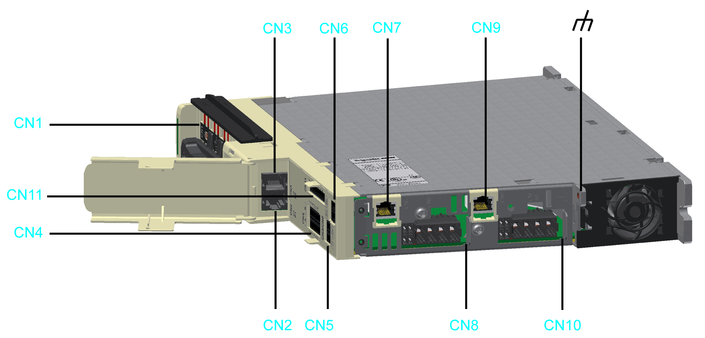
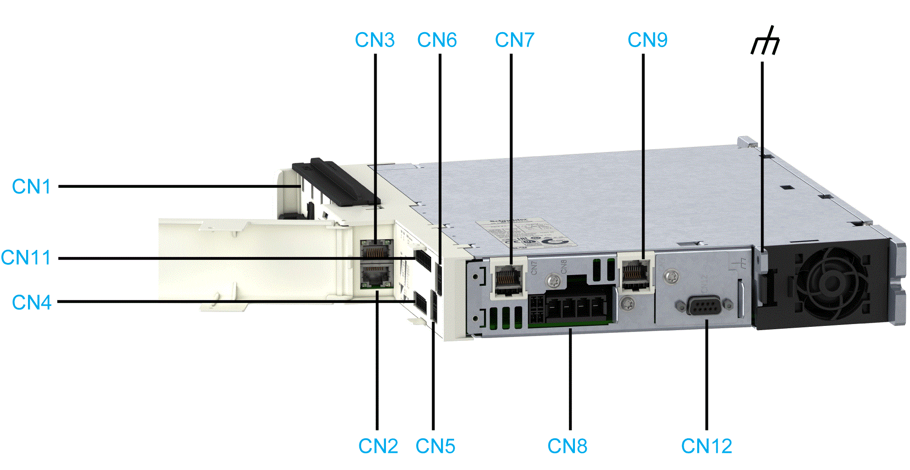
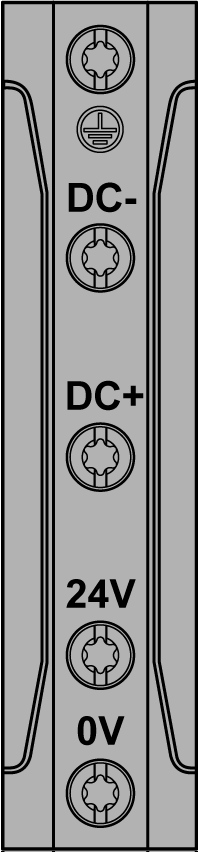
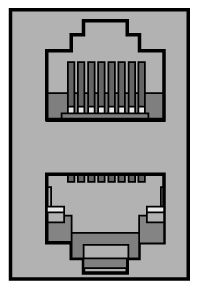
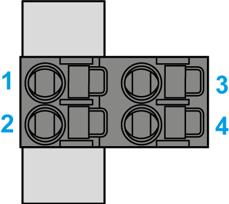
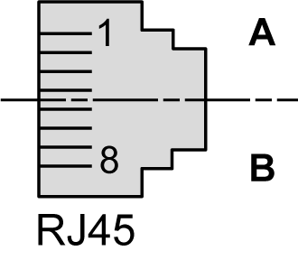
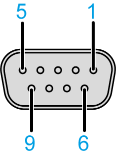

# Electrical Connections for the Lexium 62 Servo Drives

## Electrical Connections for the Lexium 62 Variants C, D, E, F

| Connector | Description | Connection cross-section [mm2] / [AWG] | Tightening torque [Nm] / [lbf in] |
| --- | --- | --- | --- |
| **[CN1](#D-SE-0051913__D-SE-0051913.6)** | Bus Bar Module | – | 2.5 / 22.13 |
| **[CN2/CN3](#D-SE-0051913__D-SE-0051913.7)** | Sercos | – | – |
| **[CN4](#D-SE-0051913__D-SE-0051913.8)** | Digital inputs/outputs | 0.25...1.5 / 24...16 | – |
| **[CN5](#D-SE-0051913__D-SE-0051913.9)** | 24 V supply for digital inputs/outputs | 0.25...1.5 / 24...16 | – |
| **[CN6](#D-SE-0051913__D-SE-0051913.10)** | Inverter Enable 1-channel(1) | 0.2...1.5 / 24...16 | – |
| **[CN7/CN9](#D-SE-0051913__D-SE-0051913.11)** | Encoder connector  **CN7** - axis A  **CN9** - axis B (only for double drives) | – | – |
| **[CN8](#D-SE-0051913__D-SE-0051913.12)** | Motor phases - axis A | 0.2...6 / 24...10 | – |
| **[CN10](#D-SE-0051913__D-SE-0051913.12)** | Motor phases - axis B (only for double drives; variants D, F) |
| **[CN11](#D-SE-0051913__D-SE-0051913.13)** | Inverter Enable 2-channel | 0.2 - 1.5 / 24 - 16 | – |
|  | Functional ground (earth) | Mounting point for the shield(2) | 3.5 / 30.98 |
| **(1)** Valid **only** for Lexium 62 variants C/D, refer to [*Extended Safety-Related Functions - Inverter Enable via Hardware Input*](D-SE-0051313.html#D-SE-0051313__D-SE-0051313.16)  **(2)** Refer to [*External Shield Connection on the Drive Module (LMX62DU and LMX62DD)*](D-SE-0052361.html#D-SE-0052361) | | | |

## Electrical Connections for the Lexium 62 Variant G

| Connector | Description | Connection cross-section [mm2] / [AWG] | Tightening torque [Nm] / [lbf in] |
| --- | --- | --- | --- |
| **[CN1](#D-SE-0051913__D-SE-0051913.6)** | Bus Bar Module | – | 2.5 / 22.13 |
| **[CN2/CN3](#D-SE-0051913__D-SE-0051913.7)** | Sercos | – | – |
| **[CN4](#D-SE-0051913__D-SE-0051913.8)** | Digital inputs/outputs | 0.25...1.5 / 24...16 | – |
| **[CN5](#D-SE-0051913__D-SE-0051913.9)** | 24 V supply for digital inputs/outputs | 0.25...1.5 / 24...16 | – |
| **[CN6](#D-SE-0051913__D-SE-0051913.10)** | Inverter Enable 1-channel | 0.2...1.5 / 24...16 | – |
| **[CN7/CN9](#D-SE-0051913__D-SE-0051913.11)** | **CN7** - Encoder connector  **CN9** - Additional machine encoder input | – | – |
| **[CN8](#D-SE-0051913__D-SE-0051913.12)** | Motor phases - axis A | 0.2...6 / 24...10 | – |
| **[CN11](#D-SE-0051913__D-SE-0051913.13)** | Inverter Enable 2-channel | 0.2 - 1.5 / 24 - 16 | – |
| **[CN12](#D-SE-0051913__CN12-EncoderOutputSimulation-6226081A)** | Machine Encoder Output | 0.2...6 / 24...10 | – |
|  | Functional ground (earth) | Mounting point for the shield(1) | 3.5 / 30.98 |
| **(1)** Refer to [*External Shield Connection on the Drive Module (LMX62DU and LMX62DD)*](D-SE-0052361.html#D-SE-0052361) | | | |

## Electrical Connections for the Single Drive LXM62DC13

|  |  |
| --- | --- |
| LXM62DC13 variant C/E | LXM62DC13 variant G |
|  |  |

| Connector | Description | Connection cross-section [mm2] / [AWG] | Tightening torque [Nm] / [lbf in] |
| --- | --- | --- | --- |
| **[CN1](#D-SE-0051913__D-SE-0051913.6)** | Bus Bar Module | – | 2.5 / 22.13 |
| **[CN2/CN3](#D-SE-0051913__D-SE-0051913.7)** | Sercos | – | – |
| **[CN4](#D-SE-0051913__D-SE-0051913.8)** | Digital inputs/outputs | 0.25...1.5 / 24...16 | – |
| **[CN5](#D-SE-0051913__D-SE-0051913.9)** | 24 V supply for digital inputs/outputs | 0.25...1.5 / 24...16 | – |
| **[CN6](#D-SE-0051913__D-SE-0051913.10)** | Inverter Enable 1-channel(1) | 0.2...1.5 / 24...16 | – |
| **[CN7](#D-SE-0051913__D-SE-0051913.11)** | Encoder connector | – | – |
| **[CN8\_1](#D-SE-0051913__D-SE-0051913.12)** | Motor temperature / holding brake | 0.2...1.5 / 24...16 | – |
| **[CN8\_2](#D-SE-0051913__D-SE-0051913.12)** | Motor phases | 4...6 / 12...10 | – |
| **[CN11](#D-SE-0051913__D-SE-0051913.13)** | Inverter Enable 2-channel | 0.2 - 1.5 / 24 - 16 | – |
| **[CN12](#D-SE-0051913__CN12-EncoderOutputSimulation-6226081A)** | Machine Encoder Output (only for LXM62DC13G) | 0.2...6 / 24...10 | – |
|  | Functional ground (earth) | Mounting point for the shield(2) | 3.5 / 30.98 |
| **(1)** Valid **only** for Lexium 62 variants C/G, refer to [*Extended Safety-Related Functions - Inverter Enable via Hardware Input*](D-SE-0051313.html#D-SE-0051313__D-SE-0051313.16)  **(2)** Refer to [*External Shield Connection on the Drive Module LXM62DC13*](D-SE-0052362.html#D-SE-0052362). | | | |

## Removable Spring-Clamping Terminal Block Wiring

The details in the following table apply for the wiring on the removable spring-clamping terminal block of the **CN4, CN5, CN6, CN8 / CN10** (holding brake, temperature) and **CN11** connections.

Overview of the connection cross-sections for the removable spring-clamping terminal blocks **CN4, CN5, CN6, CN8 / CN10** (holding brake, temperature) and **CN11**:

|  | Rigid wire | Flexible wire | Flexible wire with a wire end sleeve without a plastic sleeve | Flexible wire with a wire end sleeve and plastic sleeve |
| --- | --- | --- | --- | --- |
| mm2 | 0.2...1.5 | 0.2...1.5 | 0.25...1.5 | 0.25...0.75 |
| AWG | 24...16 | 24...16 | 23...16 | 23...19 |

The details in the following table apply for the wiring on the removable spring-clamping terminal blocks of the connections **CN8 / CN10** (PE, U, V, W).

Overview of the connection cross-sections for the removable spring-clamping terminal blocks **CN8 / CN10** motor phases (PE, U, V, W):

|  | Rigid wire | Flexible wire | Flexible wire with a wire end sleeve without a plastic sleeve | Flexible wire with a wire end sleeve and plastic sleeve |
| --- | --- | --- | --- | --- |
| mm2 | 0.2...10 | 0.2...6  0.2...10(1) | 0.25...6 | 0.25...4 |
| AWG | 24...8 | 24...10  24...8(1) | 23...10 | 23...12 |
| **(1)** Flexible conductors with an outside diameter of ≤ 4 mm | | | | |

## **CN1** - Bus Bar Module

The DC bus voltage and the 24 Vdc control voltage are distributed and the protective conductor is connected via the Bus Bar Module.

| Pin | Designation | Description |
| --- | --- | --- |
| 1 |  | Protective ground (earth) |
| 2 | DC- | DC bus voltage - |
| 3 | DC+ | DC bus voltage + |
| 4 | 24 V | Supply voltage + |
| 5 | 0 V | Supply voltage - |

## **CN2/3** - Sercos

The Sercos connection is used for the communication between the controller and the drive.

| Pin | Designation | Description |
| --- | --- | --- |
| 1.1 | Eth0\_Tx+ | Positive transmission signal |
| 1.2 | Eth0\_Tx- | Negative transmission signal |
| 1.3 | Eth0\_Rx+ | Positive receiver signal |
| 1.4 | N.C. | Reserved |
| 1.5 | N.C. | Reserved |
| 1.6 | Eth0\_Rx- | Negative receiver signal |
| 1.7 | N.C. | Reserved |
| 1.8 | N.C. | Reserved |
| 2.1 | Eth1\_Tx+ | Positive transmission signal |
| 2.2 | Eth1\_Tx- | Negative transmission signal |
| 2.3 | Eth1\_Rx+ | Positive receiver signal |
| 2.4 | N.C. | Reserved |
| 2.5 | N.C. | Reserved |
| 2.6 | Eth1\_Rx- | Negative receiver signal |
| 2.7 | N.C. | Reserved |
| 2.8 | N.C. | Reserved |

## **CN4** - Digital Inputs / Outputs

The connection **CN4** provides several digital inputs and outputs on the drive:

* The digital inputs A\_DI1 / A\_DI2 (Single Drive) or A\_DI1, A\_DI2 / B\_DI1, B\_DI2 (Double Drive) can be configured as digital inputs or as Touchprobe inputs via the EcoStruxure Machine Expert Logic Builder.
* The digital inputs A\_DI5 /A\_DI6 (Single Drive) or A\_DI5, A\_DI6 / B\_DI5, B\_DI6 can be configured as digital inputs or as digital outputs via the EcoStruxure Machine Expert Logic Builder.
* The filter time constant of the digital inputs can be set to 1 ms or 5 ms.
* The filter time constant of the Touchprobe inputs is fixed at 100 µs.

|  |  |
| --- | --- |
| Single Drive | Double Drive |
|  |  |

| Pin | Designation | Description |
| --- | --- | --- |
| 1 | A\_DI0 | Axis A – Digital input 0 - Touchprobe |
| 2 | A\_DI1 | Axis A – Digital input 1 - Touchprobe |
| 3 | A\_DI2 | Axis A – Digital input 2 |
| 4 | A\_DI3 | Axis A – Digital input 3 |
| 5 | A\_DI4 | Axis A – Digital input / output 4 |
| 6 | A\_DI5 | Axis A – Digital input / output 5 |
| 7 | B\_DI0 | Axis B – Digital input 0 - Touchprobe (only Double Drive) |
| 8 | B\_DI1 | Axis B – Digital input 1 - Touchprobe (only Double Drive) |
| 9 | B\_DI2 | Axis B – Digital input 2 (only Double Drive) |
| 10 | B\_DI3 | Axis B – Digital input 3 (only Double Drive) |
| 11 | B\_DI4 | Axis B – Digital input/output 4 (only Double Drive) |
| 12 | B\_DI5 | Axis B – Digital input/output 5 (only Double Drive) |

## **CN5** - 24 V

The 24 V DIO supply connector supplies the digital inputs/outputs of the drives with the required energy. The connection 0V1 is internally connected to 0V2 and the connection 24V1 is internally connected to 24V2 electrically.

| Pin | Designation | Description |
| --- | --- | --- |
| 1 | 24V1 | Digital I/O supply voltage Axis A |
| 2 | 0V1 |
| 3 | 24V2 | Digital I/O supply voltage Axis B |
| 4 | 0V2 |

NOTE: For the digital inputs/outputs, if the 24 V supply is interconnected to any additional devices via the connection **CN5**, the maximum current carrying capacity must be respected:

* Continuous current carrying capacity of the plug-in connectors: 3 A
* Maximum current carrying capacity of the plug-in connectors: 4 A, 1 s

The number of the devices that can be connected depends on the application.

## **CN6** - Inverter Enable 1–Channel

The Inverter Enable signal supplies the gate driver with voltage. In this way, the STO (Safe Torque Off) requirements according to EN 61508 and ISO 13849-1 are met. **IEA1** is internally connected with **IEA2** electrically, and **IEB1** is internally connected with **IEB2** electrically.

The single channel Inverter Enable is valid **only** for Lexium 62 variants C/D/G, refer to [*Extended Safety-Related Functions - Inverter Enable via Hardware Input*](D-SE-0051313.html#D-SE-0051313__D-SE-0051313.16).

| DANGER | |
| --- | --- |
|  | INADEQUATE SAFETY FUNCTION  Do not use 1-channel Inverter Enable wiring with Lexium 62 variants E/F.  Failure to follow these instructions will result in death or serious injury. |

| **CN6** - Inverter Enable 1–Channel | (**CN6**/**CN11** - Inverter Enable) |
| --- | --- |
|  | **—** Internal connections between **CN6** and **CN11**  **- - -** Possible connection to use the two-channel Inverter Enable as a single-channel Inverter Enable  The single channel Inverter Enable is valid **only** for Lexium 62 variants C/D/G, refer to [*Extended Safety-Related Functions - Inverter Enable via Hardware Input*](D-SE-0051313.html#D-SE-0051313__D-SE-0051313.16). |

| Pin | Designation | Description |
| --- | --- | --- |
| 1 | IEA1 | Inverter Enable signal for axis A (with **CN11** PIN 1, **CN11** PIN 2 and **CN6** PIN 2 jumpered) |
| 2 | IEA2 | Inverter Enable signal for axis A (with **CN11** PIN 2, **CN11** PIN 1 and **CN6** PIN 2 jumpered) |
| 3 | IEB1 | Inverter Enable signal for axis B (with **CN11** PIN 5, **CN11** PIN 6 and **CN6** PIN 4 jumpered) |
| 4 | IEB2 | Inverter Enable signal for axis B (with **CN11** PIN 6, **CN11** PIN 5 and **CN6** PIN 3 jumpered) |

NOTE: For the gate drivers connected via the connection **CN6**, the maximum current carrying capacity must be respected:

* Continuous current carrying capacity of the plug-in connectors: 3 A
* Maximum current carrying capacity of the plug-in connectors: 4 A, 1 s
* Maximum consumption per drive: 30 mA

The number of the devices that can be connected depends on the application.

## **CN7 / CN9** - Encoder Connector

The Hiperface connection consists of a standard, differential, digital connection (RS-485 = 2 wires), a differential, analog connection (sine- and cosine signal = 4 wires), and a mains connection to supply the encoder (+10 V, GND = 2 wires).

| Pin | Designation | Description |
| --- | --- | --- |
| 1 | Cos | Cosine track axis A/B |
| 2 | RefCos | Reference signal cosine axis A/B |
| 3 | Sin | Sine track axis A/B |
| 4 | RS485+ | Positive RS-485 signal axis A/B |
| 5 | RS485- | Negative RS-485 signal axis A/B |
| 6 | RefSin | Reference signal Sine axis A/B |
| 7 | N.C. | Reserved |
| 8 | N.C. | Reserved |
| A | P10V | Supply voltage encoder A/B |
| B | GND | 0 V A/B return |

NOTE: With the [5 V encoder adapter](D-SE-0052219.html#D-SE-0052219), it is also possible to connect encoders with 5 V supply voltage to the [Lexium 62 Servo Drive](D-SE-0052219.html#D-SE-0052219).

## **CN8 / CN10** - Motor Connection

The motor signals U, V, and W supply the motor with the required energy. The temperature signals are connected to a temperature sensor to measure the temperature of the motor. The holding brake output supplies the holding brake in the motor with the required energy.

|  |  |
| --- | --- |
| Lexium 62 Drives except DC13 | Lexium 62 DC13 Drives |
| **CN8 / CN10** - motor connector | **CN8\_1** - motor temperature and holding brake  **CN8\_2** - motor phases |

| Pin | Designation | Description |
| --- | --- | --- |
| 1 | ϑ− | Temperature negative signal |
| 2 | ϑ+ | Temperature positive signal |
| 3 | BR- | Brake negative signal |
| 4 | BR+ | Brake positive signal |
| 5 | PE | Protective Earth (ground) |
| 6 | U | Motor phase U |
| 7 | V | Motor phase V |
| 8 | W | Motor phase W |

| Motor cable(1) | | Motor connectors | Description |
| --- | --- | --- | --- |
| Label of cable core | Color of cable core | Label |
| 1 | Black | U | Motor phase U - Axis A/B |
| 2 | Black | V | Motor phase V - Axis A/B |
| 3 | Black | W | Motor phase W - Axis A/B |
| – | Green/Yellow |  | Protective ground (earth) - Axis A/B |
| 5 | Black | ϑ− | Temperature negative signal - Axis A/B |
| 6 | Black | ϑ+ | Temperature positive signal - Axis A/B |
| 7 | Black | BR- | Holding brake negative signal - Axis A/B |
| 8 | Black | BR+ | Holding brake positive signal - Axis A/B |
| **(1)** Order numbers: VW3E1143Rxxx, VW3E1144Rxxx, VW3E1145Rxxx | | | |

The insulation-stripped length of the wires of the motor connector is 15 mm (0.59 in.). The maximum length of the motor supply cable is 75 m (246.06 ft).

## **CN11** - Inverter Enable 2-Channel

| **CN11** - Inverter Enable 2-Channel | (**CN6**/**CN11** - Inverter Enable) |
| --- | --- |
|  | **—** Internal connections between **CN6** and **CN11**  **- - -** Possible connection to use the two-channel Inverter Enable as a single-channel Inverter Enable  The single channel Inverter Enable is valid **only** for Lexium 62 variants C/D/G, refer to [*Extended Safety-Related Functions - Inverter Enable via Hardware Input*](D-SE-0051313.html#D-SE-0051313__D-SE-0051313.16). |

| Pin | Designation | Description |
| --- | --- | --- |
| 1 | IEA\_p1 | Inverter Enable signal for drive A 24 V (with **CN6** PIN 1, **CN6** PIN 2 and **CN11** PIN 2 jumpered) |
| 2 | IEA\_p2 | Inverter Enable signal for drive A 24 V (with **CN6** PIN 1, **CN6** PIN 2 and **CN11** PIN 1 jumpered) |
| 3 | IEA\_n1 | Inverter Enable signal for drive A 0 V external |
| 4 | IEA\_n2 | Inverter Enable signal for drive A 0 V external |
| 5 | IEB\_p1 | Inverter Enable signal for drive B 24 V (with **CN6** PIN 3, **C6** PIN 4 and **CN11** PIN 6 jumpered) |
| 6 | IEB\_p2 | Inverter Enable signal for drive B 24 V (with **CN6** PIN 4, **C6** PIN 3 and **CN11** PIN 5 jumpered) |
| 7 | IEB\_n1 | Inverter Enable signal for drive B 0 V external |
| 8 | IEB\_n2 | Inverter Enable signal for drive B 0 V external |
| 9 | 0V\_int | Inverter Enable signal 0 V internal |

## **CN12** - Encoder Output Simulation

| Pin | Designation | Description |
| --- | --- | --- |
| 1 | B- | Encoder Output track B / Differential - |
| 2 | B+ | Encoder Output track B / Differential + |
| 3 | A+ | Encoder Output track A / Differential + |
| 4 | A- | Encoder Output track A / Differential - |
| 5 | n.c. | - |
| 6 | n.c. | - |
| 7 | Z+ | Encoder Output track B / Differential + |
| 8 | Z- | Encoder Output track B / Differential - |
| 9 | GND\_EXT | External Ground |

EIO0000003738.02

© 2021

Schneider Electric.

All rights reserved.